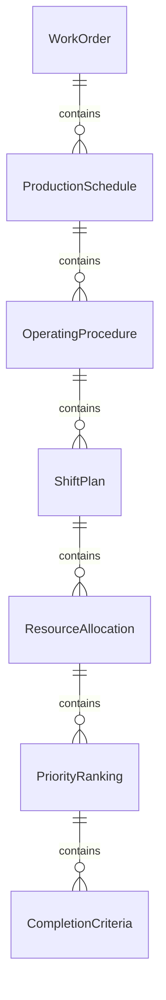
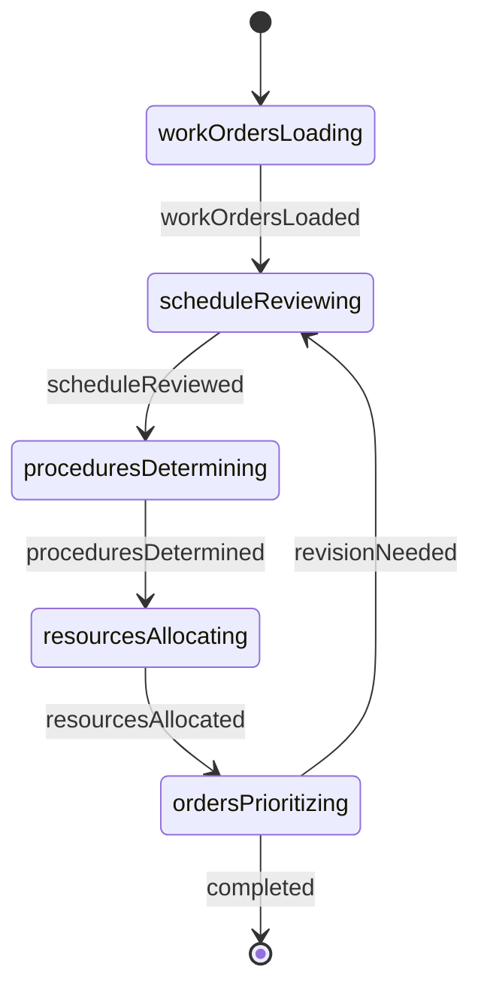
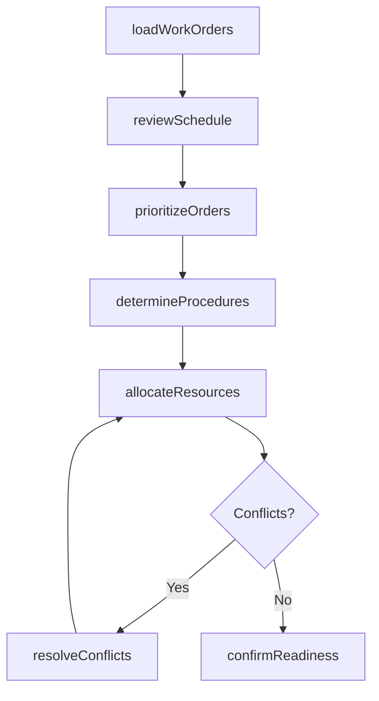
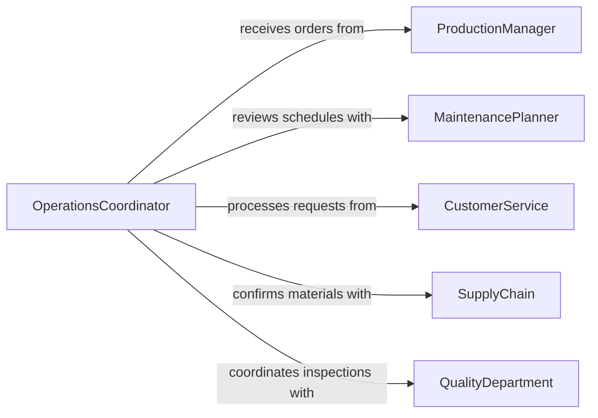

# Review Work Orders or Schedules to Determine Operations

> Business-as-Code definition for reviewing work orders or schedules to determine operations and procedures. Models the workflow from order intake through operational planning, resource alignment, and execution readiness.

## Overview

Reviewing work orders or schedules to determine operations and procedures involves examining production orders, maintenance schedules, service requests, and shift plans to identify what tasks must be performed, in what sequence, and with what resources. This process ensures that operational teams have clear instructions and adequate preparation before beginning work. This definition exposes actions for schedule analysis, events for operational readiness, and searches for retrieving order and schedule data.

## Actors

| Actor | Description |
|-------|-------------|
| ProductionManager | Issues work orders with priority and deadline information |
| MaintenancePlanner | Creates preventive and corrective maintenance schedules |
| CustomerService | Generates service requests that translate into work orders |
| SupplyChain | Confirms material availability for scheduled operations |
| QualityDepartment | Specifies inspection points within operational procedures |
| UnionRepresentative | Ensures scheduling complies with labor agreements |

## Roles

| Role | Description |
|------|-------------|
| OperationsCoordinator | Reviews orders and schedules to plan daily operations |
| ShiftSupervisor | Translates work orders into task assignments for crew members |
| Scheduler | Sequences operations based on priority, capacity, and dependencies |
| ProcessEngineer | Defines standard operating procedures referenced by work orders |

## Entities

| Entity | Description |
|--------|-------------|
| WorkOrder | A directive specifying a task, its priority, and completion criteria |
| ProductionSchedule | A timeline of manufacturing or service operations |
| OperatingProcedure | A documented method for executing a specific operation |
| ShiftPlan | A staffing and task allocation for a specific work period |
| ResourceAllocation | An assignment of personnel, equipment, or materials to a task |
| PriorityRanking | A classification determining the execution order of work orders |
| CompletionCriteria | Standards that define when a work order is considered done |

## Actions

| Action | Description |
|--------|-------------|
| loadWorkOrders | Import pending work orders for the planning period |
| reviewSchedule | Examine the production or maintenance schedule for conflicts |
| determineProcedures | Identify the operating procedures required for each order |
| allocateResources | Assign personnel, equipment, and materials to each operation |
| prioritizeOrders | Rank work orders by urgency, customer commitment, or dependency |
| resolveConflicts | Address scheduling overlaps or resource shortages |
| confirmReadiness | Verify all prerequisites are met before operations begin |

## Events

| Event | Description |
|-------|-------------|
| workOrdersLoaded | Pending work orders have been imported for planning |
| scheduleReviewed | The production or maintenance schedule has been examined |
| proceduresDetermined | Required operating procedures have been identified |
| resourcesAllocated | Personnel and equipment have been assigned to operations |
| ordersPrioritized | Work orders have been ranked by execution priority |
| conflictsResolved | Scheduling overlaps or shortages have been addressed |
| readinessConfirmed | All prerequisites for operations have been verified |

## Searches

| Search | Description |
|--------|-------------|
| findWorkOrders | Search orders by status, priority, or due date |
| getScheduleSlots | Retrieve available production or maintenance windows |
| getProcedures | List operating procedures by operation type or work order |
| getResourceAvailability | Check personnel and equipment availability for a period |
| getConflicts | Find scheduling overlaps or resource contention issues |

## Entity Relationships



## State Diagram



## Workflow



## Actor Relationships



## Usage

### Calling Actions

```typescript
import { reviewWorkOrdersSchedulesDetermine } from '@headlessly/review-work-orders-schedules-determine'

const ops = reviewWorkOrdersSchedulesDetermine()

// Load all pending work orders for the week
const orders = await ops.loadWorkOrders({
  facility: 'plant-a',
  period: { start: '2026-03-09', end: '2026-03-13' },
  statuses: ['pending', 'scheduled']
})

// Review the schedule for conflicts
const schedule = await ops.reviewSchedule({
  facility: 'plant-a',
  period: { start: '2026-03-09', end: '2026-03-13' }
})

// Allocate resources to prioritized orders
await ops.allocateResources({
  workOrderIds: orders.map(o => o.id),
  constraints: { maxOvertime: 8, shiftPattern: '3x8' }
})
```

### Event-Driven Automation

```typescript
// Alert shift supervisor when readiness is confirmed
ops.readinessConfirmed(async ({ facility, period, totalOrders }) => {
  await notify({
    to: 'shift-supervisor',
    message: `${totalOrders} work orders ready for execution at ${facility}`
  })
})

// Escalate unresolved scheduling conflicts
ops.conflictsResolved(async ({ facility, remainingConflicts }) => {
  if (remainingConflicts > 0) {
    await notify({
      to: 'production-manager',
      message: `${remainingConflicts} conflicts still unresolved at ${facility}`
    })
  }
})
```
