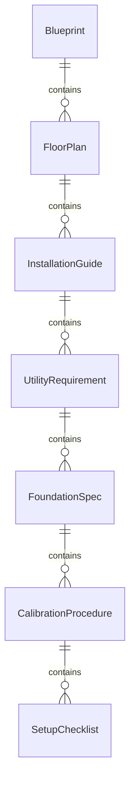
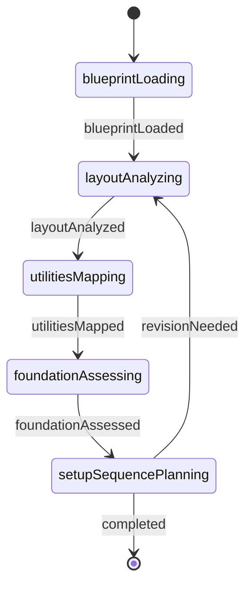
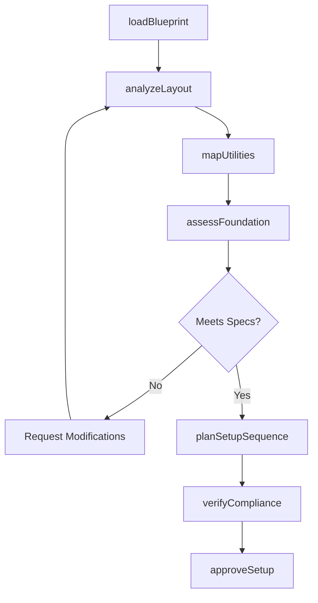
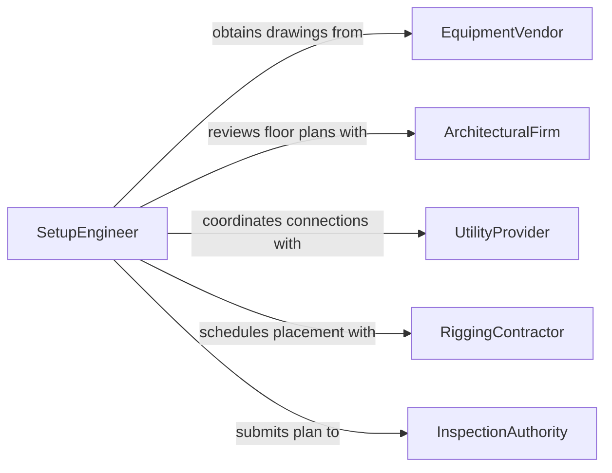

# Study Blueprints or Instructions to Determine Equipment Setup Requirements

> Business-as-Code definition for studying blueprints or instructions to determine equipment setup requirements. Models the workflow from drawing review through layout planning, utility mapping, and setup readiness verification.

## Overview

Studying blueprints or instructions to determine equipment setup requirements involves interpreting engineering drawings, installation guides, floor plans, and piping and instrumentation diagrams to identify spatial dimensions, utility connections, foundation requirements, and calibration procedures needed to install and configure equipment. This definition exposes actions for blueprint analysis, events for setup milestone tracking, and searches for retrieving layout and specification data.

## Actors

| Actor | Description |
|-------|-------------|
| EquipmentVendor | Supplies machines along with installation drawings and manuals |
| ArchitecturalFirm | Provides facility floor plans and structural specifications |
| UtilityProvider | Delivers electrical, water, gas, or compressed air connections |
| RiggingContractor | Handles heavy equipment transport and placement |
| InspectionAuthority | Certifies installations meet code and safety standards |
| FacilitiesOwner | Authorizes modifications to the facility for equipment setup |

## Roles

| Role | Description |
|------|-------------|
| SetupEngineer | Interprets blueprints and plans equipment installation |
| InstallationTechnician | Executes physical setup according to the plan |
| FacilitiesPlanner | Ensures floor space and utilities support the equipment |
| SafetyCoordinator | Verifies that setup meets occupational safety requirements |

## Entities

| Entity | Description |
|--------|-------------|
| Blueprint | An engineering drawing showing equipment dimensions and placement |
| FloorPlan | A facility layout depicting available space and obstructions |
| InstallationGuide | Step-by-step instructions for equipment assembly and connection |
| UtilityRequirement | A specification for electrical, plumbing, or pneumatic connections |
| FoundationSpec | Structural requirements for equipment mounting surfaces |
| CalibrationProcedure | Instructions for adjusting equipment to operating parameters |
| SetupChecklist | A verification document confirming all installation steps are complete |

## Actions

| Action | Description |
|--------|-------------|
| loadBlueprint | Import an engineering drawing or installation diagram for review |
| analyzeLayout | Evaluate spatial requirements against the facility floor plan |
| mapUtilities | Identify electrical, plumbing, and pneumatic connection points |
| assessFoundation | Determine if the mounting surface meets load and vibration specs |
| planSetupSequence | Define the order of assembly and connection steps |
| verifyCompliance | Check the setup plan against building codes and safety standards |
| approveSetup | Sign off that the equipment setup plan is ready for execution |

## Events

| Event | Description |
|-------|-------------|
| blueprintLoaded | An engineering drawing has been imported for analysis |
| layoutAnalyzed | Spatial requirements have been evaluated against the floor plan |
| utilitiesMapped | Connection points for utilities have been identified |
| foundationAssessed | Mounting surface suitability has been determined |
| setupSequencePlanned | The assembly and connection order has been defined |
| complianceVerified | The setup plan has been checked against codes and standards |
| setupApproved | The equipment setup plan has been signed off for execution |

## Searches

| Search | Description |
|--------|-------------|
| findBlueprints | Search drawings by equipment model, project, or revision |
| getUtilityRequirements | Retrieve utility specs for a given equipment installation |
| getFoundationSpecs | Find structural requirements by equipment type or weight class |
| getSetupChecklists | List verification documents by project or installation stage |
| searchInstallationGuides | Locate guides by equipment vendor or model number |

## Entity Relationships



## State Diagram



## Workflow



## Actor Relationships



## Usage

### Calling Actions

```typescript
import { studyBlueprintsInstructionsDetermineEquipment } from '@headlessly/study-blueprints-instructions-determine-equipment'

const setup = studyBlueprintsInstructionsDetermineEquipment()

// Load the installation blueprint for a CNC machine
const blueprint = await setup.loadBlueprint({
  equipmentModel: 'Haas VF-2SS',
  vendor: 'haas-automation',
  revision: 'C',
  documentUrl: 'https://docs.example.com.ai/haas-vf2ss-install.pdf'
})

// Analyze spatial layout against the shop floor
const layout = await setup.analyzeLayout({
  blueprintId: blueprint.id,
  facilityId: 'building-a-bay-3',
  clearanceMargin: 36
})

// Map utility connection points
const utilities = await setup.mapUtilities({
  blueprintId: blueprint.id,
  required: ['480V-3phase', 'compressedAir-90psi', 'coolantDrain']
})
```

### Event-Driven Automation

```typescript
// Notify facilities when utility mapping is complete
setup.utilitiesMapped(async ({ blueprintId, utilityPoints }) => {
  await notify({
    to: 'facilities-planner',
    message: `${utilityPoints.length} utility connections identified for installation`
  })
})

// Auto-generate checklist after setup is approved
setup.setupApproved(async ({ blueprintId, projectId }) => {
  await generateChecklist({ blueprintId, projectId, type: 'installation' })
})
```
