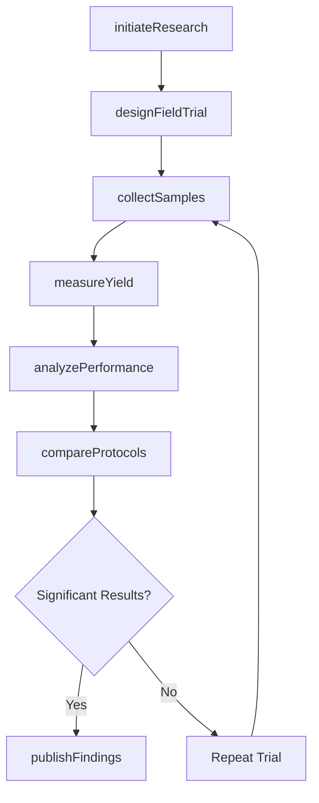
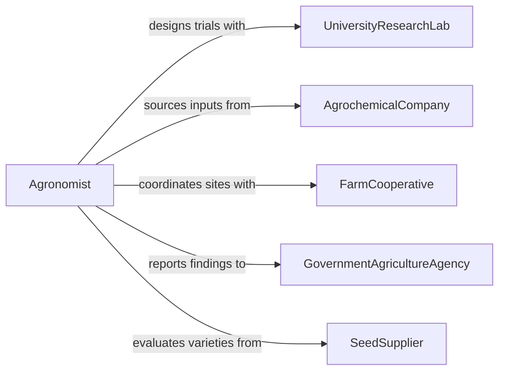

# Research Crop Management Methods

> Business-as-Code definition for crop management research. Models systematic investigation of cultivation techniques, pest control strategies, and yield optimization practices for agricultural production.

## Overview

Crop management research involves investigating cultivation techniques, irrigation methods, fertilization strategies, and pest control approaches to optimize agricultural yield and sustainability. This definition provides actions for conducting field trials, analyzing crop performance data, and evaluating management practices across different growing conditions.

## Actors

| Actor | Description |
|-------|-------------|
| UniversityResearchLab | Conducts controlled agricultural studies and trials |
| AgrochemicalCompany | Provides fertilizers and pesticides for evaluation |
| FarmCooperative | Supplies field sites and operational data |
| GovernmentAgricultureAgency | Funds research and sets regulatory standards |
| SeedSupplier | Provides crop varieties for performance testing |
| WeatherServiceProvider | Supplies climate and environmental data |

## Roles

| Role | Description |
|------|-------------|
| Agronomist | Designs and conducts crop research studies |
| FieldTechnician | Collects samples and monitors crop conditions |
| DataAnalyst | Analyzes yield and performance metrics |
| ResearchDirector | Oversees research programs and priorities |

## Entities

| Entity | Description |
|--------|-------------|
| ResearchProject | A study investigating specific crop management practices |
| FieldTrial | Controlled experiment comparing management techniques |
| CropSample | Specimen collected for laboratory analysis |
| YieldDataset | Harvest results and performance measurements |
| ManagementProtocol | Documented procedure for crop cultivation |
| EnvironmentalCondition | Soil, weather, and climate factors affecting crops |

## Actions

| Action | Description |
|--------|-------------|
| initiateResearch | Begin a new crop management research project |
| designFieldTrial | Develop experimental protocol for field testing |
| collectSamples | Gather crop specimens for analysis |
| measureYield | Record harvest output and quality metrics |
| analyzePerformance | Evaluate crop response to management practices |
| compareProtocols | Assess relative effectiveness of different methods |
| publishFindings | Document and disseminate research results |

## Events

| Event | Description |
|-------|-------------|
| researchInitiated | New crop management study has begun |
| fieldTrialDesigned | Experimental protocol is ready for implementation |
| samplesCollected | Crop specimens have been gathered for analysis |
| yieldMeasured | Harvest data has been recorded |
| performanceAnalyzed | Crop response data has been evaluated |
| protocolsCompared | Comparative analysis of methods is complete |
| findingsPublished | Research results have been documented |

## Searches

| Search | Description |
|--------|-------------|
| findResearchProjects | List crop studies by crop type, location, or status |
| getFieldTrials | Retrieve field experiments by management practice |
| getYieldData | Find harvest results by crop and growing conditions |
| getManagementProtocols | Search cultivation procedures by effectiveness |

## Workflow



## Actor Relationships



## Usage

### Calling Actions

```typescript
import { researchCropManagementMethods } from '@headlessly/research-crop-management-methods'

const research = researchCropManagementMethods()

// Launch a new research project on irrigation methods
const project = await research.initiateResearch({
  title: 'Drip Irrigation Efficiency in Corn Production',
  cropType: 'corn',
  researchQuestion: 'Does drip irrigation improve water use efficiency vs. center pivot?',
  duration: '2 growing seasons'
})

// Design field trial comparing irrigation methods
const trial = await research.designFieldTrial({
  projectId: project.id,
  treatments: ['drip', 'center_pivot', 'flood'],
  replicates: 4,
  fieldSize: '5 acres per replicate'
})

// Analyze crop performance after harvest
const analysis = await research.analyzePerformance({
  trialId: trial.id,
  metrics: ['yield', 'water_use', 'grain_moisture']
})
```

### Event-Driven Automation

```typescript
// Alert when yield measurements are complete
research.yieldMeasured(async ({ trialId, cropType, yield }) => {
  await notify({
    to: 'research-team',
    message: `Harvest complete for ${cropType} trial ${trialId}: ${yield.avg} bu/acre`
  })
})

// Auto-publish when protocols show significant improvement
research.protocolsCompared(async ({ projectId, bestProtocol, improvement }) => {
  if (improvement > 15) {
    await research.publishFindings({
      projectId,
      conclusion: `${bestProtocol} showed ${improvement}% yield increase`
    })
  }
})
```
