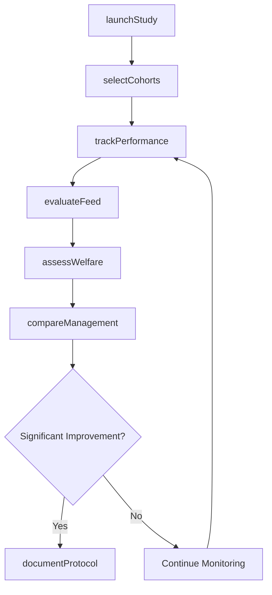
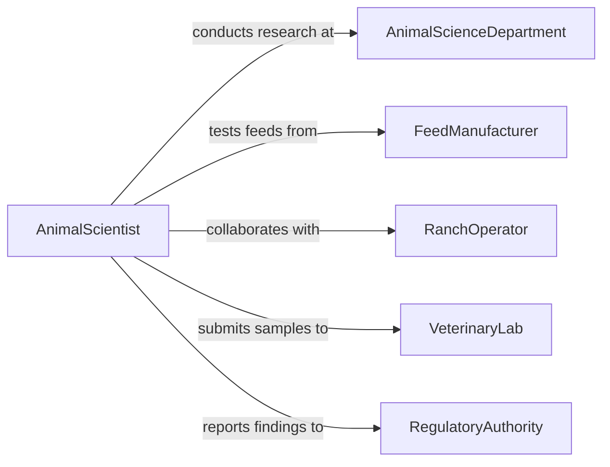

# Research Livestock Management Methods

> Business-as-Code definition for livestock management research. Models scientific investigation of animal husbandry practices, nutrition programs, and health protocols to improve production efficiency and animal welfare.

## Overview

Livestock management research involves studying feeding regimens, housing systems, breeding strategies, and health interventions to optimize animal productivity and welfare. This definition exposes actions for conducting animal trials, monitoring health outcomes, and evaluating management systems across species and production environments.

## Actors

| Actor | Description |
|-------|-------------|
| AnimalScienceDepartment | Conducts controlled livestock studies |
| FeedManufacturer | Supplies feed formulations for evaluation |
| RanchOperator | Provides production facilities and data |
| VeterinaryLab | Analyzes health and nutrition samples |
| BreedingAssociation | Tracks genetic performance data |
| RegulatoryAuthority | Oversees animal welfare and safety standards |

## Roles

| Role | Description |
|------|-------------|
| AnimalScientist | Designs and oversees livestock research studies |
| Stockhandler | Manages daily animal care and observations |
| NutritionSpecialist | Develops and evaluates feed programs |
| ResearchCoordinator | Manages multi-site research projects |

## Entities

| Entity | Description |
|--------|-------------|
| LivestockStudy | Research project investigating animal management practices |
| AnimalCohort | Group of animals enrolled in a comparative study |
| PerformanceRecord | Production metrics for individual animals |
| FeedTrial | Experiment evaluating nutritional interventions |
| HealthAssessment | Veterinary evaluation of animal condition |
| ManagementSystem | Documented approach to livestock husbandry |

## Actions

| Action | Description |
|--------|-------------|
| launchStudy | Initialize a new livestock management research project |
| selectCohorts | Assign animals to treatment groups for comparison |
| trackPerformance | Monitor growth, production, and health metrics |
| evaluateFeed | Assess impact of nutrition on animal productivity |
| assessWelfare | Measure animal health and behavioral outcomes |
| compareManagement | Analyze effectiveness of different husbandry practices |
| documentProtocol | Record standardized livestock management procedures |

## Events

| Event | Description |
|-------|-------------|
| studyLaunched | New livestock research project has begun |
| cohortsSelected | Animals have been assigned to treatment groups |
| performanceTracked | Production data has been recorded |
| feedEvaluated | Nutritional intervention results are complete |
| welfareAssessed | Animal health evaluation is finished |
| managementCompared | Comparative analysis of practices is complete |
| protocolDocumented | Management procedures have been standardized |

## Searches

| Search | Description |
|--------|-------------|
| findLivestockStudies | List research projects by species or management area |
| getPerformanceData | Retrieve production metrics by animal group |
| getFeedTrials | Find nutrition studies by species and feed type |
| getHealthAssessments | Search welfare evaluations by condition or treatment |

## Workflow



## Actor Relationships



## Usage

### Calling Actions

```typescript
import { researchLivestockManagementMethods } from '@headlessly/research-livestock-management-methods'

const research = researchLivestockManagementMethods()

// Begin a cattle feeding efficiency study
const study = await research.launchStudy({
  title: 'High-Protein Supplementation in Beef Cattle',
  species: 'cattle',
  objective: 'Evaluate feed conversion rate with 18% vs 14% protein diet',
  duration: '120 days'
})

// Assign cattle to treatment groups
const cohorts = await research.selectCohorts({
  studyId: study.id,
  groups: [
    { name: 'Control', diet: '14% protein', count: 50 },
    { name: 'Treatment', diet: '18% protein', count: 50 }
  ]
})

// Analyze feed efficiency results
const comparison = await research.compareManagement({
  studyId: study.id,
  metrics: ['avg_daily_gain', 'feed_conversion_ratio', 'cost_per_pound']
})
```

### Event-Driven Automation

```typescript
// Alert when welfare concerns are detected
research.welfareAssessed(async ({ cohortId, assessment, issues }) => {
  if (issues.length > 0) {
    await notify({
      to: 'veterinary-team',
      priority: 'high',
      message: `Animal welfare issues detected in cohort ${cohortId}`
    })
  }
})

// Auto-document successful management protocols
research.managementCompared(async ({ studyId, bestPractice, improvement }) => {
  if (improvement > 20) {
    await research.documentProtocol({
      studyId,
      protocol: bestPractice,
      status: 'recommended'
    })
  }
})
```
