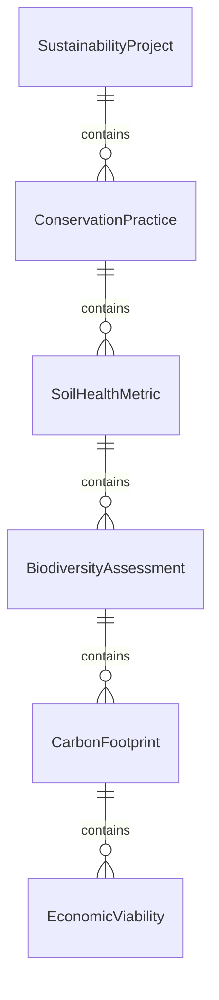
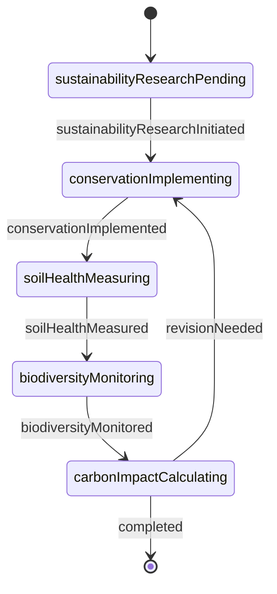
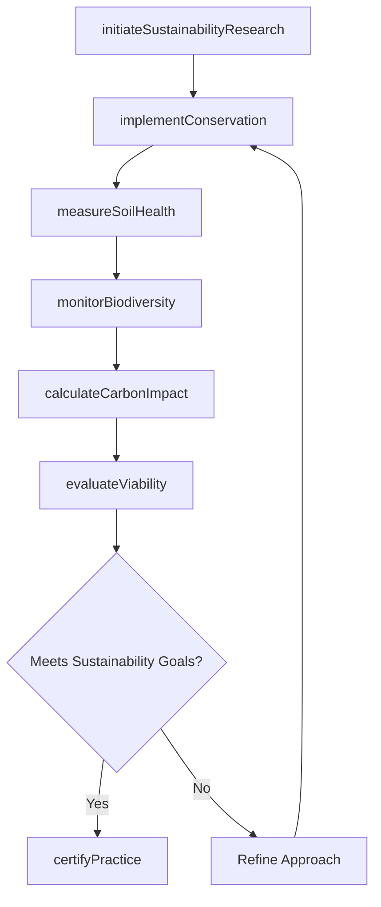
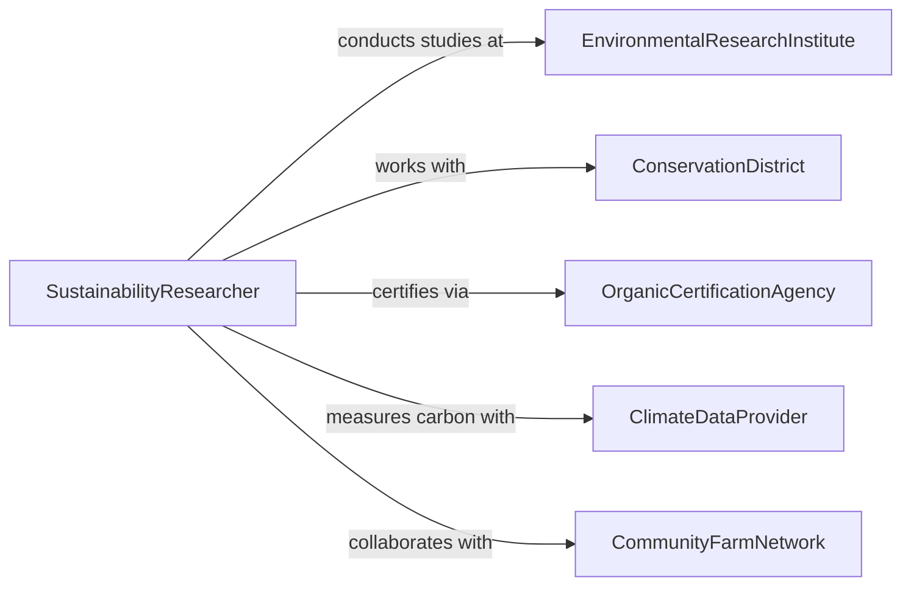

# Research Sustainable Agricultural Processes Practices

> Business-as-Code definition for sustainable agriculture research. Models investigation of regenerative farming methods, conservation practices, and environmentally responsible production systems that maintain productivity while preserving natural resources.

## Overview

Sustainable agriculture research focuses on developing farming practices that minimize environmental impact, conserve soil and water resources, reduce chemical inputs, and maintain long-term productivity. This definition provides actions for evaluating conservation techniques, measuring environmental outcomes, and validating regenerative agriculture systems across diverse production contexts.

## Actors

| Actor | Description |
|-------|-------------|
| EnvironmentalResearchInstitute | Conducts studies on ecological farming impacts |
| OrganicCertificationAgency | Validates sustainable practice compliance |
| ConservationDistrict | Provides technical assistance and monitoring |
| SustainableFoodBuyer | Sources products from verified sustainable farms |
| ClimateDataProvider | Supplies carbon and emissions measurements |
| CommunityFarmNetwork | Implements and tests sustainable practices |

## Roles

| Role | Description |
|------|-------------|
| SustainabilityResearcher | Investigates regenerative agriculture methods |
| SoilScientist | Analyzes soil health and carbon sequestration |
| EcologicalMonitor | Tracks biodiversity and ecosystem indicators |
| SystemsAnalyst | Evaluates whole-farm sustainability performance |

## Entities

| Entity | Description |
|--------|-------------|
| SustainabilityProject | Research initiative studying regenerative practices |
| ConservationPractice | Specific technique for environmental stewardship |
| SoilHealthMetric | Measurement of soil quality and fertility |
| BiodiversityAssessment | Evaluation of ecological diversity on farmland |
| CarbonFootprint | Measurement of greenhouse gas emissions |
| EconomicViability | Financial analysis of sustainable farming systems |

## Actions

| Action | Description |
|--------|-------------|
| initiateSustainabilityResearch | Begin study of regenerative farming practices |
| implementConservation | Apply environmental stewardship techniques |
| measureSoilHealth | Assess soil quality and carbon content |
| monitorBiodiversity | Track species diversity and ecosystem function |
| calculateCarbonImpact | Measure greenhouse gas emissions and sequestration |
| evaluateViability | Assess economic and environmental outcomes |
| certifyPractice | Validate sustainable agriculture methods |

## Events

| Event | Description |
|-------|-------------|
| sustainabilityResearchInitiated | New regenerative agriculture study has begun |
| conservationImplemented | Environmental stewardship practice is in place |
| soilHealthMeasured | Soil quality assessment is complete |
| biodiversityMonitored | Ecological diversity data has been collected |
| carbonImpactCalculated | Emissions and sequestration have been quantified |
| viabilityEvaluated | Economic and environmental analysis is complete |
| practiceCertified | Sustainable method has been validated |

## Searches

| Search | Description |
|--------|-------------|
| findSustainabilityProjects | List studies by practice type or environmental goal |
| getSoilHealthData | Retrieve soil metrics by farm and practice |
| getBiodiversityAssessments | Find ecological monitoring results by region |
| getCarbonFootprints | Search emissions data by farming system |

## Entity Relationships



## State Diagram



## Workflow



## Actor Relationships



## Usage

### Calling Actions

```typescript
import { researchSustainableAgriculturalProcessesPractices } from '@headlessly/research-sustainable-agricultural-processes-practices'

const research = researchSustainableAgriculturalProcessesPractices()

// Launch a cover crop carbon sequestration study
const project = await research.initiateSustainabilityResearch({
  title: 'Carbon Sequestration in Multi-Species Cover Crops',
  practiceType: 'cover_cropping',
  goal: 'Measure soil carbon increase and erosion reduction',
  sites: 12,
  duration: '3 years'
})

// Apply conservation practice at research sites
await research.implementConservation({
  projectId: project.id,
  practice: 'multi_species_cover_crop',
  species: ['rye', 'clover', 'radish'],
  plantingDate: '2025-10-01'
})

// Evaluate overall sustainability outcomes
const assessment = await research.evaluateViability({
  projectId: project.id,
  metrics: ['soil_carbon', 'erosion_rate', 'profit_margin', 'labor_hours']
})
```

### Event-Driven Automation

```typescript
// Alert when significant carbon sequestration is detected
research.carbonImpactCalculated(async ({ projectId, practice, sequestration }) => {
  if (sequestration > 1.5) {
    await notify({
      to: 'sustainability-team',
      message: `${practice} sequestering ${sequestration} tons CO2/acre/year`
    })
  }
})

// Auto-certify practices that meet sustainability thresholds
research.viabilityEvaluated(async ({ projectId, practice, outcomes }) => {
  if (outcomes.soilHealth > 85 && outcomes.profitMargin > 0) {
    await research.certifyPractice({
      projectId,
      practice,
      certification: 'regenerative_verified'
    })
  }
})
```
