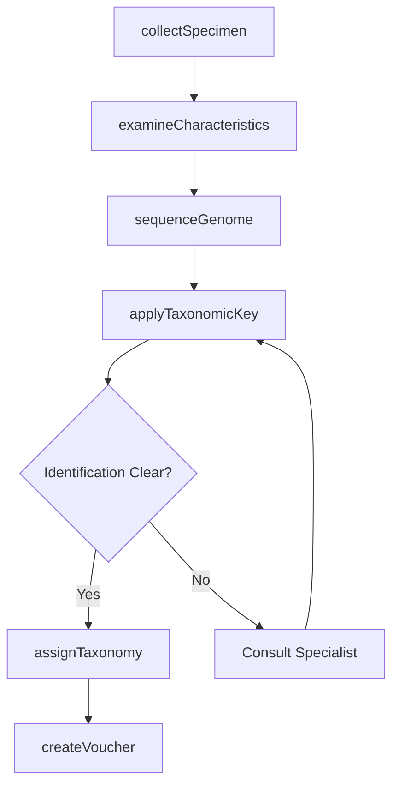
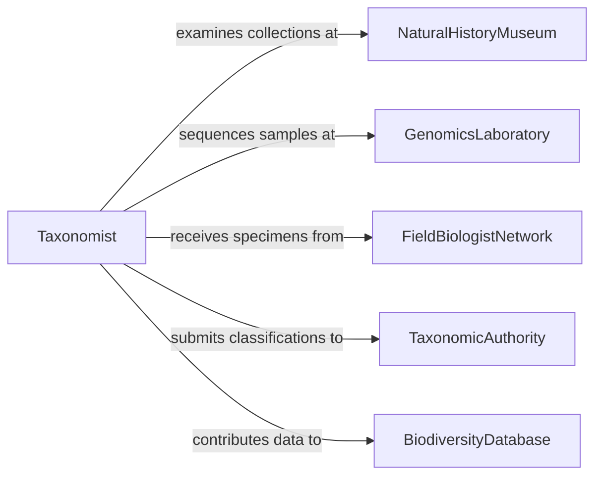

# Classify Organisms Based Their Characteristics

> Business-as-Code definition for biological classification. Models systematic identification and taxonomic categorization of organisms using morphological, genetic, and behavioral characteristics for scientific research and biodiversity management.

## Overview

Organism classification involves examining physical features, genetic markers, and behavioral traits to assign species to taxonomic groups within established biological hierarchies. This definition provides actions for specimen examination, trait analysis, and taxonomic assignment based on standardized classification systems and molecular data.

## Actors

| Actor | Description |
|-------|-------------|
| NaturalHistoryMuseum | Maintains reference collections and taxonomic experts |
| GenomicsLaboratory | Sequences DNA for molecular classification |
| FieldBiologistNetwork | Collects and submits specimens for identification |
| TaxonomicAuthority | Maintains official species names and classifications |
| BiodiversityDatabase | Stores global occurrence and trait data |
| ConservationAgency | Uses classification data for species protection |

## Roles

| Role | Description |
|------|-------------|
| Taxonomist | Identifies and classifies organisms using systematic methods |
| MorphologicalAnalyst | Examines physical characteristics for identification |
| MolecularSystematist | Uses genetic data for classification |
| CurationSpecialist | Manages reference specimens and vouchers |

## Entities

| Entity | Description |
|--------|-------------|
| Specimen | Physical sample of an organism for identification |
| TaxonomicKey | Diagnostic tool for species identification |
| TraitProfile | Documented characteristics used for classification |
| GeneticSequence | DNA or RNA data for molecular identification |
| TaxonomicAssignment | Placement of organism within classification hierarchy |
| VoucherRecord | Archived specimen documenting a classification |

## Actions

| Action | Description |
|--------|-------------|
| collectSpecimen | Gather organism samples for identification |
| examineCharacteristics | Analyze morphological and behavioral traits |
| sequenceGenome | Obtain genetic data for molecular classification |
| applyTaxonomicKey | Use diagnostic criteria to narrow identification |
| assignTaxonomy | Place organism within systematic classification |
| createVoucher | Archive specimen as reference for classification |
| updateClassification | Revise taxonomic assignment based on new evidence |

## Events

| Event | Description |
|-------|-------------|
| specimenCollected | Organism sample has been obtained for study |
| characteristicsExamined | Trait analysis is complete |
| genomeSequenced | Genetic data is available for classification |
| taxonomicKeyApplied | Diagnostic identification process is complete |
| taxonomyAssigned | Organism has been placed in classification system |
| voucherCreated | Reference specimen has been archived |
| classificationUpdated | Taxonomic placement has been revised |

## Searches

| Search | Description |
|--------|-------------|
| findSpecimens | List samples by collection site or taxonomic group |
| getTaxonomicKeys | Retrieve identification guides by organism group |
| getTraitProfiles | Find characteristic data by species or trait type |
| getClassifications | Search taxonomic assignments by authority or date |

## Workflow



## Actor Relationships



## Usage

### Calling Actions

```typescript
import { classifyOrganismsBasedTheirCharacteristics } from '@headlessly/classify-organisms-based-their-characteristics'

const classifier = classifyOrganismsBasedTheirCharacteristics()

// Begin classification of field-collected beetle
const specimen = await classifier.collectSpecimen({
  collectionDate: '2025-08-15',
  location: { latitude: 40.7128, longitude: -74.0060 },
  habitat: 'deciduous forest leaf litter',
  collector: 'J. Smith'
})

// Examine physical characteristics
const traits = await classifier.examineCharacteristics({
  specimenId: specimen.id,
  traits: {
    bodyLength: '4.5mm',
    coloration: 'metallic green',
    antennaSegments: 11,
    tarsalFormula: '5-5-5'
  }
})

// Assign to taxonomic hierarchy
const classification = await classifier.assignTaxonomy({
  specimenId: specimen.id,
  taxonomy: {
    kingdom: 'Animalia',
    phylum: 'Arthropoda',
    class: 'Insecta',
    order: 'Coleoptera',
    family: 'Carabidae',
    genus: 'Calosoma',
    species: 'scrutator'
  }
})
```

### Event-Driven Automation

```typescript
// Request molecular data when morphology is ambiguous
classifier.taxonomicKeyApplied(async ({ specimenId, confidenceLevel }) => {
  if (confidenceLevel < 0.75) {
    await classifier.sequenceGenome({
      specimenId,
      genes: ['COI', '16S', '18S']
    })
  }
})

// Auto-create voucher for new species or range extensions
classifier.taxonomyAssigned(async ({ specimenId, taxonomy, novelty }) => {
  if (novelty === 'new_species' || novelty === 'range_extension') {
    await classifier.createVoucher({
      specimenId,
      archiveLocation: 'permanent_collection',
      preservationMethod: 'pinned'
    })
  }
})
```
