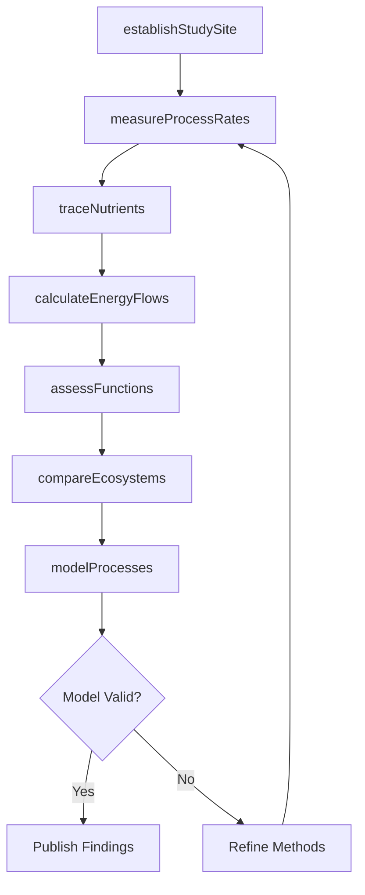
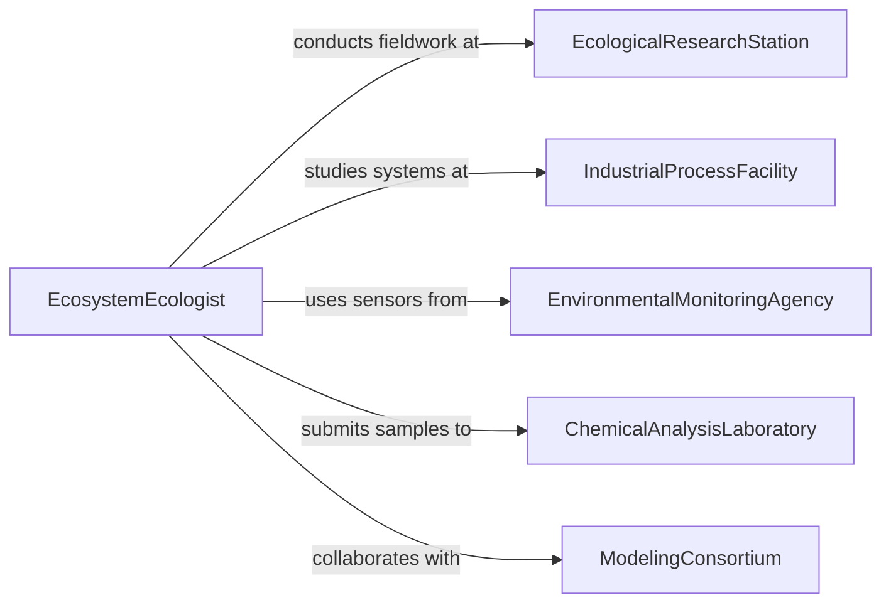

# Conduct Research Processes Natural Industrial

> Business-as-Code definition for ecosystem process research. Models investigation of biological, chemical, and physical processes in natural environments and industrial systems to understand energy flows, nutrient cycles, and functional relationships.

## Overview

Ecosystem process research examines the mechanisms driving nutrient cycling, energy transfer, decomposition, and population dynamics in both natural and managed environments. This definition provides actions for studying biogeochemical processes, measuring ecosystem functions, and comparing natural versus industrial system performance.

## Actors

| Actor | Description |
|-------|-------------|
| EcologicalResearchStation | Operates field sites for ecosystem monitoring |
| IndustrialProcessFacility | Provides access to engineered biological systems |
| EnvironmentalMonitoringAgency | Supplies sensor networks and data infrastructure |
| ChemicalAnalysisLaboratory | Processes samples for nutrient and compound analysis |
| ModelingConsortium | Develops predictive ecosystem models |
| PolicyMakingBody | Uses research findings for environmental regulation |

## Roles

| Role | Description |
|------|-------------|
| EcosystemEcologist | Investigates processes in natural systems |
| IndustrialEcologist | Studies material and energy flows in production systems |
| BiogeochemicalAnalyst | Measures nutrient and element cycling |
| ProcessModeler | Develops mathematical models of ecosystem functions |

## Entities

| Entity | Description |
|--------|-------------|
| EcosystemStudy | Research project examining system-level processes |
| ProcessMeasurement | Quantification of rates and flows in ecosystems |
| NutrientCycle | Pathway of element movement through system components |
| EnergyBudget | Accounting of energy inputs, storage, and outputs |
| FunctionalAssessment | Evaluation of ecosystem service provision |
| ComparativeAnalysis | Side-by-side evaluation of natural vs industrial systems |

## Actions

| Action | Description |
|--------|-------------|
| establishStudySite | Set up ecosystem monitoring infrastructure |
| measureProcessRates | Quantify rates of biological and chemical transformations |
| traceNutrients | Follow element movement through ecosystem components |
| calculateEnergyFlows | Quantify energy capture, transfer, and loss |
| assessFunctions | Evaluate ecosystem service provision and efficiency |
| compareEcosystems | Analyze differences between natural and industrial systems |
| modelProcesses | Develop predictive models of ecosystem dynamics |

## Events

| Event | Description |
|-------|-------------|
| studySiteEstablished | Monitoring infrastructure is operational |
| processRatesMeasured | Transformation rates have been quantified |
| nutrientsTraced | Element pathways have been mapped |
| energyFlowsCalculated | Energy budget is complete |
| functionsAssessed | Ecosystem service evaluation is finished |
| ecosystemsCompared | Comparative analysis is complete |
| processesModeled | Predictive model has been developed |

## Searches

| Search | Description |
|--------|-------------|
| findEcosystemStudies | List research projects by ecosystem type or process |
| getProcessMeasurements | Retrieve rate data by process type and site |
| getNutrientCycles | Find element cycling data by nutrient and ecosystem |
| getFunctionalAssessments | Search ecosystem service evaluations by function |

## Workflow



## Actor Relationships



## Usage

### Calling Actions

```typescript
import { conductResearchProcessesNaturalIndustrial } from '@headlessly/conduct-research-processes-natural-industrial'

const research = conductResearchProcessesNaturalIndustrial()

// Launch wetland nitrogen cycling study
const study = await research.establishStudySite({
  ecosystem: 'freshwater_wetland',
  location: { latitude: 42.3601, longitude: -71.0589 },
  parameters: ['nitrogen', 'phosphorus', 'carbon'],
  duration: '24 months'
})

// Measure denitrification rates
const rates = await research.measureProcessRates({
  studyId: study.id,
  process: 'denitrification',
  method: 'acetylene_block',
  replicates: 6
})

// Compare wetland to wastewater treatment system
const comparison = await research.compareEcosystems({
  natural: study.id,
  industrial: 'wwtp_2024_003',
  metrics: ['nitrogen_removal_rate', 'energy_cost', 'area_required']
})
```

### Event-Driven Automation

```typescript
// Alert when nutrient removal efficiency is high
research.functionsAssessed(async ({ studyId, ecosystem, efficiency }) => {
  if (efficiency.nitrogenRemoval > 80) {
    await notify({
      to: 'policy-team',
      message: `${ecosystem} shows ${efficiency.nitrogenRemoval}% N removal`
    })
  }
})

// Auto-model when sufficient data is collected
research.processRatesMeasured(async ({ studyId, measurements }) => {
  if (measurements.length > 50) {
    await research.modelProcesses({
      studyId,
      modelType: 'mass_balance',
      parameters: ['nitrogen', 'carbon']
    })
  }
})
```
