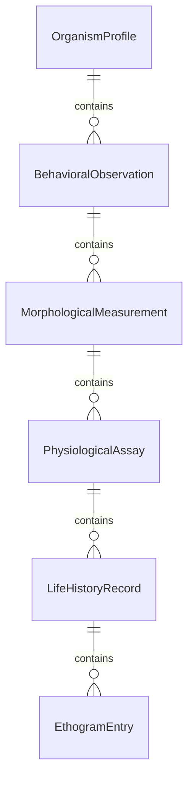
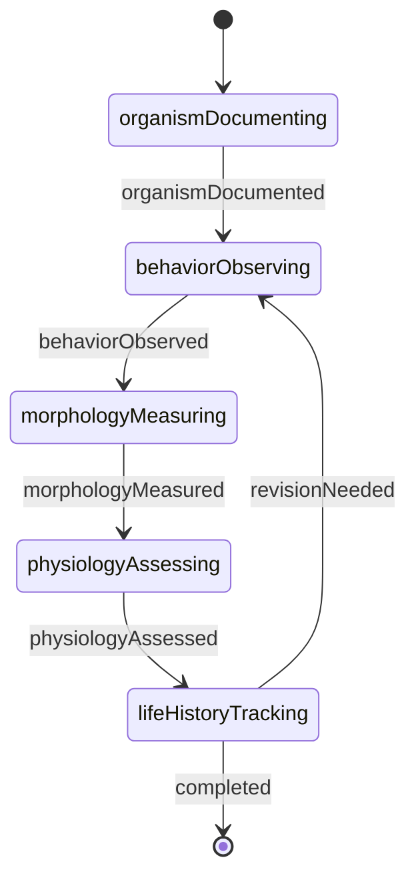
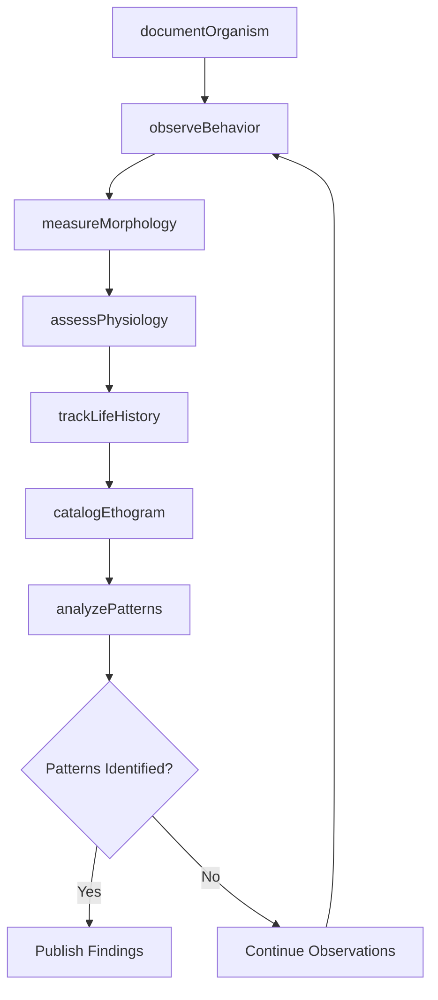
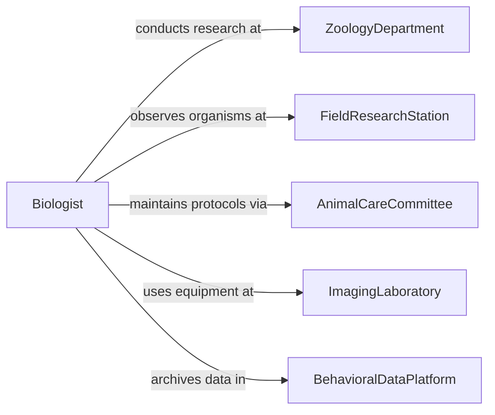

# Examine Characteristics Behavior Living Organisms

> Business-as-Code definition for organismal study. Models systematic observation and documentation of physical features, physiological processes, and behavioral patterns to understand species biology and ecological roles.

## Overview

Examining organism characteristics and behavior involves detailed observation of morphology, anatomy, physiology, life history, and behavioral patterns through field and laboratory studies. This definition provides actions for specimen documentation, behavioral observation, and trait analysis across diverse taxa and environments.

## Actors

| Actor | Description |
|-------|-------------|
| ZoologyDepartment | Conducts animal behavior and physiology studies |
| FieldResearchStation | Provides facilities for in-situ organism observation |
| AnimalCareCommittee | Oversees ethical treatment of research subjects |
| ImagingLaboratory | Provides microscopy and diagnostic equipment |
| BehavioralDataPlatform | Stores video and observational datasets |
| ConservationProgram | Applies research findings to species management |

## Roles

| Role | Description |
|------|-------------|
| Biologist | Studies organism structure and function |
| BehavioralEcologist | Observes and analyzes animal behavior patterns |
| Physiologist | Investigates metabolic and functional processes |
| AnatomicalSpecialist | Examines internal and external morphology |

## Entities

| Entity | Description |
|--------|-------------|
| OrganismProfile | Comprehensive documentation of species characteristics |
| BehavioralObservation | Recorded instance of animal activity or interaction |
| MorphologicalMeasurement | Quantification of physical features and dimensions |
| PhysiologicalAssay | Test measuring metabolic or functional processes |
| LifeHistoryRecord | Documentation of reproduction, growth, and survival |
| EthogramEntry | Catalogued behavioral unit or action pattern |

## Actions

| Action | Description |
|--------|-------------|
| documentOrganism | Record comprehensive species characteristics |
| observeBehavior | Monitor and record activity patterns and interactions |
| measureMorphology | Quantify physical dimensions and features |
| assessPhysiology | Evaluate metabolic and functional processes |
| trackLifeHistory | Monitor reproduction, growth, and survival over time |
| catalogEthogram | Create standardized inventory of behavioral repertoire |
| analyzePatterns | Identify recurring behavioral sequences or traits |

## Events

| Event | Description |
|-------|-------------|
| organismDocumented | Species characteristics have been recorded |
| behaviorObserved | Activity pattern has been documented |
| morphologyMeasured | Physical features have been quantified |
| physiologyAssessed | Metabolic processes have been evaluated |
| lifeHistoryTracked | Reproductive or developmental data is recorded |
| ethogramCatalogued | Behavioral inventory is complete |
| patternsAnalyzed | Behavioral or morphological trends are identified |

## Searches

| Search | Description |
|--------|-------------|
| findOrganismProfiles | List species by taxonomic group or trait |
| getBehavioralObservations | Retrieve activity data by species and context |
| getMorphologicalData | Find physical measurements by organism and feature |
| getLifeHistoryRecords | Search reproductive and developmental data |

## Entity Relationships



## State Diagram



## Workflow



## Actor Relationships



## Usage

### Calling Actions

```typescript
import { examineCharacteristicsBehaviorLivingOrganisms } from '@headlessly/examine-characteristics-behavior-living-organisms'

const examiner = examineCharacteristicsBehaviorLivingOrganisms()

// Begin study of red fox behavior
const profile = await examiner.documentOrganism({
  species: 'Vulpes vulpes',
  studyLocation: 'suburban habitat',
  individualId: 'RF-2025-042',
  sex: 'female',
  estimatedAge: '2 years'
})

// Record foraging behavior observation
const behavior = await examiner.observeBehavior({
  profileId: profile.id,
  date: '2025-09-15',
  time: '22:30',
  activity: 'foraging',
  context: 'residential area',
  duration: 42,
  notes: 'caching food items near den entrance'
})

// Analyze activity patterns from observations
const patterns = await examiner.analyzePatterns({
  profileId: profile.id,
  analysisType: 'temporal_activity',
  timeframe: '90 days'
})
```

### Event-Driven Automation

```typescript
// Alert when rare behaviors are observed
examiner.behaviorObserved(async ({ species, activity, rarity }) => {
  if (rarity === 'uncommon' || rarity === 'rare') {
    await notify({
      to: 'research-team',
      priority: 'high',
      message: `Rare ${activity} behavior observed in ${species}`
    })
  }
})

// Auto-catalogue when sufficient behavioral data exists
examiner.lifeHistoryTracked(async ({ profileId, observations }) => {
  if (observations.length > 100) {
    await examiner.catalogEthogram({
      profileId,
      categories: ['foraging', 'social', 'maintenance', 'reproductive']
    })
  }
})
```
