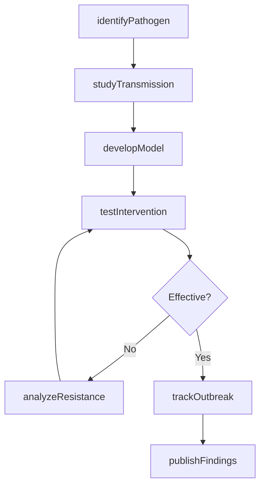
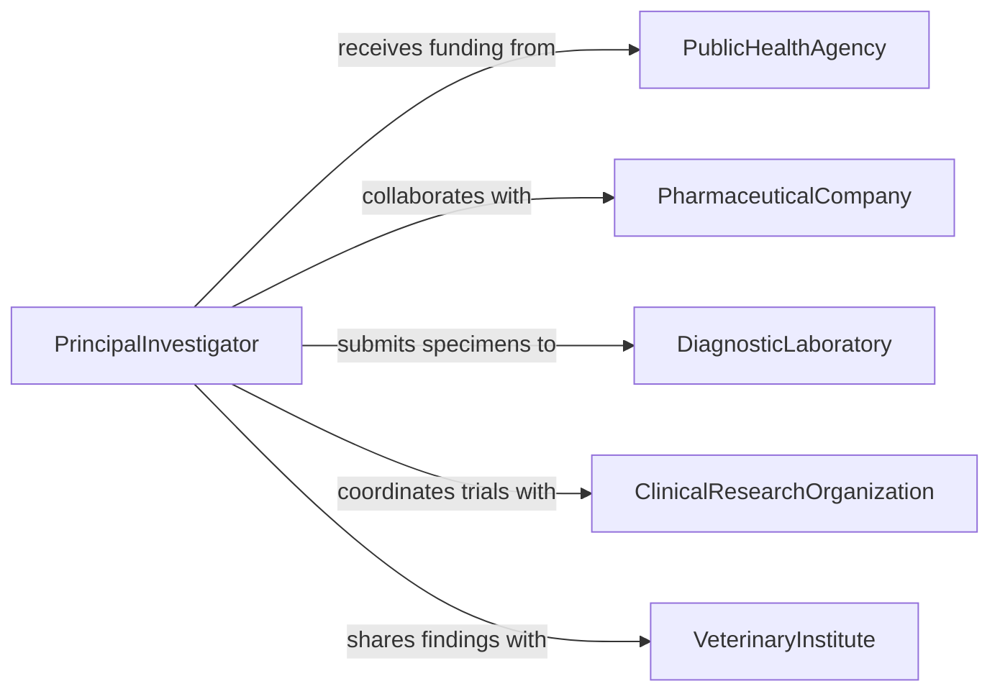

# Research Diseases Parasites

> Business-as-Code definition for researching diseases and parasitic organisms. Models the complete research process from pathogen identification through disease mechanism study and treatment development.

## Overview

Disease and parasite research involves identifying pathogens, studying transmission pathways, analyzing host-pathogen interactions, and developing treatment strategies. This definition exposes actions for pathogen characterization, disease modeling, clinical studies, and therapeutic development across human, animal, and plant health domains.

## Actors

| Actor | Description |
|-------|-------------|
| PublicHealthAgency | Funds research and implements disease control programs |
| PharmaceuticalCompany | Develops and tests therapeutic interventions |
| ClinicalResearchOrganization | Conducts controlled human trials |
| DiagnosticLaboratory | Provides pathogen identification and testing services |
| VeterinaryInstitute | Studies animal diseases and zoonotic transmission |
| AgriculturalExtension | Addresses plant diseases and crop protection |

## Roles

| Role | Description |
|------|-------------|
| PrincipalInvestigator | Leads disease research programs |
| Epidemiologist | Studies disease patterns and transmission dynamics |
| Microbiologist | Isolates and characterizes pathogenic organisms |
| ClinicalTrialCoordinator | Manages human or animal treatment studies |

## Entities

| Entity | Description |
|--------|-------------|
| Pathogen | Disease-causing organism or infectious agent |
| DiseaseModel | Experimental system for studying infection |
| ClinicalTrial | Controlled study evaluating treatment efficacy |
| Specimen | Biological sample containing pathogen |
| Intervention | Therapeutic or preventive treatment approach |
| Finding | Research result about disease or parasite |

## Actions

| Action | Description |
|--------|-------------|
| identifyPathogen | Isolate and characterize disease-causing organism |
| studyTransmission | Investigate how disease spreads between hosts |
| developModel | Create experimental system to study infection |
| testIntervention | Evaluate effectiveness of treatment or prevention |
| analyzeResistance | Assess pathogen response to therapeutic agents |
| trackOutbreak | Monitor disease incidence and geographic spread |
| publishFindings | Disseminate research results to scientific community |

## Events

| Event | Description |
|-------|-------------|
| pathogenIdentified | Disease-causing organism has been characterized |
| transmissionStudied | Infection spread mechanism has been elucidated |
| modelDeveloped | Experimental disease system is operational |
| interventionTested | Treatment efficacy has been evaluated |
| resistanceAnalyzed | Pathogen drug resistance has been assessed |
| outbreakTracked | Disease surveillance data has been compiled |
| findingsPublished | Research results have been shared publicly |

## Searches

| Search | Description |
|--------|-------------|
| findPathogens | List disease organisms by species, host, or region |
| getTrials | Retrieve clinical studies by disease and intervention |
| getOutbreaks | Find disease surveillance data by location and date |
| getFindings | Search published research by pathogen or condition |

## Workflow



## Actor Relationships



## Usage

### Calling Actions

```typescript
import { researchDiseasesParasites } from '@headlessly/research-diseases-parasites'

const research = researchDiseasesParasites()

// Identify a novel pathogen from clinical specimens
const pathogen = await research.identifyPathogen({
  specimen: {
    type: 'blood sample',
    patientId: 'PT-4521',
    collectionDate: '2026-01-15'
  },
  methods: ['PCR', 'whole genome sequencing', 'culture'],
  suspectedOrganism: 'bacterial infection'
})

// Study transmission dynamics
const transmission = await research.studyTransmission({
  pathogenId: pathogen.id,
  populationSize: 5000,
  contactTracing: true,
  environmentalSampling: ['water', 'surfaces', 'air']
})

// Develop experimental model
const model = await research.developModel({
  pathogenId: pathogen.id,
  modelType: 'mouse infection model',
  parameters: {
    dose: '1e6 CFU',
    route: 'intraperitoneal',
    duration: '14 days'
  }
})

// Test therapeutic intervention
const trial = await research.testIntervention({
  modelId: model.id,
  intervention: {
    type: 'antibiotic',
    compound: 'compound-X',
    dose: '50 mg/kg',
    frequency: 'twice daily'
  },
  controls: ['placebo', 'standard treatment']
})
```

### Event-Driven Automation

```typescript
// Alert when drug resistance is detected
research.resistanceAnalyzed(async ({ pathogenId, resistanceProfile, drugs }) => {
  if (resistanceProfile.multidrugResistant) {
    await notify({
      to: 'infectious-disease-team',
      priority: 'urgent',
      message: `Multidrug-resistant pathogen ${pathogenId} detected. Resistant to: ${drugs.join(', ')}`
    })
  }
})

// Auto-publish significant findings
research.interventionTested(async ({ trialId, efficacy, significance }) => {
  if (efficacy > 80 && significance < 0.001) {
    await research.publishFindings({
      trialId,
      venue: 'high-impact journal',
      priority: 'expedited review'
    })
  }
})
```
