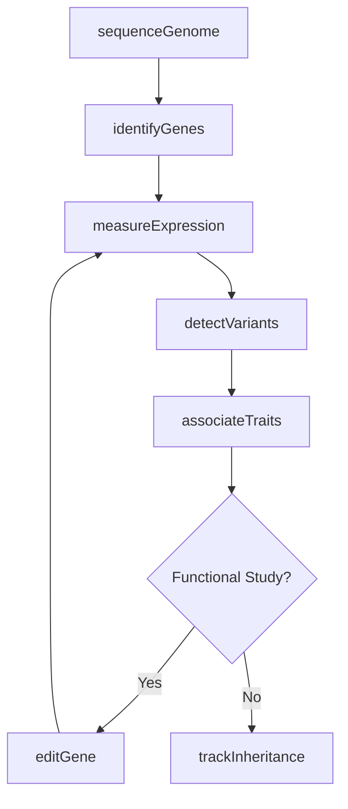
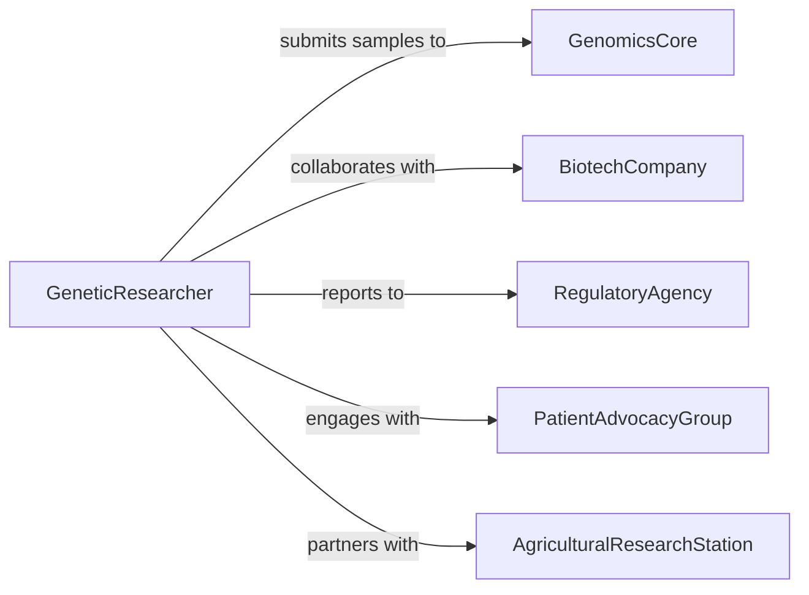

# Research Genetic Characteristics Expression

> Business-as-Code definition for researching genetic characteristics and gene expression patterns. Models the complete research process from genome sequencing through functional genomics and trait association studies.

## Overview

Genetic research involves sequencing genomes, identifying genes, analyzing expression patterns, and linking genetic variation to phenotypic traits. This definition exposes actions for genomic analysis, transcriptomics, gene editing experiments, and heredity studies across organisms and populations.

## Actors

| Actor | Description |
|-------|-------------|
| GenomicsCore | Provides sequencing and bioinformatics services |
| BiotechCompany | Develops genetic technologies and therapeutics |
| RegulatoryAgency | Oversees genetic research and bioethics compliance |
| PatientAdvocacyGroup | Represents individuals with genetic conditions |
| AgriculturalResearchStation | Studies crop and livestock genetics |
| ConservationOrganization | Investigates genetics of endangered species |

## Roles

| Role | Description |
|------|-------------|
| GeneticResearcher | Leads genomic investigation projects |
| Bioinformatician | Analyzes sequence data and expression patterns |
| MolecularBiologist | Conducts gene function experiments |
| GeneticCounselor | Interprets genetic findings for stakeholders |

## Entities

| Entity | Description |
|--------|-------------|
| Genome | Complete DNA sequence of an organism |
| Gene | DNA sequence encoding functional product |
| Variant | Genetic difference between individuals |
| Expression | Level of gene activity in cells or tissues |
| Trait | Observable characteristic influenced by genetics |
| Pedigree | Family tree showing inheritance patterns |

## Actions

| Action | Description |
|--------|-------------|
| sequenceGenome | Determine complete DNA sequence of organism |
| identifyGenes | Locate and annotate functional genetic elements |
| measureExpression | Quantify gene activity across conditions |
| detectVariants | Find genetic differences between individuals |
| associateTraits | Link genetic variation to observable characteristics |
| editGene | Modify specific DNA sequences experimentally |
| trackInheritance | Follow genetic transmission across generations |

## Events

| Event | Description |
|-------|-------------|
| genomeSequenced | Complete DNA sequence has been determined |
| genesIdentified | Functional genetic elements have been annotated |
| expressionMeasured | Gene activity levels have been quantified |
| variantsDetected | Genetic differences have been discovered |
| traitsAssociated | Genotype-phenotype relationships have been established |
| geneEdited | Targeted DNA modification has been performed |
| inheritanceTracked | Genetic transmission patterns have been documented |

## Searches

| Search | Description |
|--------|-------------|
| findGenomes | List sequenced organisms by species or project |
| getGenes | Retrieve genes by function, location, or expression |
| getVariants | Search genetic differences by type or frequency |
| getTraits | Find characteristics with genetic associations |

## Workflow



## Actor Relationships



## Usage

### Calling Actions

```typescript
import { researchGeneticCharacteristicsExpression } from '@headlessly/research-genetic-characteristics-expression'

const genetics = researchGeneticCharacteristicsExpression()

// Sequence a novel organism genome
const genome = await genetics.sequenceGenome({
  organism: 'Arabidopsis thaliana',
  accession: 'Col-0',
  sequencingPlatform: 'Illumina NovaSeq',
  coverage: '50x',
  assemblyMethod: 'de novo'
})

// Identify genes and functional elements
const annotation = await genetics.identifyGenes({
  genomeId: genome.id,
  methods: ['ab initio prediction', 'homology search', 'RNA-seq evidence'],
  databases: ['UniProt', 'NCBI RefSeq']
})

// Measure gene expression under stress conditions
const expression = await genetics.measureExpression({
  genomeId: genome.id,
  conditions: ['control', 'drought stress', 'heat stress'],
  technology: 'RNA-seq',
  replicates: 3
})

// Detect genetic variants in population
const variants = await genetics.detectVariants({
  genomeId: genome.id,
  population: 'natural accessions',
  sampleSize: 1000,
  variantTypes: ['SNP', 'indel', 'CNV']
})

// Associate variants with phenotypic traits
await genetics.associateTraits({
  variantSetId: variants.id,
  traits: ['flowering time', 'disease resistance', 'yield'],
  method: 'GWAS',
  significance: 5e-8
})
```

### Event-Driven Automation

```typescript
// Alert when disease-associated variant is detected
genetics.variantsDetected(async ({ variantSetId, variants, population }) => {
  const pathogenic = variants.filter(v => v.clinicalSignificance === 'pathogenic')
  if (pathogenic.length > 0) {
    await notify({
      to: 'genetic-counseling-team',
      message: `${pathogenic.length} pathogenic variants detected in population ${population}`
    })
  }
})

// Auto-initiate functional studies for high-impact associations
genetics.traitsAssociated(async ({ gene, trait, significance, effect }) => {
  if (significance < 1e-10 && Math.abs(effect) > 2) {
    await genetics.editGene({
      geneId: gene.id,
      method: 'CRISPR-Cas9',
      modification: 'knockout',
      purpose: 'validate trait association'
    })
  }
})
```
