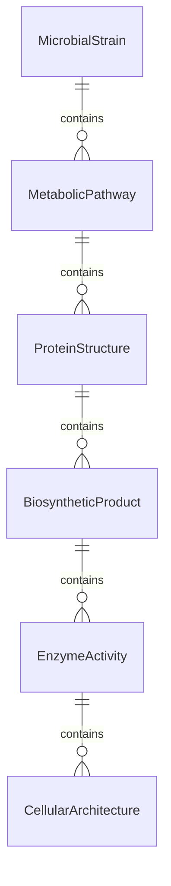
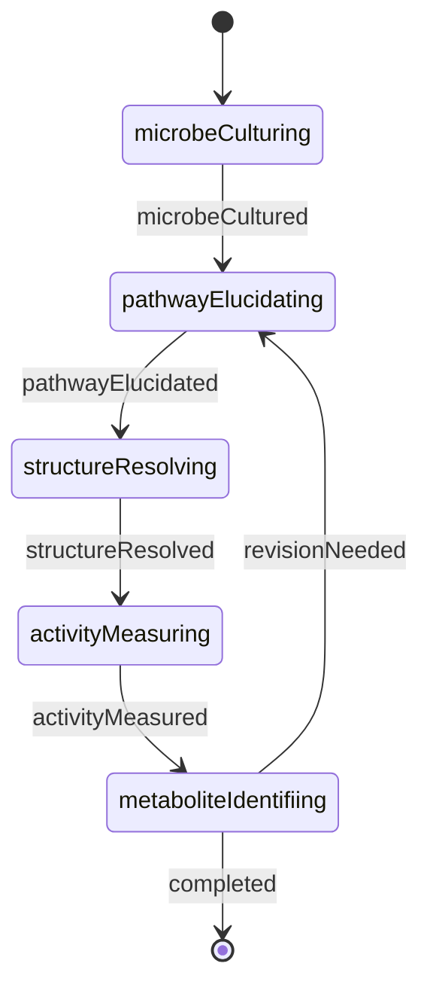
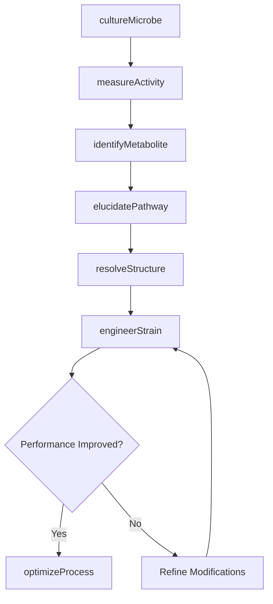
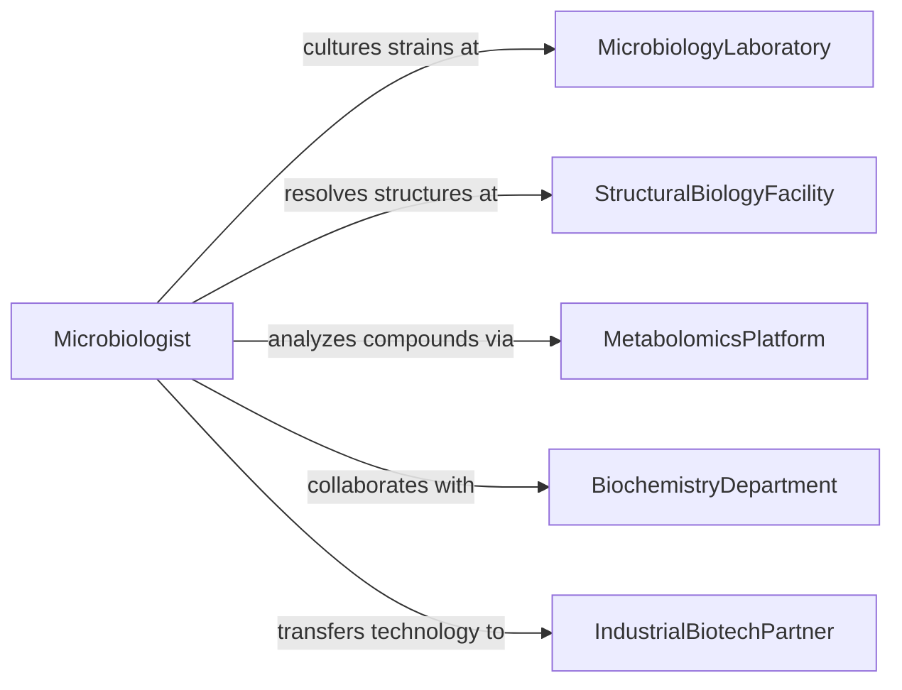

# Research Microbiological Chemical Processes Structures

> Business-as-Code definition for microbiology and biochemistry research. Models investigation of microbial metabolism, cellular structures, enzymatic reactions, and chemical transformations in biological systems.

## Overview

Microbiological and chemical process research examines metabolic pathways, cellular architecture, protein structure, and biochemical mechanisms in microorganisms and cell systems. This definition provides actions for culturing microbes, characterizing metabolites, resolving structures, and elucidating biochemical pathways across diverse microbial and molecular systems.

## Actors

| Actor | Description |
|-------|-------------|
| MicrobiologyLaboratory | Cultures and maintains microbial collections |
| StructuralBiologyFacility | Provides crystallography and imaging equipment |
| MetabolomicsPlatform | Analyzes chemical compounds in biological samples |
| BiochemistryDepartment | Investigates enzymatic and metabolic processes |
| IndustrialBiotechPartner | Applies microbial processes to production systems |
| BiocontainmentAuthority | Regulates handling of potentially hazardous microbes |

## Roles

| Role | Description |
|------|-------------|
| Microbiologist | Studies microbial physiology and ecology |
| Biochemist | Investigates molecular mechanisms and pathways |
| StructuralBiologist | Resolves three-dimensional molecular architecture |
| MetabolicEngineer | Modifies pathways for desired biochemical outputs |

## Entities

| Entity | Description |
|--------|-------------|
| MicrobialStrain | Isolated microorganism with characterized properties |
| MetabolicPathway | Series of enzymatic reactions transforming compounds |
| ProteinStructure | Three-dimensional arrangement of amino acids |
| BiosyntheticProduct | Chemical compound produced by biological process |
| EnzymeActivity | Catalytic function of biological macromolecule |
| CellularArchitecture | Spatial organization of cellular components |

## Actions

| Action | Description |
|--------|-------------|
| cultureMicrobe | Grow microorganisms under controlled conditions |
| elucidatePathway | Map enzymatic steps in metabolic process |
| resolveStructure | Determine three-dimensional molecular architecture |
| measureActivity | Quantify enzymatic or metabolic reaction rates |
| identifyMetabolite | Characterize chemical compounds in biological samples |
| engineerStrain | Modify microbial genetics for altered metabolism |
| optimizeProcess | Improve yield or efficiency of biochemical production |

## Events

| Event | Description |
|-------|-------------|
| microbeCultured | Microorganism has been grown successfully |
| pathwayElucidated | Metabolic process steps have been mapped |
| structureResolved | Molecular architecture has been determined |
| activityMeasured | Enzymatic or metabolic rates are quantified |
| metaboliteIdentified | Chemical compound has been characterized |
| strainEngineered | Microbial genetics have been modified |
| processOptimized | Production efficiency has been improved |

## Searches

| Search | Description |
|--------|-------------|
| findMicrobialStrains | List organisms by taxonomy or metabolic capability |
| getMetabolicPathways | Retrieve biochemical processes by substrate or product |
| getProteinStructures | Find molecular architectures by protein or function |
| getEnzymeActivities | Search catalytic functions by reaction type |

## Entity Relationships



## State Diagram



## Workflow



## Actor Relationships



## Usage

### Calling Actions

```typescript
import { researchMicrobiologicalChemicalProcessesStructures } from '@headlessly/research-microbiological-chemical-processes-structures'

const research = researchMicrobiologicalChemicalProcessesStructures()

// Begin study of novel antibiotic-producing bacterium
const strain = await research.cultureMicrobe({
  organism: 'Streptomyces sp.',
  isolationSource: 'soil_sample_rainforest',
  medium: 'actinomycete_isolation_agar',
  temperature: 28,
  incubationDays: 14
})

// Map biosynthetic pathway for antibiotic compound
const pathway = await research.elucidatePathway({
  strainId: strain.id,
  targetCompound: 'novel_polyketide',
  methods: ['gene_cluster_analysis', 'feeding_studies', 'intermediate_isolation']
})

// Optimize production through metabolic engineering
const optimized = await research.engineerStrain({
  strainId: strain.id,
  modifications: ['overexpress_biosynthetic_genes', 'knockout_competing_pathway'],
  targetImprovement: 'increase_yield'
})
```

### Event-Driven Automation

```typescript
// Automatically resolve structure when novel metabolite is found
research.metaboliteIdentified(async ({ strainId, compound, novelty }) => {
  if (novelty === 'previously_unknown') {
    await research.resolveStructure({
      compound,
      methods: ['nmr_spectroscopy', 'mass_spectrometry', 'x-ray_crystallography']
    })
  }
})

// Request process optimization when engineered strain shows promise
research.strainEngineered(async ({ strainId, yieldImprovement }) => {
  if (yieldImprovement > 2.0) {
    await research.optimizeProcess({
      strainId,
      parameters: ['growth_conditions', 'feeding_strategy', 'extraction_method']
    })
  }
})
```
