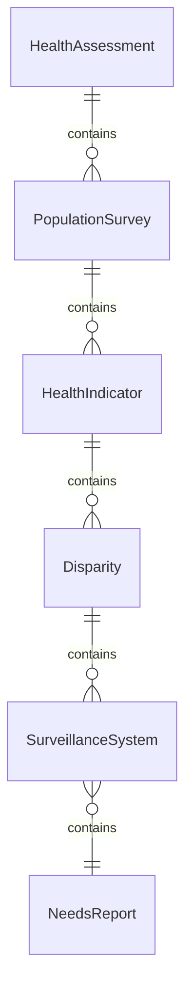
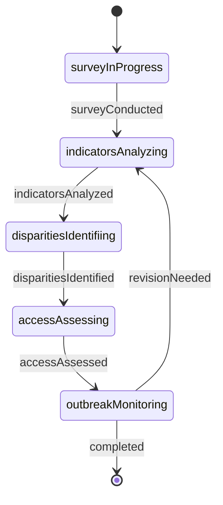
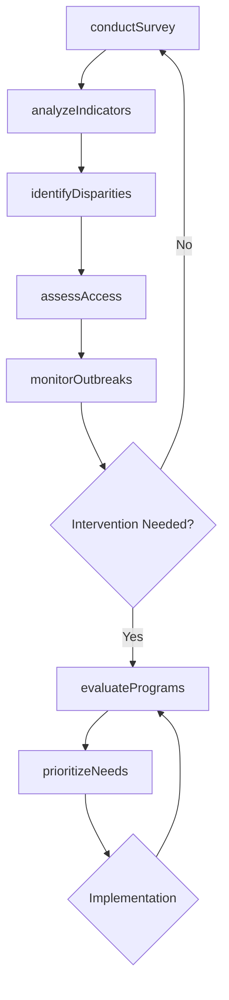
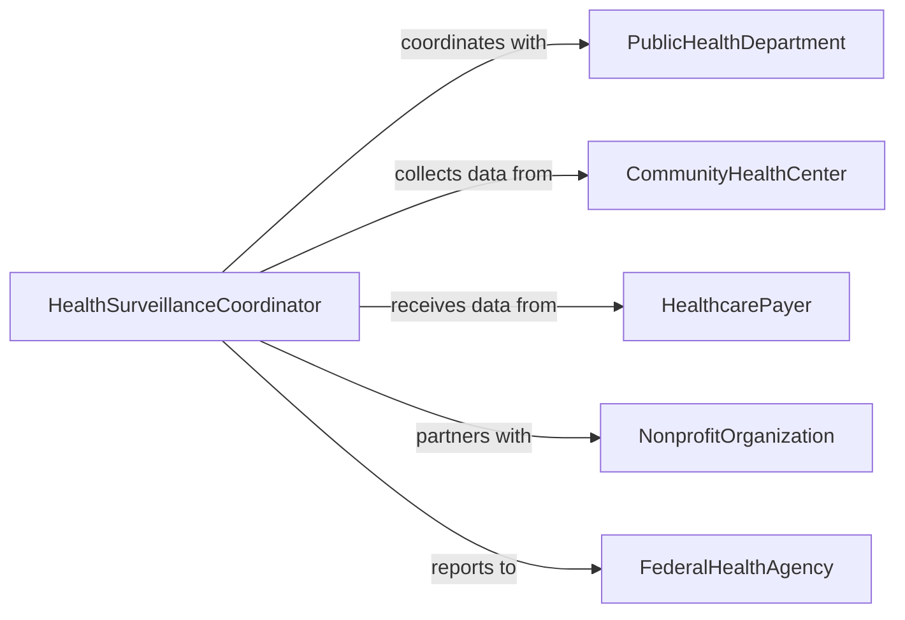

# Collect Information About Community Health

> Business-as-Code definition for collecting community health information and assessing population health needs. Models the complete data collection process from needs assessment through surveillance and program evaluation.

## Overview

Community health information collection involves surveying populations, monitoring disease trends, identifying health disparities, and evaluating healthcare access. This definition exposes actions for health assessments, epidemiological surveillance, demographic analysis, and intervention planning across communities and regions.

## Actors

| Actor | Description |
|-------|-------------|
| PublicHealthDepartment | Conducts population health monitoring |
| CommunityHealthCenter | Provides frontline health services and data |
| HealthcarePayer | Supplies claims and utilization data |
| NonprofitOrganization | Conducts outreach and collects community input |
| AcademicResearchInstitution | Performs health needs assessments |
| FederalHealthAgency | Coordinates national health surveillance |

## Roles

| Role | Description |
|------|-------------|
| HealthSurveillanceCoordinator | Manages community health data collection |
| CommunityHealthWorker | Gathers information from local populations |
| EpidemiologicalAnalyst | Analyzes population health trends |
| ProgramEvaluator | Assesses effectiveness of health interventions |

## Entities

| Entity | Description |
|--------|-------------|
| HealthAssessment | Systematic evaluation of community health status |
| PopulationSurvey | Questionnaire administered to community sample |
| HealthIndicator | Metric measuring population health status |
| Disparity | Inequitable health outcome across populations |
| SurveillanceSystem | Ongoing disease and health behavior monitoring |
| NeedsReport | Document identifying community health priorities |

## Actions

| Action | Description |
|--------|-------------|
| conductSurvey | Administer health questionnaire to community sample |
| analyzeIndicators | Examine population health metrics and trends |
| identifyDisparities | Detect inequitable health outcomes by demographics |
| assessAccess | Evaluate healthcare service availability and barriers |
| monitorOutbreaks | Track disease incidence and transmission patterns |
| evaluatePrograms | Measure impact of health interventions |
| prioritizeNeeds | Rank community health concerns for action |

## Events

| Event | Description |
|-------|-------------|
| surveyConducted | Community health questionnaire has been administered |
| indicatorsAnalyzed | Population health metrics have been examined |
| disparitiesIdentified | Health inequities have been documented |
| accessAssessed | Healthcare availability has been evaluated |
| outbreakMonitored | Disease surveillance data has been compiled |
| programsEvaluated | Intervention effectiveness has been measured |
| needsPrioritized | Health concerns have been ranked for action |

## Searches

| Search | Description |
|--------|-------------|
| findAssessments | List health assessments by community and date |
| getIndicators | Retrieve health metrics by category and population |
| getDisparities | Find health inequities by demographic factors |
| getSurveillance | Search disease monitoring data by condition and location |

## Entity Relationships



## State Diagram



## Workflow



## Actor Relationships



## Usage

### Calling Actions

```typescript
import { collectInformationAboutCommunityHealth } from '@headlessly/collect-information-about-community-health'

const health = collectInformationAboutCommunityHealth()

// Conduct community health survey
const survey = await health.conductSurvey({
  community: 'East Side Neighborhood',
  population: 25000,
  sampleSize: 500,
  topics: ['chronic disease', 'mental health', 'healthcare access', 'social determinants'],
  method: 'stratified random sampling'
})

// Analyze key health indicators
const analysis = await health.analyzeIndicators({
  surveyId: survey.id,
  indicators: [
    'diabetes prevalence',
    'hypertension rate',
    'obesity percentage',
    'smoking rate',
    'insurance coverage'
  ],
  timeComparison: 'past 5 years'
})

// Identify health disparities
const disparities = await health.identifyDisparities({
  analysisId: analysis.id,
  demographics: ['race', 'income', 'education', 'age', 'gender'],
  threshold: 'statistically significant difference'
})

// Assess healthcare access barriers
const access = await health.assessAccess({
  community: 'East Side Neighborhood',
  services: ['primary care', 'mental health', 'dental', 'pharmacy'],
  factors: ['geographic distance', 'wait times', 'insurance acceptance', 'language services']
})

// Prioritize health needs for intervention
await health.prioritizeNeeds({
  disparitiesId: disparities.id,
  accessId: access.id,
  criteria: ['severity', 'prevalence', 'preventability', 'feasibility']
})
```

### Event-Driven Automation

```typescript
// Alert when disease outbreak is detected
health.outbreakMonitored(async ({ disease, incidence, community, trend }) => {
  if (trend === 'rapid increase' && incidence > threshold) {
    await notify({
      to: 'public-health-emergency-team',
      priority: 'urgent',
      message: `Potential ${disease} outbreak detected in ${community}. Incidence: ${incidence}`
    })
  }
})

// Auto-evaluate programs after implementation
health.needsPrioritized(async ({ needsReportId, priorities }) => {
  for (const priority of priorities.slice(0, 3)) {
    if (priority.hasActiveProgram) {
      await health.evaluatePrograms({
        programId: priority.programId,
        metrics: priority.successMetrics,
        evaluationPeriod: '6 months'
      })
    }
  }
})
```
