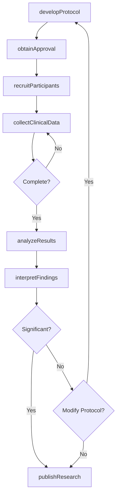
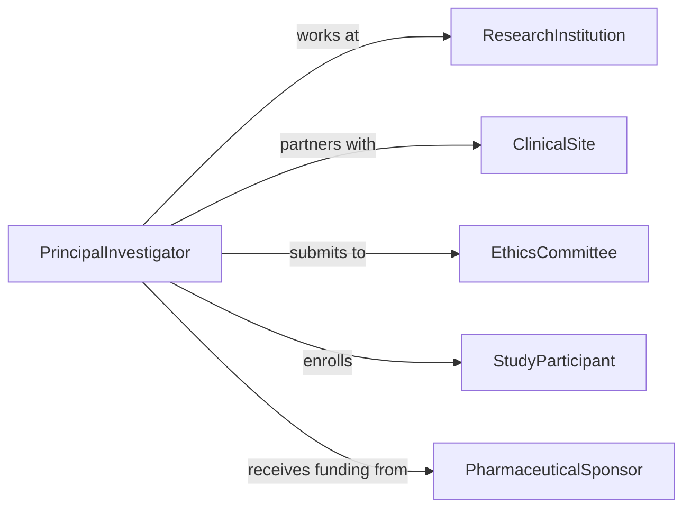

# Conduct Research Increase Knowledge About

> Business-as-Code definition for conducting medical research to advance understanding of health conditions and treatments. Models the complete research process from hypothesis development through clinical trials and knowledge dissemination.

## Overview

Medical research involves designing studies, recruiting participants, collecting clinical data, analyzing outcomes, and publishing findings to advance healthcare knowledge. This definition exposes actions for research protocols, patient enrollment, data collection, statistical analysis, and peer-reviewed publication across biomedical domains.

## Actors

| Actor | Description |
|-------|-------------|
| ResearchInstitution | Hosts and funds medical research programs |
| ClinicalSite | Provides patient access and conducts trials |
| EthicsCommittee | Reviews and approves research protocols |
| StudyParticipant | Volunteers for medical research studies |
| PharmaceuticalSponsor | Funds drug development research |
| RegulatoryAgency | Oversees research compliance and safety |

## Roles

| Role | Description |
|------|-------------|
| PrincipalInvestigator | Leads medical research projects |
| ClinicalResearchCoordinator | Manages study operations and participant interactions |
| Biostatistician | Designs analyses and interprets results |
| ResearchNurse | Collects clinical data and monitors participants |

## Entities

| Entity | Description |
|--------|-------------|
| ResearchProtocol | Detailed plan for conducting medical study |
| ClinicalTrial | Controlled investigation of medical intervention |
| StudyCohort | Group of participants enrolled in research |
| ClinicalData | Health measurements and outcomes from participants |
| Finding | Research result advancing medical knowledge |
| Publication | Peer-reviewed article reporting study results |

## Actions

| Action | Description |
|--------|-------------|
| developProtocol | Design research methodology and procedures |
| obtainApproval | Secure ethics committee and regulatory authorization |
| recruitParticipants | Enroll eligible individuals into study |
| collectClinicalData | Gather health measurements and outcomes |
| analyzeResults | Perform statistical evaluation of study data |
| interpretFindings | Draw conclusions from research results |
| publishResearch | Disseminate findings through peer-reviewed journals |

## Events

| Event | Description |
|-------|-------------|
| protocolDeveloped | Research methodology has been designed |
| approvalObtained | Ethics and regulatory authorization received |
| participantsRecruited | Study enrollment is complete |
| clinicalDataCollected | Health measurements have been gathered |
| resultsAnalyzed | Statistical evaluation is complete |
| findingsInterpreted | Research conclusions have been drawn |
| researchPublished | Study results have been shared publicly |

## Searches

| Search | Description |
|--------|-------------|
| findTrials | List clinical trials by condition, phase, or status |
| getParticipants | Retrieve study cohorts by demographics or enrollment |
| getClinicalData | Search health measurements by variable or timepoint |
| getPublications | Find published research by topic or investigator |

## Workflow



## Actor Relationships



## Usage

### Calling Actions

```typescript
import { conductResearchIncreaseKnowledgeAbout } from '@headlessly/conduct-research-increase-knowledge-about'

const research = conductResearchIncreaseKnowledgeAbout()

// Develop research protocol for new treatment study
const protocol = await research.developProtocol({
  title: 'Phase III Trial of Novel Immunotherapy for Melanoma',
  hypothesis: 'Drug X improves progression-free survival vs standard care',
  design: 'randomized controlled trial',
  populationCriteria: {
    inclusion: ['stage III or IV melanoma', 'age 18-75', 'ECOG 0-1'],
    exclusion: ['prior immunotherapy', 'autoimmune disease']
  },
  sampleSize: 500,
  duration: '36 months',
  primaryEndpoint: 'progression-free survival',
  secondaryEndpoints: ['overall survival', 'response rate', 'quality of life']
})

// Obtain ethics approval
const approval = await research.obtainApproval({
  protocolId: protocol.id,
  committees: ['Institutional Review Board', 'FDA'],
  documents: ['informed consent', 'investigator brochure', 'case report forms']
})

// Recruit study participants
const recruitment = await research.recruitParticipants({
  protocolId: protocol.id,
  targetEnrollment: 500,
  sites: ['Medical Center A', 'Cancer Institute B', 'Hospital C'],
  screeningPeriod: '18 months'
})

// Collect clinical data during trial
await research.collectClinicalData({
  cohortId: recruitment.cohortId,
  timepoints: ['baseline', 'month 3', 'month 6', 'month 12', 'progression'],
  measurements: ['tumor size', 'biomarkers', 'adverse events', 'quality of life scores']
})

// Analyze study results
const results = await research.analyzeResults({
  cohortId: recruitment.cohortId,
  statistical: 'intention-to-treat',
  primaryAnalysis: 'log-rank test for survival',
  significance: 0.05
})
```

### Event-Driven Automation

```typescript
// Alert when significant safety signal emerges
research.clinicalDataCollected(async ({ cohortId, adverseEvents }) => {
  const serious = adverseEvents.filter(ae => ae.severity === 'grade 4 or 5')
  if (serious.length > threshold) {
    await notify({
      to: 'data-safety-monitoring-board',
      priority: 'urgent',
      message: `Elevated serious adverse events detected in study ${cohortId}`
    })
  }
})

// Auto-publish positive trial results
research.findingsInterpreted(async ({ protocolId, findings, significance }) => {
  if (findings.primaryEndpointMet && significance < 0.001) {
    await research.publishResearch({
      protocolId,
      venue: 'high-impact medical journal',
      priority: 'expedited submission'
    })
  }
})
```
