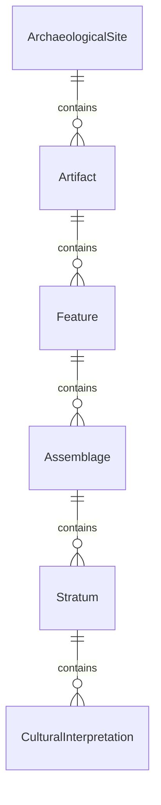
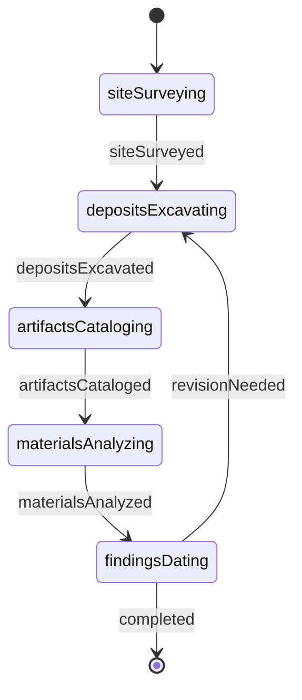
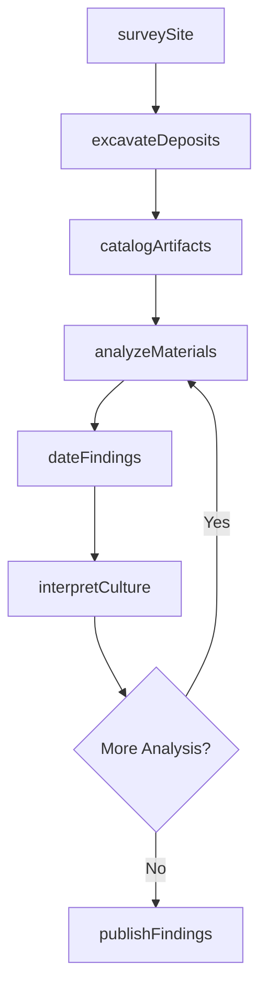
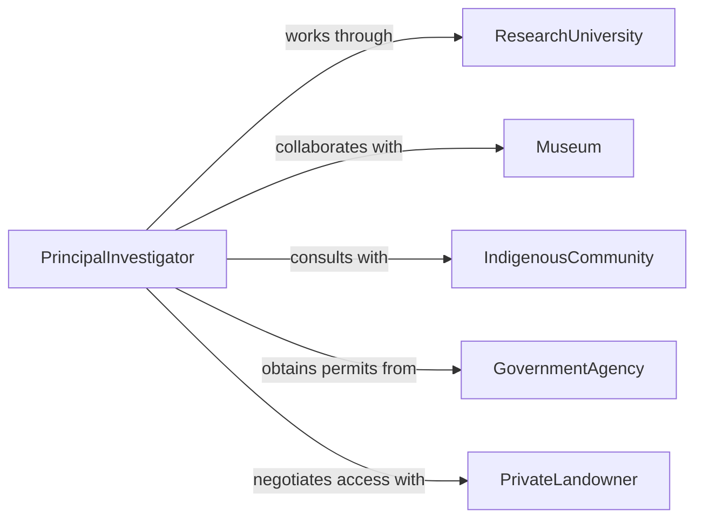

# Conduct Anthropological Archaeological Research

> Business-as-Code definition for conducting anthropological and archaeological research. Models the complete research process from site survey through excavation, artifact analysis, and cultural interpretation.

## Overview

Anthropological and archaeological research involves surveying sites, excavating artifacts, analyzing cultural materials, and interpreting human societies across time and space. This definition exposes actions for fieldwork, laboratory analysis, dating techniques, and ethnographic documentation across prehistoric and historic periods.

## Actors

| Actor | Description |
|-------|-------------|
| ResearchUniversity | Hosts academic research programs |
| CulturalResourceManagement | Conducts compliance archaeology for development projects |
| Museum | Curates collections and conducts research |
| IndigenousCommunity | Provides cultural knowledge and consultation |
| GovernmentAgency | Manages public lands and archaeological sites |
| PrivateLandowner | Controls access to archaeological resources |

## Roles

| Role | Description |
|------|-------------|
| PrincipalInvestigator | Leads archaeological or anthropological research |
| FieldDirector | Oversees excavation and survey operations |
| LabAnalyst | Studies artifacts and material culture |
| Ethnographer | Documents cultural practices and oral histories |

## Entities

| Entity | Description |
|--------|-------------|
| ArchaeologicalSite | Location containing cultural remains |
| Artifact | Portable object created by humans |
| Feature | Non-portable archaeological evidence |
| Assemblage | Collection of related artifacts and materials |
| Stratum | Geological layer containing cultural deposits |
| CulturalInterpretation | Explanation of past human behavior and society |

## Actions

| Action | Description |
|--------|-------------|
| surveySite | Identify and document archaeological locations |
| excavateDeposits | Systematically uncover buried cultural materials |
| catalogArtifacts | Record and organize recovered objects |
| analyzeMaterials | Study artifact composition and manufacture |
| dateFindings | Determine age of cultural remains |
| interpretCulture | Explain significance of archaeological evidence |
| publishFindings | Disseminate research through scholarly channels |

## Events

| Event | Description |
|-------|-------------|
| siteSurveyed | Archaeological location has been documented |
| depositsExcavated | Cultural layers have been systematically uncovered |
| artifactsCataloged | Recovered objects have been recorded |
| materialsAnalyzed | Artifact composition has been studied |
| findingsDated | Age of cultural remains has been determined |
| cultureInterpreted | Significance of evidence has been explained |
| researchPublished | Study results have been shared publicly |

## Searches

| Search | Description |
|--------|-------------|
| findSites | List archaeological locations by region or period |
| getArtifacts | Retrieve objects by type, material, or context |
| getAssemblages | Find artifact collections by site or culture |
| getInterpretations | Search cultural explanations by theme or period |

## Entity Relationships



## State Diagram



## Workflow



## Actor Relationships



## Usage

### Calling Actions

```typescript
import { conductAnthropologicalArchaeologicalResearch } from '@headlessly/conduct-anthropological-archaeological-research'

const research = conductAnthropologicalArchaeologicalResearch()

// Survey region for archaeological sites
const survey = await research.surveySite({
  region: 'Southwest Colorado',
  area: '50 square kilometers',
  methods: ['pedestrian survey', 'shovel testing', 'remote sensing'],
  timePeriods: ['Ancestral Puebloan', 'Historic']
})

// Excavate promising archaeological deposits
const excavation = await research.excavateDeposits({
  siteId: survey.sites[0].id,
  units: [
    { location: 'Structure 1', size: '2x2 meters', depth: '1.5 meters' },
    { location: 'Midden', size: '1x1 meters', depth: '1 meter' }
  ],
  strategy: 'stratigraphic excavation',
  screening: '1/4 inch mesh'
})

// Catalog recovered artifacts
const catalog = await research.catalogArtifacts({
  excavationId: excavation.id,
  artifacts: [
    { type: 'ceramic sherd', count: 245, context: 'Structure 1, level 3' },
    { type: 'lithic tool', count: 18, context: 'Midden, level 2' },
    { type: 'faunal remains', count: 156, context: 'various' }
  ]
})

// Analyze artifact materials
const analysis = await research.analyzeMaterials({
  catalogId: catalog.id,
  techniques: ['petrography', 'XRF', 'use-wear analysis'],
  questions: ['raw material sources', 'manufacturing techniques', 'function']
})

// Date archaeological findings
const dating = await research.dateFindings({
  siteId: survey.sites[0].id,
  methods: ['radiocarbon', 'dendrochronology', 'ceramic seriation'],
  samples: ['charcoal from hearth', 'wooden beam', 'pottery assemblage']
})

// Interpret cultural significance
await research.interpretCulture({
  siteId: survey.sites[0].id,
  themes: ['subsistence practices', 'social organization', 'trade networks'],
  comparisons: ['regional sites', 'ethnographic analogs']
})
```

### Event-Driven Automation

```typescript
// Alert when significant artifacts are discovered
research.artifactsCataloged(async ({ catalogId, artifacts, context }) => {
  const significant = artifacts.filter(a => a.rarity === 'exceptional' || a.preservation === 'excellent')
  if (significant.length > 0) {
    await notify({
      to: 'project-team',
      message: `${significant.length} significant artifacts discovered in ${context}`,
      priority: 'high'
    })
  }
})

// Auto-request additional dating when chronology is uncertain
research.findingsDated(async ({ siteId, dates, uncertainty }) => {
  if (uncertainty > 100) { // years
    await research.dateFindings({
      siteId,
      methods: ['additional radiocarbon samples'],
      rationale: 'refine chronology'
    })
  }
})
```
