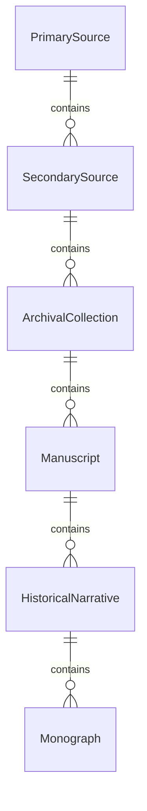
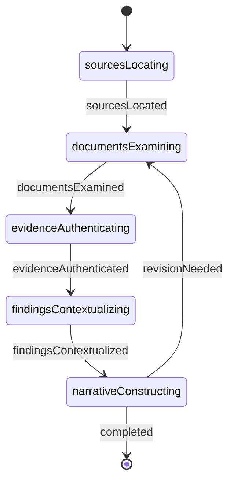
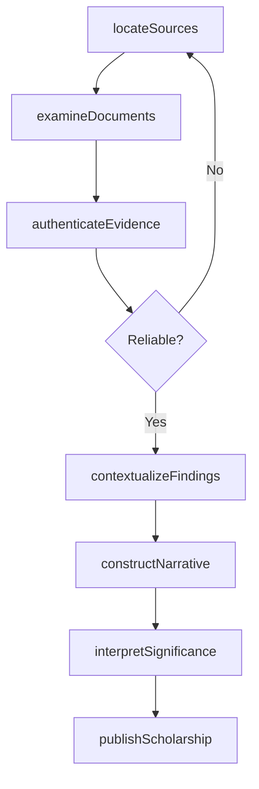
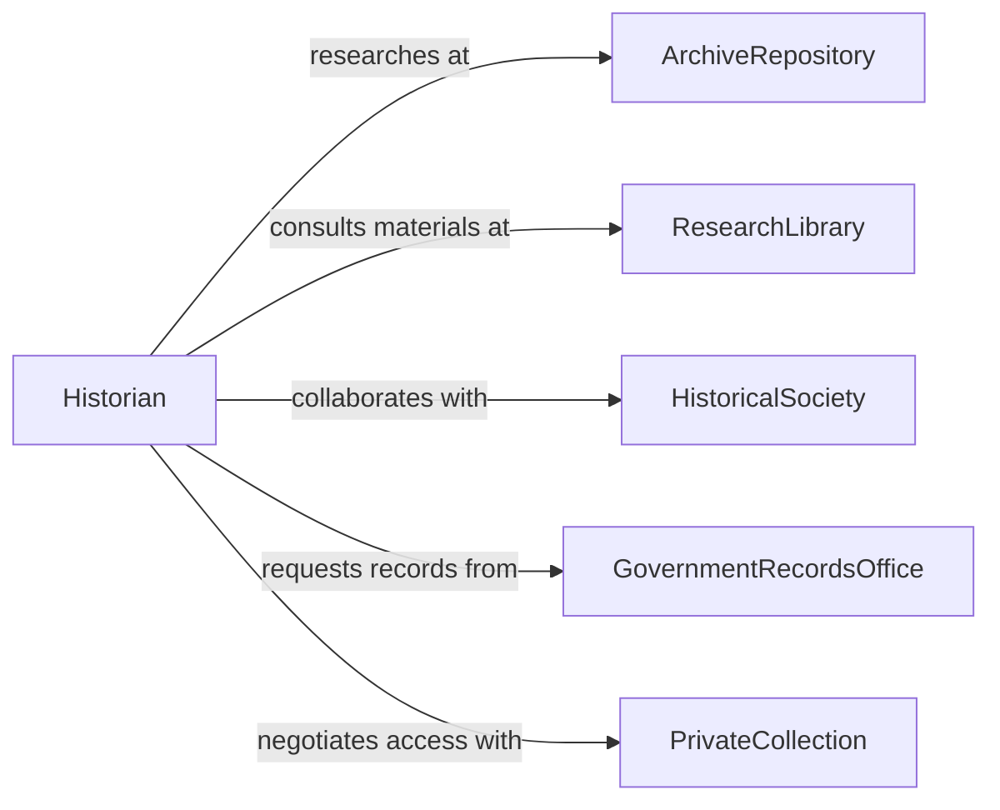

# Conduct Historical Research

> Business-as-Code definition for conducting historical research. Models the complete research process from archival investigation through primary source analysis, interpretation, and scholarly publication.

## Overview

Historical research involves locating primary sources, analyzing documents, contextualizing evidence, and constructing narratives about past events and societies. This definition exposes actions for archival research, source criticism, historical interpretation, and scholarly writing across time periods and geographic regions.

## Actors

| Actor | Description |
|-------|-------------|
| ArchiveRepository | Preserves and provides access to historical records |
| ResearchLibrary | Maintains collections of historical materials |
| HistoricalSociety | Collects local history and community records |
| GovernmentRecordsOffice | Holds official state and federal documents |
| PrivateCollection | Owns personal papers and family archives |
| AcademicPublisher | Disseminates historical scholarship |

## Roles

| Role | Description |
|------|-------------|
| Historian | Conducts historical investigation and interpretation |
| Archivist | Assists researchers and manages collections |
| ResearchAssistant | Locates sources and transcribes documents |
| PeerReviewer | Evaluates historical scholarship for publication |

## Entities

| Entity | Description |
|--------|-------------|
| PrimarySource | Original historical document or artifact |
| SecondarySource | Scholarly interpretation of historical evidence |
| ArchivalCollection | Organized group of related historical records |
| Manuscript | Handwritten or typed historical document |
| HistoricalNarrative | Constructed account of past events |
| Monograph | Book-length historical study |

## Actions

| Action | Description |
|--------|-------------|
| locateSources | Identify relevant archives and collections |
| examineDocuments | Review and transcribe primary source materials |
| authenticateEvidence | Verify provenance and reliability of sources |
| contextualizeFindings | Situate evidence within historical circumstances |
| constructNarrative | Build coherent account of historical events |
| interpretSignificance | Explain meaning and impact of historical developments |
| publishScholarship | Share research through academic channels |

## Events

| Event | Description |
|-------|-------------|
| sourcesLocated | Relevant archives and collections have been identified |
| documentsExamined | Primary source materials have been reviewed |
| evidenceAuthenticated | Source reliability has been verified |
| findingsContextualized | Evidence has been situated historically |
| narrativeConstructed | Coherent historical account has been built |
| significanceInterpreted | Historical meaning has been explained |
| scholarshipPublished | Research has been shared publicly |

## Searches

| Search | Description |
|--------|-------------|
| findCollections | List archives by topic, period, or geographic focus |
| getSources | Retrieve primary documents by type, date, or creator |
| getScholarship | Find published research by topic or historian |
| getManuscripts | Search handwritten documents by collection or subject |

## Entity Relationships



## State Diagram



## Workflow



## Actor Relationships



## Usage

### Calling Actions

```typescript
import { conductHistoricalResearch } from '@headlessly/conduct-historical-research'

const research = conductHistoricalResearch()

// Locate archival sources for research project
const sources = await research.locateSources({
  topic: 'Industrial Labor Movement 1890-1920',
  region: 'Northeastern United States',
  sourceTypes: ['union records', 'company correspondence', 'newspaper articles', 'government reports'],
  repositories: ['National Archives', 'Tamiment Library', 'state historical societies']
})

// Examine primary source documents
const examination = await research.examineDocuments({
  sourceIds: sources.collections.map(c => c.id),
  focus: ['labor organizing', 'strike activity', 'working conditions', 'management responses'],
  methods: ['transcription', 'photography', 'note-taking']
})

// Authenticate historical evidence
const authentication = await research.authenticateEvidence({
  documentIds: examination.documents.map(d => d.id),
  checks: ['provenance verification', 'handwriting analysis', 'cross-reference with known events'],
  standards: 'archival best practices'
})

// Contextualize findings within historical period
const context = await research.contextualizeFindings({
  authenticatedDocs: authentication.verified,
  factors: [
    'economic conditions',
    'political climate',
    'social movements',
    'technological changes',
    'legal framework'
  ],
  secondarySources: ['scholarly monographs', 'contemporary accounts']
})

// Construct historical narrative
const narrative = await research.constructNarrative({
  contextId: context.id,
  structure: 'chronological with thematic chapters',
  argument: 'Labor activism transformed industrial relations despite fierce opposition',
  chapters: [
    'Early Organizing Efforts',
    'Strike Wave of 1902',
    'Management Counter-offensive',
    'Legal Battles',
    'Legacy and Impact'
  ]
})

// Interpret historical significance
await research.interpretSignificance({
  narrativeId: narrative.id,
  themes: ['worker agency', 'class conflict', 'institutional change', 'social justice'],
  historiographicalDebate: 'revisionist vs traditional labor history'
})
```

### Event-Driven Automation

```typescript
// Alert when authentication fails for important documents
research.evidenceAuthenticated(async ({ documentId, verified, concerns }) => {
  if (!verified && concerns.includes('potential forgery')) {
    await notify({
      to: 'research-team',
      priority: 'high',
      message: `Document ${documentId} failed authentication - potential forgery detected`
    })
  }
})

// Auto-submit completed manuscripts for peer review
research.narrativeConstructed(async ({ narrativeId, wordCount, status }) => {
  if (status === 'complete' && wordCount > 80000) {
    await research.publishScholarship({
      narrativeId,
      venue: 'university press',
      submissionType: 'book manuscript',
      peerReview: true
    })
  }
})
```
