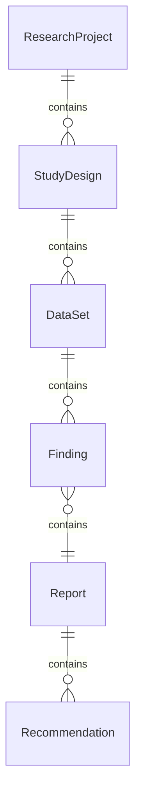
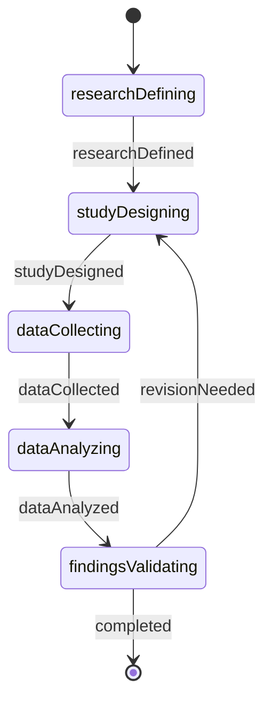
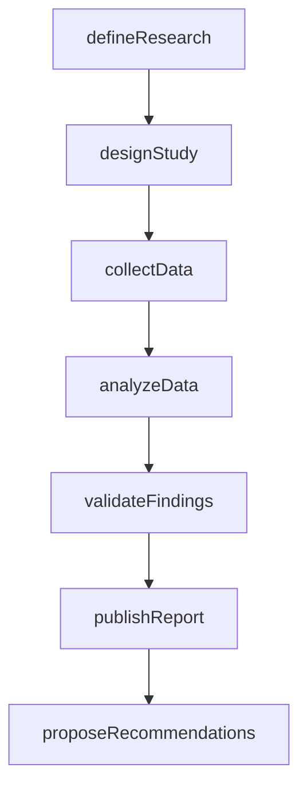
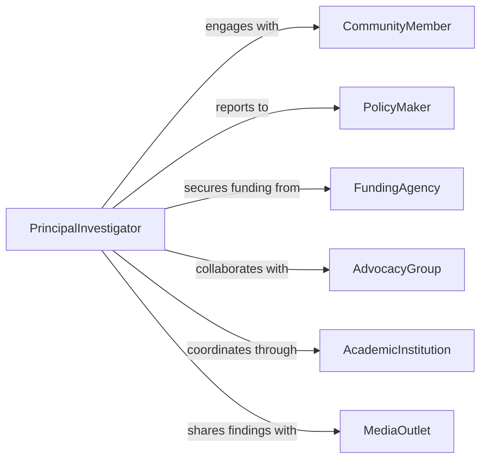

# Conduct Research Social Issues

> Business-as-Code definition for social issues research. Models the investigation, analysis, and documentation of societal challenges and trends.

## Overview

Social issues research involves systematic investigation of societal challenges, demographic trends, policy impacts, and community needs. This definition exposes actions for study design, data collection, stakeholder engagement, and findings dissemination, along with searches for tracking research progress and outcomes.

## Actors

| Actor | Description |
|-------|-------------|
| CommunityMember | Provides lived experience and participates in studies |
| PolicyMaker | Uses research findings to inform policy decisions |
| FundingAgency | Provides grants and financial support for research |
| AdvocacyGroup | Partners in research and applies findings |
| AcademicInstitution | Provides research infrastructure and ethical review |
| MediaOutlet | Disseminates research findings to public audiences |

## Roles

| Role | Description |
|------|-------------|
| PrincipalInvestigator | Leads research design and execution |
| ResearchAssociate | Conducts fieldwork and data collection |
| DataAnalyst | Analyzes quantitative and qualitative data |
| EthicsOfficer | Ensures research complies with ethical standards |

## Entities

| Entity | Description |
|--------|-------------|
| ResearchProject | A study focused on a specific social issue |
| StudyDesign | Methodology and approach for investigation |
| DataSet | Collected information from surveys, interviews, or observations |
| Finding | Research result or insight from analysis |
| Report | Formal documentation of research outcomes |
| Recommendation | Action proposed based on research findings |

## Actions

| Action | Description |
|--------|-------------|
| defineResearch | Establish research questions and scope |
| designStudy | Create methodology and sampling approach |
| collectData | Gather information through surveys, interviews, or observation |
| analyzeData | Identify patterns and insights from collected data |
| validateFindings | Review results for accuracy and significance |
| publishReport | Disseminate research findings to stakeholders |
| proposeRecommendations | Suggest actions based on research outcomes |

## Events

| Event | Description |
|-------|-------------|
| researchDefined | Research questions and objectives have been established |
| studyDesigned | Methodology has been documented and approved |
| dataCollected | Information has been gathered from sources |
| dataAnalyzed | Patterns and insights have been identified |
| findingsValidated | Results have been reviewed for accuracy |
| reportPublished | Research findings have been disseminated |
| recommendationsProposed | Actions have been suggested based on findings |

## Searches

| Search | Description |
|--------|-------------|
| findProjects | List research projects by topic or status |
| getDataSets | Retrieve collected data by source or method |
| getFindings | Access research results by theme or date |
| getReports | Find published research documents |
| getRecommendations | View proposed actions by stakeholder or priority |

## Entity Relationships



## State Diagram



## Workflow



## Actor Relationships



## Usage

### Calling Actions

```typescript
import { conductResearchSocialIssues } from '@headlessly/conduct-research-social-issues'

const research = conductResearchSocialIssues()

// Define a new research project
const project = await research.defineResearch({
  title: 'Housing Insecurity in Urban Communities',
  questions: [
    'What factors contribute to housing instability?',
    'How do communities adapt to displacement risk?'
  ],
  duration: 18,
  fundingSource: 'National Science Foundation'
})

// Design study methodology
await research.designStudy({
  projectId: project.id,
  methodology: 'mixed-methods',
  sampling: 'stratified random sample',
  sampleSize: 500,
  dataCollection: ['survey', 'focus-group', 'case-study']
})

// Collect data from community members
await research.collectData({
  projectId: project.id,
  method: 'survey',
  participants: 450,
  completionRate: 0.9,
  dataPoints: 12500
})

// Analyze and validate findings
const analysis = await research.analyzeData({
  projectId: project.id,
  techniques: ['regression', 'thematic-analysis']
})

await research.validateFindings({
  projectId: project.id,
  reviewers: ['peer-expert', 'community-member'],
  significance: 0.05
})
```

### Event-Driven Automation

```typescript
// Notify stakeholders when report is published
research.reportPublished(async ({ projectId, reportUrl }) => {
  const project = await research.findProjects({ id: projectId })
  await notify({
    to: project.stakeholders,
    template: 'research-report-available',
    data: { title: project.title, url: reportUrl }
  })
})

// Alert ethics officer if sensitive data collected
research.dataCollected(async ({ projectId, method, participants }) => {
  if (method === 'interview' && participants > 100) {
    await notify({
      to: 'ethics-officer',
      message: `Review required for large interview dataset in project ${projectId}`
    })
  }
})
```
