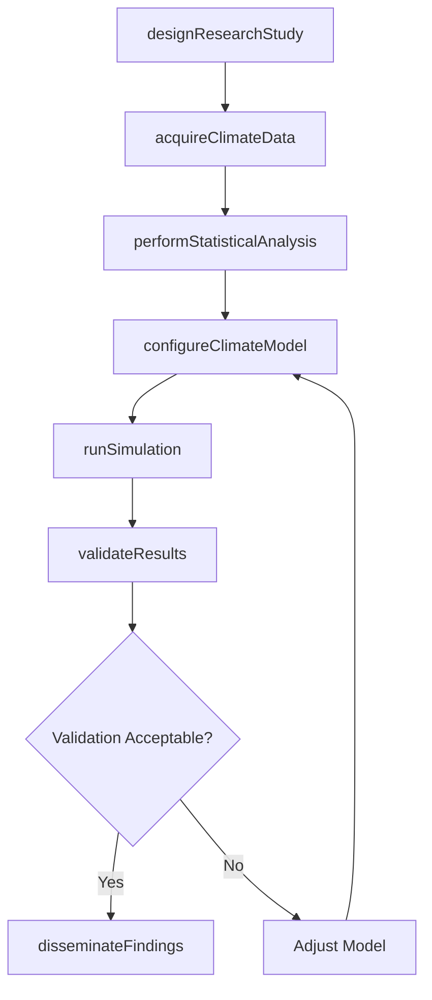
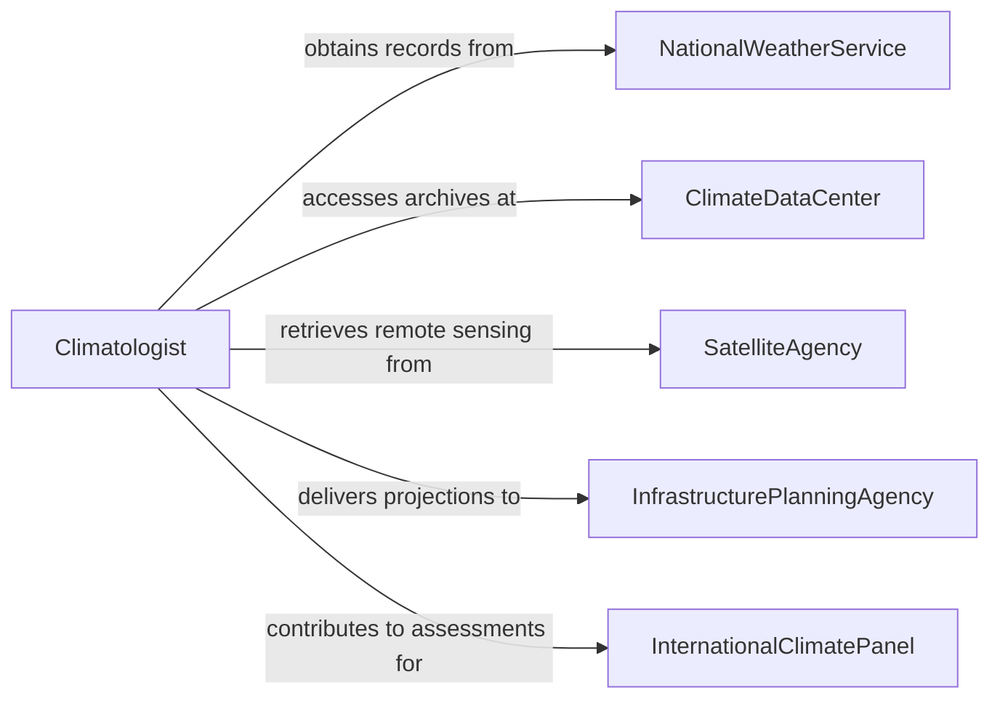

# Conduct Climatological Research

> Business-as-Code definition for conducting climatological research. Models the workflow from research design through data acquisition, statistical analysis, climate modeling, and dissemination of findings.

## Overview

Conducting climatological research involves studying long-term weather patterns, atmospheric processes, and climate variability to understand trends such as temperature change, precipitation shifts, and extreme weather frequency. Researchers design observational and modeling studies, acquire historical and real-time climate data, perform statistical analyses, run climate simulations, and publish findings that inform adaptation planning, agriculture, infrastructure design, and policy. This definition exposes actions for climate research, events for study milestones, and searches for retrieving climate data and publications.

## Actors

| Actor | Description |
|-------|-------------|
| NationalWeatherService | Maintains historical weather observation networks and datasets |
| ClimateDataCenter | Archives long-term climate records and reanalysis products |
| SatelliteAgency | Provides remote sensing data on atmospheric composition and temperature |
| AgriculturalResearchService | Uses climate data for crop yield modeling and growing season analysis |
| InfrastructurePlanningAgency | Applies climate projections to design standards and resilience planning |
| InternationalClimatePanel | Coordinates global climate assessments and scenario development |

## Roles

| Role | Description |
|------|-------------|
| Climatologist | Designs research studies and interprets climate trends |
| DataScientist | Processes large observational and model datasets |
| ClimateModeler | Configures and runs general circulation and regional climate models |
| StatisticalAnalyst | Applies time series analysis and extreme value statistics to climate data |

## Entities

| Entity | Description |
|--------|-------------|
| ClimateStudy | A research project investigating specific climate patterns or processes |
| ObservationRecord | A time series of measured temperature, precipitation, or atmospheric data |
| ReanalysisDataset | A gridded reconstruction of past atmospheric conditions from models and observations |
| ClimateProjection | A modeled estimate of future climate under specified emission scenarios |
| StatisticalTrendReport | An analysis of long-term changes in climate variables |
| ClimateModel | A computational simulation of atmospheric and oceanic processes |
| ResearchPublication | A peer-reviewed paper presenting climatological findings |

## Actions

| Action | Description |
|--------|-------------|
| designResearchStudy | Define objectives, variables, time periods, and methods |
| acquireClimateData | Obtain observational, satellite, and reanalysis datasets |
| performStatisticalAnalysis | Apply trend detection, frequency analysis, and regression to climate data |
| configureClimateModel | Set up boundary conditions, emission scenarios, and model parameters |
| runSimulation | Execute the climate model and generate projection outputs |
| validateResults | Compare model outputs against observed data for accuracy |
| disseminateFindings | Publish results through journals, reports, and stakeholder briefings |

## Events

| Event | Description |
|-------|-------------|
| researchStudyDesigned | Objectives and methods for the climate study have been defined |
| climateDataAcquired | Observational and reanalysis datasets have been obtained |
| statisticalAnalysisPerformed | Trend and frequency analyses have been completed |
| climateModelConfigured | Model parameters and scenarios have been set up |
| simulationRun | The climate model has produced projection outputs |
| resultsValidated | Model outputs have been compared against observations |
| findingsDisseminated | Research results have been published and shared with stakeholders |

## Searches

| Search | Description |
|--------|-------------|
| findStudies | Search climate research projects by region, variable, or investigator |
| getObservationRecords | Retrieve weather station data by location, parameter, or date range |
| getProjections | Locate climate projections by scenario, model, or region |
| getTrendReports | Find statistical trend analyses by variable, region, or period |
| getPublications | List research papers by topic, model, or author |

## Workflow



## Actor Relationships



## Usage

### Calling Actions

```typescript
import { conductClimatologicalResearch } from '@headlessly/conduct-climatological-research'

const climate = conductClimatologicalResearch()

// Design a research study on extreme precipitation trends
const study = await climate.designResearchStudy({
  title: 'Extreme Precipitation Frequency Analysis for the Great Lakes Region',
  objectives: ['updateIDFCurves', 'assessNonstationarity', 'projectFutureExtremes'],
  region: 'great-lakes-basin',
  variables: ['dailyPrecipitation', 'annualMaxima'],
  period: { historical: '1950-2025', projection: '2026-2100' }
})

// Acquire data and perform analysis
await climate.acquireClimateData({
  studyId: study.id,
  sources: ['ghcn-daily', 'era5-reanalysis', 'cmip6-projections'],
  variables: ['precipitation', 'temperature']
})

await climate.performStatisticalAnalysis({
  studyId: study.id,
  methods: ['generalizedExtremeValue', 'mannKendallTrend', 'changePointDetection']
})

// Run climate model simulations
await climate.configureClimateModel({
  studyId: study.id,
  model: 'wrf-regional',
  scenarios: ['ssp245', 'ssp585'],
  resolution: '4km'
})
```

### Event-Driven Automation

```typescript
// Notify stakeholders when projections are validated
climate.resultsValidated(async ({ studyId, biasScore }) => {
  await notify({
    to: 'infrastructure-planning',
    message: `Climate projections validated for study ${studyId} with bias score ${biasScore.toFixed(2)}`
  })
})

// Auto-disseminate when validation passes
climate.resultsValidated(async ({ studyId, acceptable }) => {
  if (acceptable) {
    await climate.disseminateFindings({ studyId })
  }
})
```
