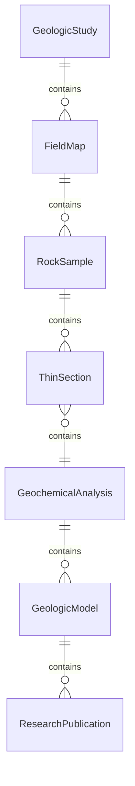
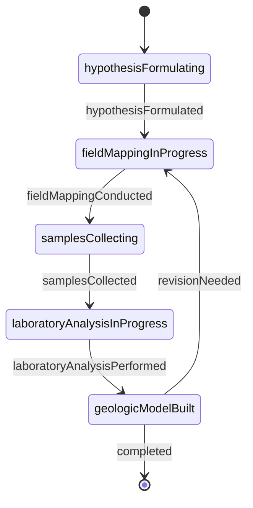
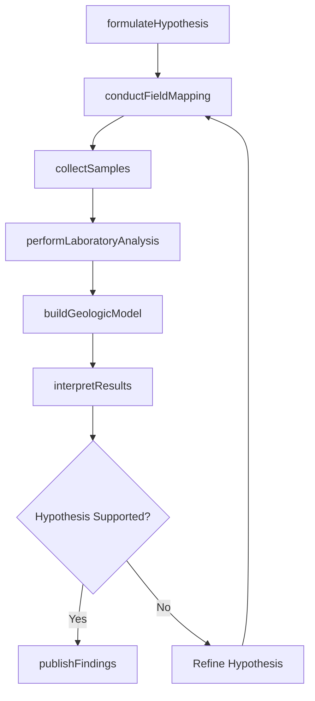
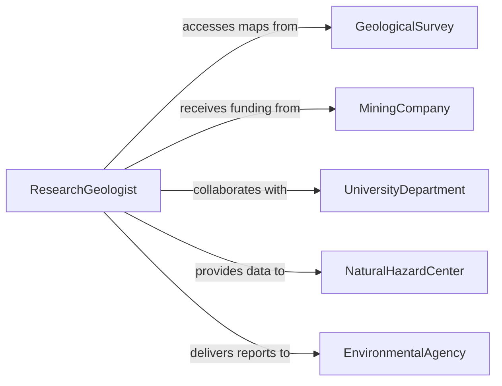

# Research Geological Features or Processes

> Business-as-Code definition for researching geological features or processes. Models the workflow from hypothesis formulation through field mapping, sample collection, laboratory analysis, geologic modeling, and publication.

## Overview

Researching geological features or processes involves studying the composition, structure, and dynamics of the Earth's crust, including rock formations, mineral deposits, fault systems, volcanic activity, and sedimentary processes. Geoscientists formulate research questions, conduct field mapping, collect rock and mineral samples, perform laboratory analyses, build geologic models, and publish findings that inform resource exploration, hazard assessment, and land use planning. This definition exposes actions for geological research, events for investigation milestones, and searches for retrieving geologic data and publications.

## Actors

| Actor | Description |
|-------|-------------|
| GeologicalSurvey | Maintains geologic maps, databases, and monitoring networks |
| MiningCompany | Funds mineral exploration and resource characterization research |
| UniversityDepartment | Conducts fundamental research in geology and geophysics |
| NaturalHazardCenter | Uses geologic research for earthquake, landslide, and volcanic risk assessment |
| EnvironmentalAgency | Requires geologic data for contamination and remediation decisions |
| PetroleumExplorationFirm | Commissions subsurface studies for hydrocarbon resource evaluation |

## Roles

| Role | Description |
|------|-------------|
| ResearchGeologist | Designs field studies and interprets geologic data |
| FieldMapper | Conducts outcrop observations and creates geologic maps |
| Petrographer | Analyzes rock samples using microscopy and geochemical techniques |
| GeophysicalModeler | Builds computational models of subsurface structures and processes |

## Entities

| Entity | Description |
|--------|-------------|
| GeologicStudy | A research project investigating specific features or processes |
| FieldMap | A spatial representation of rock units, contacts, and structural features |
| RockSample | A specimen collected from an outcrop, drill core, or excavation |
| ThinSection | A prepared slide of rock for petrographic microscope analysis |
| GeochemicalAnalysis | Laboratory determination of elemental and isotopic composition |
| GeologicModel | A three-dimensional representation of subsurface geology |
| ResearchPublication | A peer-reviewed paper or technical report presenting geologic findings |

## Actions

| Action | Description |
|--------|-------------|
| formulateHypothesis | Define the research question and predicted outcomes |
| conductFieldMapping | Map rock units, structures, and geomorphic features in the study area |
| collectSamples | Gather rock, mineral, and sediment specimens for laboratory analysis |
| performLaboratoryAnalysis | Analyze samples using petrography, geochemistry, and geochronology |
| buildGeologicModel | Construct a three-dimensional representation of the subsurface |
| interpretResults | Synthesize field and laboratory data to test the hypothesis |
| publishFindings | Prepare manuscripts and submit for peer review |

## Events

| Event | Description |
|-------|-------------|
| hypothesisFormulated | The research question and predictions have been defined |
| fieldMappingConducted | Rock units and structures have been mapped in the study area |
| samplesCollected | Rock and mineral specimens have been gathered |
| laboratoryAnalysisPerformed | Petrographic and geochemical analyses have been completed |
| geologicModelBuilt | A three-dimensional subsurface model has been constructed |
| resultsInterpreted | Field and laboratory data have been synthesized into conclusions |
| findingsPublished | Research results have been submitted for publication |

## Searches

| Search | Description |
|--------|-------------|
| findStudies | Search geologic research projects by location, topic, or investigator |
| getFieldMaps | Retrieve geologic maps by area, formation, or age |
| getSamples | Locate collected specimens by location, rock type, or project |
| getGeochemicalData | Find analytical results by element, method, or sample |
| getPublications | List research papers by author, formation, or geologic process |

## Entity Relationships



## State Diagram



## Workflow



## Actor Relationships



## Usage

### Calling Actions

```typescript
import { researchGeologicalFeaturesProcesses } from '@headlessly/research-geological-features-processes'

const geology = researchGeologicalFeaturesProcesses()

// Formulate a research hypothesis
const study = await geology.formulateHypothesis({
  title: 'Structural Controls on Gold Mineralization in the Greenstone Belt',
  hypothesis: 'Gold deposits are concentrated along second-order shear zones adjacent to the regional fault',
  studyArea: { region: 'abitibi-greenstone-belt', coordinates: { lat: 48.45, lon: -79.12 } },
  methods: ['fieldMapping', 'petrography', 'wholeRockGeochemistry', 'fluidInclusionStudy']
})

// Conduct field work and collect samples
await geology.conductFieldMapping({
  studyId: study.id,
  scale: '1:10000',
  features: ['lithologicContacts', 'faultTraces', 'foldAxes', 'mineralization']
})

await geology.collectSamples({
  studyId: study.id,
  sampleTypes: ['channelSamples', 'drillCore', 'surfaceGrab'],
  count: 45
})

// Analyze and model
await geology.performLaboratoryAnalysis({
  studyId: study.id,
  methods: ['thinSection', 'xrfGeochemistry', 'argentometricAssay']
})
```

### Event-Driven Automation

```typescript
// Notify team when laboratory results are available
geology.laboratoryAnalysisPerformed(async ({ studyId, sampleCount }) => {
  await notify({
    to: 'research-team',
    message: `Lab analysis complete for ${sampleCount} samples in study ${studyId}`
  })
})

// Auto-build model when all analyses are done
geology.laboratoryAnalysisPerformed(async ({ studyId }) => {
  await geology.buildGeologicModel({ studyId })
})
```
