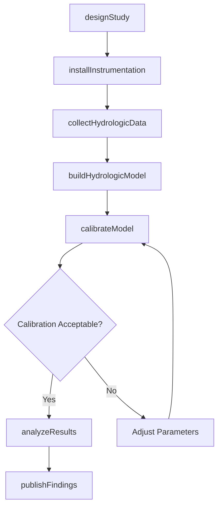
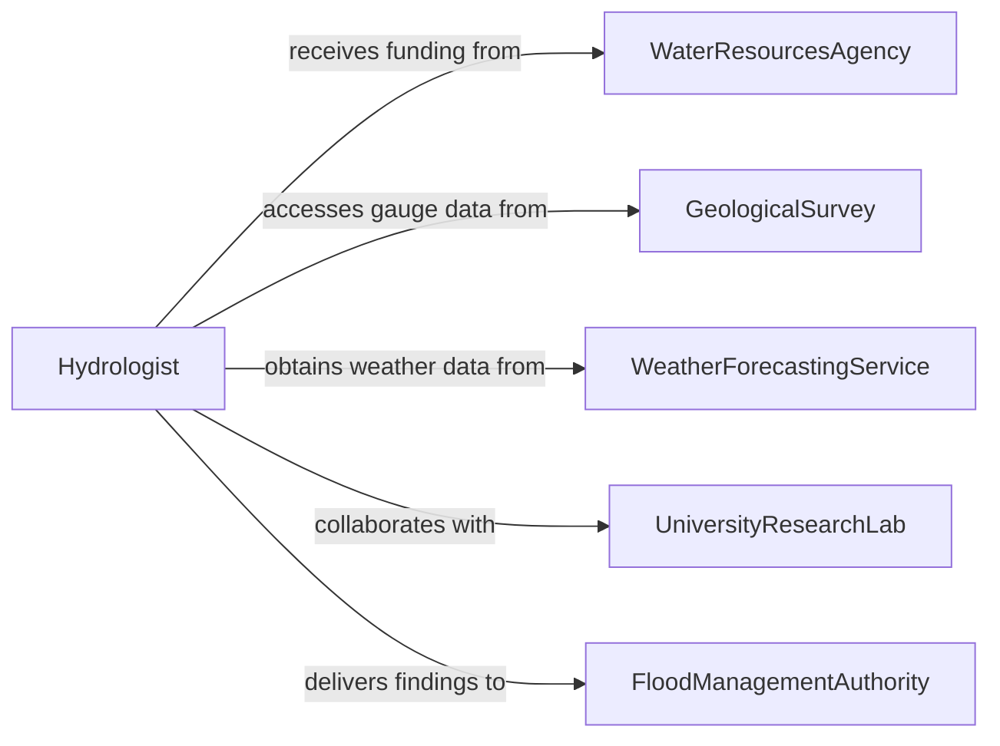

# Research Hydrologic Features or Processes

> Business-as-Code definition for researching hydrologic features or processes. Models the workflow from study design through data collection, hydrologic modeling, analysis, and findings publication.

## Overview

Researching hydrologic features or processes involves studying the movement, distribution, and quality of water across landscapes including rivers, aquifers, watersheds, wetlands, and groundwater systems. Scientists design field studies, collect streamflow and precipitation data, analyze water chemistry, build hydrologic models, and publish findings that inform water resource management, flood prediction, and environmental policy. This definition exposes actions for hydrologic research, events for study milestones, and searches for retrieving hydrologic data and publications.

## Actors

| Actor | Description |
|-------|-------------|
| WaterResourcesAgency | Funds and directs hydrologic research for water management purposes |
| GeologicalSurvey | Maintains long-term streamflow gauges and groundwater monitoring networks |
| EnvironmentalProtectionAgency | Sets water quality standards and requires compliance monitoring |
| UniversityResearchLab | Conducts fundamental and applied hydrologic research |
| FloodManagementAuthority | Uses hydrologic data for flood forecasting and mitigation planning |
| WeatherForecastingService | Provides precipitation and climate data for hydrologic analysis |

## Roles

| Role | Description |
|------|-------------|
| Hydrologist | Designs studies and analyzes water movement and distribution patterns |
| FieldHydrotechnician | Installs instruments, collects samples, and records field measurements |
| HydrologicModeler | Builds and calibrates computational models of water systems |
| WaterQualityScientist | Analyzes chemical, physical, and biological properties of water samples |

## Entities

| Entity | Description |
|--------|-------------|
| WatershedStudy | A research project focused on the hydrology of a defined drainage area |
| StreamflowRecord | A time series of water discharge measurements at a gauging station |
| GroundwaterObservation | Measurements of water table depth, pressure, and flow in an aquifer |
| WaterQualitySample | A collected specimen analyzed for chemical and biological parameters |
| PrecipitationRecord | A time series of rainfall or snowfall measurements |
| HydrologicModel | A computational representation of water flow through a system |
| ResearchPublication | A peer-reviewed paper or technical report presenting hydrologic findings |

## Actions

| Action | Description |
|--------|-------------|
| designStudy | Define the research objectives, study area, and methodology |
| installInstrumentation | Deploy gauges, sensors, and monitoring wells in the field |
| collectHydrologicData | Gather streamflow, groundwater, precipitation, and water quality measurements |
| buildHydrologicModel | Develop a computational model of the water system being studied |
| calibrateModel | Adjust model parameters to match observed hydrologic data |
| analyzeResults | Interpret data and model outputs to draw scientific conclusions |
| publishFindings | Prepare and submit research results for peer review and publication |

## Events

| Event | Description |
|-------|-------------|
| studyDesigned | Research objectives and methodology have been defined |
| instrumentationInstalled | Field gauges and sensors have been deployed |
| hydrologicDataCollected | Streamflow, groundwater, and water quality data have been gathered |
| hydrologicModelBuilt | A computational model of the water system has been developed |
| modelCalibrated | Model parameters have been adjusted to match observed data |
| resultsAnalyzed | Scientific conclusions have been drawn from data and model outputs |
| findingsPublished | Research results have been submitted for publication |

## Searches

| Search | Description |
|--------|-------------|
| findStudies | Search watershed studies by location, date, or research topic |
| getStreamflowRecords | Retrieve discharge data by gauging station, date range, or watershed |
| getGroundwaterObservations | Locate aquifer measurements by well, depth, or date |
| getWaterQualitySamples | Find water chemistry results by station, parameter, or date |
| getPublications | List research publications by author, topic, or watershed |

## Workflow



## Actor Relationships



## Usage

### Calling Actions

```typescript
import { researchHydrologicFeaturesProcesses } from '@headlessly/research-hydrologic-features-processes'

const hydro = researchHydrologicFeaturesProcesses()

// Design a watershed study
const study = await hydro.designStudy({
  title: 'Baseflow Recession Analysis of the Upper Cedar Creek Watershed',
  objectives: ['characterizeBaseflow', 'estimateAquiferContribution', 'modelDroughtResponse'],
  studyArea: { watershed: 'upper-cedar-creek', huc12: '071000040301' },
  duration: '24-months'
})

// Install instrumentation and collect data
await hydro.installInstrumentation({
  studyId: study.id,
  instruments: [
    { type: 'streamGauge', location: 'cedar-creek-outlet', parameters: ['stage', 'discharge'] },
    { type: 'monitoringWell', location: 'alluvial-aquifer-MW1', parameters: ['waterLevel', 'temperature'] },
    { type: 'rainGauge', location: 'watershed-centroid', parameters: ['precipitation'] }
  ]
})

await hydro.collectHydrologicData({
  studyId: study.id,
  period: { from: '2026-03-01', to: '2027-02-28' },
  frequency: 'daily'
})

// Build and calibrate model
await hydro.buildHydrologicModel({
  studyId: study.id,
  modelType: 'rainfallRunoff',
  software: 'hec-hms',
  inputs: ['precipitation', 'evapotranspiration', 'soilProperties']
})
```

### Event-Driven Automation

```typescript
// Notify research team when model is calibrated
hydro.modelCalibrated(async ({ studyId, nashSutcliffe }) => {
  await notify({
    to: 'research-team',
    message: `Model calibrated for study ${studyId} with NSE=${nashSutcliffe.toFixed(2)}`
  })
})

// Auto-analyze results when calibration is acceptable
hydro.modelCalibrated(async ({ studyId, nashSutcliffe }) => {
  if (nashSutcliffe > 0.7) {
    await hydro.analyzeResults({ studyId })
  }
})
```
