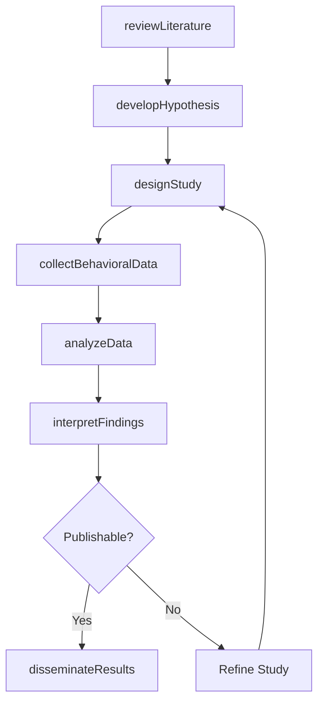
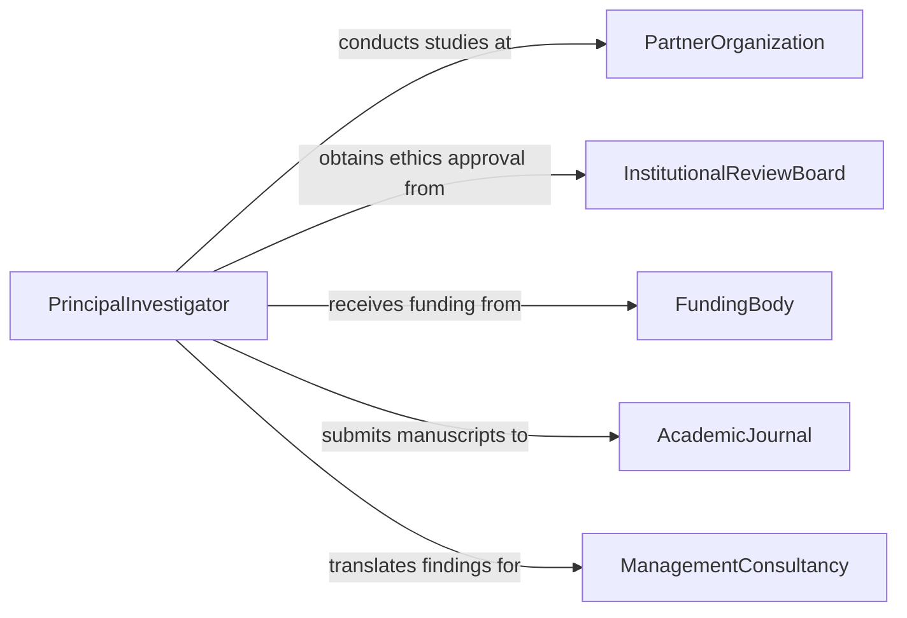

# Conduct Scientific Research of Organizational Behavior

> Business-as-Code definition for conducting scientific research of organizational behavior or processes. Models the workflow from literature review through hypothesis development, study design, data collection, statistical analysis, and findings dissemination.

## Overview

Conducting scientific research of organizational behavior or processes involves applying rigorous research methods to study how individuals, teams, and systems function within organizations. Researchers review existing literature, develop testable hypotheses, design experiments or observational studies, collect behavioral and process data, apply statistical analyses, and publish findings that advance management theory and inform organizational practice. This definition exposes actions for behavioral research, events for study milestones, and searches for retrieving research data and publications.

## Actors

| Actor | Description |
|-------|-------------|
| PartnerOrganization | Provides access to employees, teams, and processes for study |
| AcademicJournal | Reviews and publishes organizational behavior research |
| InstitutionalReviewBoard | Ensures research complies with ethical standards for human subjects |
| FundingBody | Provides grants and resources for organizational research |
| ManagementConsultancy | Applies research findings to client organizations |
| ProfessionalAssociation | Sets standards for organizational research methodology |

## Roles

| Role | Description |
|------|-------------|
| PrincipalInvestigator | Designs the study and oversees all research activities |
| ResearchAssociate | Conducts data collection and preliminary analysis |
| Statistician | Applies advanced analytical methods to research data |
| PeerReviewer | Evaluates the rigor and contribution of research before publication |

## Entities

| Entity | Description |
|--------|-------------|
| LiteratureReview | A systematic assessment of existing research on the topic |
| ResearchHypothesis | A testable prediction about organizational behavior or processes |
| StudyDesign | The methodology, sampling strategy, and data collection plan |
| SurveyInstrument | A validated questionnaire measuring behavioral or attitudinal constructs |
| BehavioralDataset | Collected observations, survey responses, and performance measures |
| StatisticalModel | A quantitative representation of relationships between variables |
| ResearchManuscript | A written report of methods, findings, and implications |

## Actions

| Action | Description |
|--------|-------------|
| reviewLiterature | Systematically assess existing research to identify gaps |
| developHypothesis | Formulate testable predictions based on theory and prior findings |
| designStudy | Specify the methodology, sample, measures, and analysis plan |
| collectBehavioralData | Gather observations, surveys, and performance data from participants |
| analyzeData | Apply statistical methods to test hypotheses and identify patterns |
| interpretFindings | Draw conclusions about organizational behavior from the analysis |
| disseminateResults | Publish findings through journals, conferences, and practitioner outlets |

## Events

| Event | Description |
|-------|-------------|
| literatureReviewed | Existing research has been systematically assessed |
| hypothesisDeveloped | Testable predictions have been formulated |
| studyDesigned | The methodology and data collection plan have been specified |
| behavioralDataCollected | Observations and survey responses have been gathered |
| dataAnalyzed | Statistical tests and models have been applied to the data |
| findingsInterpreted | Conclusions about organizational behavior have been drawn |
| resultsDisseminated | Findings have been published and shared with practitioners |

## Searches

| Search | Description |
|--------|-------------|
| findStudies | Search research projects by topic, organization, or investigator |
| getLiteratureReviews | Retrieve systematic reviews by subject area or date |
| getDatasets | Locate behavioral datasets by construct, sample, or study |
| getStatisticalModels | Find analytical results by variable, method, or study |
| getPublications | List manuscripts by author, journal, or topic |

## Workflow



## Actor Relationships



## Usage

### Calling Actions

```typescript
import { conductScientificResearchOrganizationalBehavior } from '@headlessly/conduct-scientific-research-organizational-behavior'

const research = conductScientificResearchOrganizationalBehavior()

// Review literature and develop hypothesis
const review = await research.reviewLiterature({
  topic: 'psychological-safety-innovation',
  databases: ['psychInfo', 'webOfScience', 'scopus'],
  yearRange: { from: 2015, to: 2026 }
})

const hypothesis = await research.developHypothesis({
  reviewId: review.id,
  prediction: 'Teams with higher psychological safety report greater innovative behavior, mediated by knowledge sharing',
  constructs: ['psychologicalSafety', 'knowledgeSharing', 'innovativeBehavior']
})

// Design and execute the study
const study = await research.designStudy({
  hypothesisId: hypothesis.id,
  method: 'crossSectionalSurvey',
  sample: { targetSize: 300, unit: 'teams', selection: 'stratifiedRandom' },
  measures: ['edmondsonPsychSafetyScale', 'knowledgeSharingIndex', 'innovativeBehaviorScale']
})

await research.collectBehavioralData({
  studyId: study.id,
  organization: 'tech-company-partner',
  duration: '6-weeks'
})
```

### Event-Driven Automation

```typescript
// Notify statistician when data collection is complete
research.behavioralDataCollected(async ({ studyId, sampleSize }) => {
  await notify({
    to: 'statistician',
    message: `Data collection complete for study ${studyId}: ${sampleSize} participants`
  })
})

// Auto-interpret when analysis is done
research.dataAnalyzed(async ({ studyId, significantPaths }) => {
  await research.interpretFindings({ studyId })
})
```
