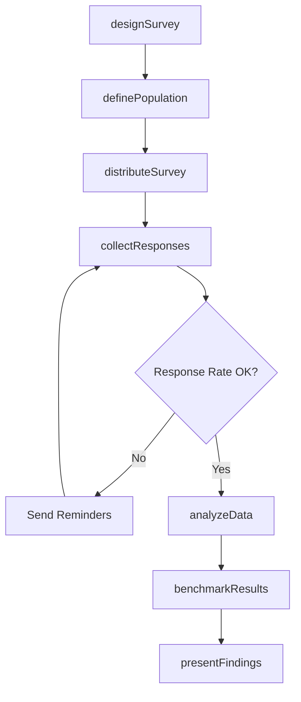
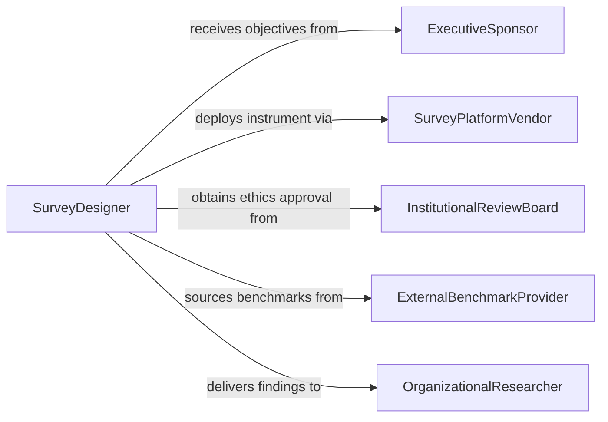

# Conduct Surveys in Organizations

> Business-as-Code definition for conducting surveys in organizations. Models the workflow from survey design through distribution, response collection, data analysis, and findings presentation.

## Overview

Conducting surveys in organizations involves designing questionnaires, identifying target populations, distributing instruments through appropriate channels, collecting and cleaning responses, analyzing results using statistical methods, and presenting findings to inform management decisions. Surveys measure employee engagement, customer satisfaction, process effectiveness, and organizational climate. This definition exposes actions for organizational survey management, events for survey milestones, and searches for retrieving survey data and reports.

## Actors

| Actor | Description |
|-------|-------------|
| ExecutiveSponsor | Commissions the survey and defines its strategic purpose |
| SurveyRespondent | Provides answers to survey questions from within the organization |
| SurveyPlatformVendor | Hosts the digital survey instrument and manages response collection |
| InstitutionalReviewBoard | Reviews survey design for ethical compliance when applicable |
| ExternalBenchmarkProvider | Supplies industry comparison data for survey results |
| UnionRepresentative | May participate in survey design and review for labor relations surveys |

## Roles

| Role | Description |
|------|-------------|
| SurveyDesigner | Creates the questionnaire and defines the methodology |
| SurveyAdministrator | Manages distribution, reminders, and response tracking |
| DataAnalyst | Cleans, codes, and statistically analyzes survey responses |
| OrganizationalResearcher | Interprets findings and develops recommendations |

## Entities

| Entity | Description |
|--------|-------------|
| SurveyInstrument | A questionnaire comprising structured and open-ended items |
| TargetPopulation | The defined group of respondents selected to participate |
| ResponseDataset | The collected set of answers from all respondents |
| ConfidentialityProtocol | Rules governing how responses are anonymized and protected |
| StatisticalReport | A quantitative analysis of survey results including frequencies and correlations |
| BenchmarkComparison | A comparison of organizational results against industry norms |
| FindingsPresentation | A summary of conclusions and recommendations for stakeholders |

## Actions

| Action | Description |
|--------|-------------|
| designSurvey | Create the questionnaire, scales, and skip logic |
| definePopulation | Identify the target respondents and sampling strategy |
| distributeSurvey | Send the survey instrument to respondents through selected channels |
| collectResponses | Gather and aggregate answers as they are submitted |
| analyzeData | Apply statistical methods to identify patterns and significance |
| benchmarkResults | Compare organizational scores against external norms |
| presentFindings | Deliver conclusions and recommendations to stakeholders |

## Events

| Event | Description |
|-------|-------------|
| surveyDesigned | The questionnaire and methodology have been finalized |
| populationDefined | Target respondents and sampling strategy have been identified |
| surveyDistributed | The survey has been sent to respondents |
| responsesCollected | All answers have been gathered and aggregated |
| dataAnalyzed | Statistical analysis of responses has been completed |
| resultsBenchmarked | Organizational scores have been compared to industry norms |
| findingsPresented | Conclusions and recommendations have been delivered |

## Searches

| Search | Description |
|--------|-------------|
| findSurveys | Search surveys by topic, department, or date |
| getResponses | Retrieve response data by survey, question, or demographic |
| getStatisticalReports | Locate analysis reports by survey or metric |
| getBenchmarks | Find industry comparison data by survey topic or sector |
| getResponseRates | Check participation rates by department or survey wave |

## Workflow



## Actor Relationships



## Usage

### Calling Actions

```typescript
import { conductSurveysOrganizations } from '@headlessly/conduct-surveys-organizations'

const surveys = conductSurveysOrganizations()

// Design an employee engagement survey
const survey = await surveys.designSurvey({
  title: 'Annual Employee Engagement Survey 2026',
  dimensions: ['jobSatisfaction', 'managerEffectiveness', 'careerDevelopment', 'workLifeBalance'],
  questionCount: 42,
  scaleType: 'likert-5-point',
  anonymity: 'full'
})

// Define population and distribute
await surveys.definePopulation({
  surveyId: survey.id,
  scope: 'allActiveEmployees',
  exclusions: ['newHiresUnder90Days'],
  samplingMethod: 'census'
})

await surveys.distributeSurvey({
  surveyId: survey.id,
  channel: 'email',
  openDate: '2026-03-01',
  closeDate: '2026-03-21',
  reminderSchedule: ['2026-03-08', '2026-03-15']
})

// Analyze and present
const analysis = await surveys.analyzeData({
  surveyId: survey.id,
  methods: ['frequencyDistribution', 'factorAnalysis', 'demographicCrosstabs']
})
```

### Event-Driven Automation

```typescript
// Alert sponsor when findings are ready
surveys.findingsPresented(async ({ surveyId, title }) => {
  await notify({
    to: 'executive-sponsor',
    message: `Findings ready for review: ${title}`
  })
})

// Auto-benchmark when data analysis completes
surveys.dataAnalyzed(async ({ surveyId }) => {
  await surveys.benchmarkResults({ surveyId })
})
```
