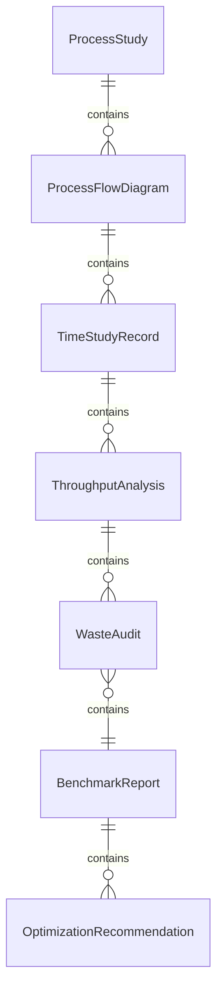
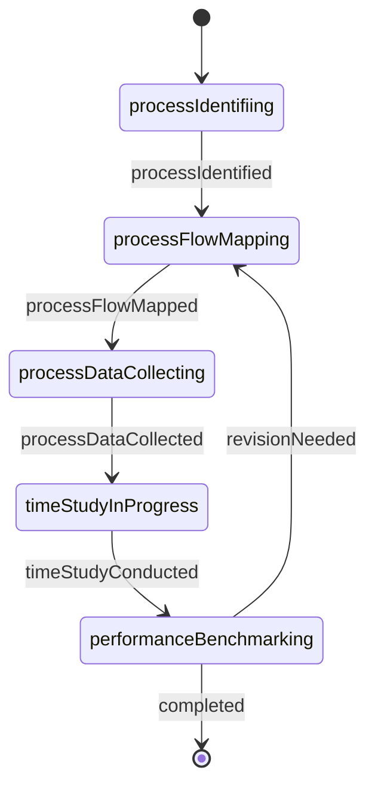
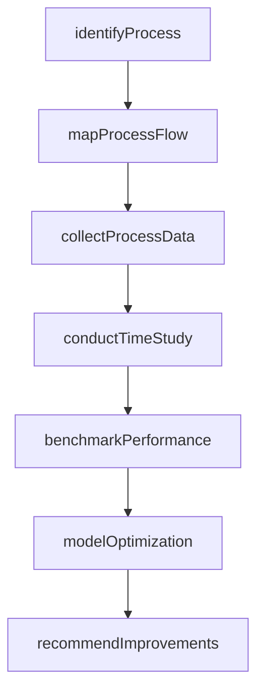
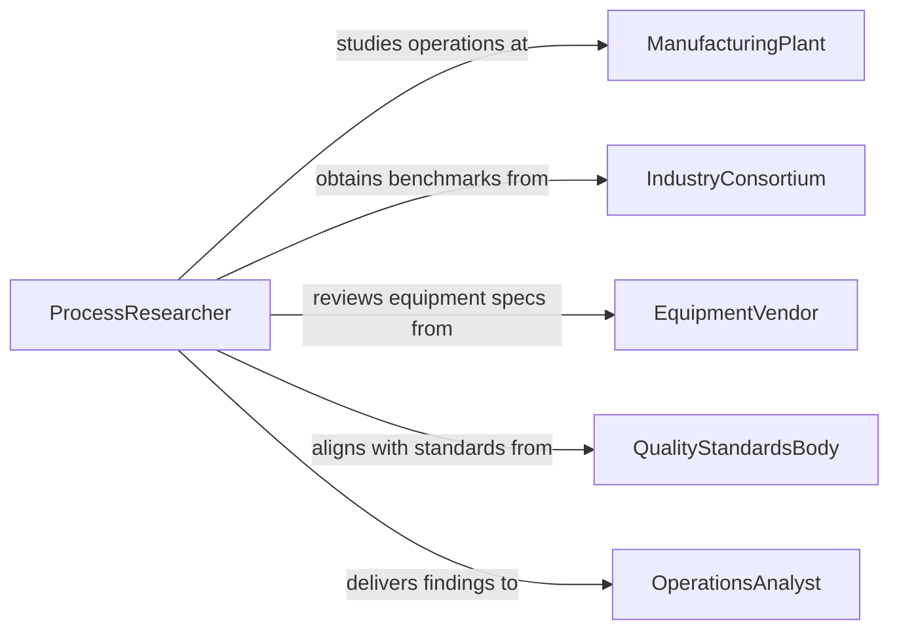

# Research Industrial Processes or Operations

> Business-as-Code definition for researching industrial processes or operations. Models the workflow from process identification through data collection, analysis, benchmarking, optimization modeling, and improvement recommendation.

## Overview

Researching industrial processes or operations involves studying manufacturing methods, production workflows, supply chain logistics, quality control systems, and operational efficiency to identify improvement opportunities. Researchers collect process data, conduct time-and-motion studies, analyze throughput and waste, benchmark against industry leaders, and develop optimization recommendations. This definition exposes actions for industrial process research, events for study milestones, and searches for retrieving process data and improvement recommendations.

## Actors

| Actor | Description |
|-------|-------------|
| ManufacturingPlant | Provides access to production lines, equipment, and process data |
| IndustryConsortium | Publishes operational benchmarks and best practices |
| EquipmentVendor | Supplies technical specifications and performance capabilities |
| QualityStandardsBody | Sets production quality and safety standards such as ISO or Six Sigma |
| AcademicResearchCenter | Conducts fundamental research on manufacturing and process engineering |
| RegulatoryAuthority | Establishes emissions, safety, and waste handling requirements |

## Roles

| Role | Description |
|------|-------------|
| ProcessResearcher | Designs and conducts studies of industrial operations |
| IndustrialEngineer | Analyzes workflow efficiency and develops optimization models |
| QualityEngineer | Evaluates defect rates, process capability, and control systems |
| OperationsAnalyst | Collects and analyzes production data for performance insights |

## Entities

| Entity | Description |
|--------|-------------|
| ProcessStudy | A research project examining a specific industrial operation |
| ProcessFlowDiagram | A visual map of steps, inputs, outputs, and decision points in a process |
| TimeStudyRecord | Documented observations of cycle times and labor utilization |
| ThroughputAnalysis | A quantitative assessment of production rate and capacity utilization |
| WasteAudit | An inventory of material waste, rework, and scrap in the process |
| BenchmarkReport | A comparison of process performance against industry standards |
| OptimizationRecommendation | A proposed change to improve efficiency, quality, or cost |

## Actions

| Action | Description |
|--------|-------------|
| identifyProcess | Select the industrial process or operation to study |
| mapProcessFlow | Document the sequence of steps, inputs, outputs, and controls |
| collectProcessData | Gather cycle times, throughput rates, defect counts, and resource usage |
| conductTimeStudy | Observe and record the duration of individual process steps |
| benchmarkPerformance | Compare collected data against industry standards and best practices |
| modelOptimization | Develop simulation or analytical models to identify improvements |
| recommendImprovements | Propose specific changes to enhance process performance |

## Events

| Event | Description |
|-------|-------------|
| processIdentified | The target industrial process has been selected for study |
| processFlowMapped | The sequence of steps and controls has been documented |
| processDataCollected | Operational metrics have been gathered from the production environment |
| timeStudyConducted | Cycle time observations have been recorded and analyzed |
| performanceBenchmarked | Process metrics have been compared to industry standards |
| optimizationModeled | Improvement scenarios have been simulated and evaluated |
| improvementsRecommended | Specific changes have been proposed for implementation |

## Searches

| Search | Description |
|--------|-------------|
| findProcessStudies | Search studies by industry, process type, or researcher |
| getProcessFlows | Retrieve flow diagrams by process, plant, or product |
| getThroughputData | Locate production rate data by line, shift, or date range |
| getBenchmarkReports | Find industry comparison reports by metric or sector |
| getRecommendations | List improvement proposals by process, priority, or expected impact |

## Entity Relationships



## State Diagram



## Workflow



## Actor Relationships



## Usage

### Calling Actions

```typescript
import { researchIndustrialProcessesOperations } from '@headlessly/research-industrial-processes-operations'

const research = researchIndustrialProcessesOperations()

// Identify and map the process
const study = await research.identifyProcess({
  plantId: 'midwest-assembly-plant-3',
  processName: 'electronicComponentAssembly',
  productLine: 'circuit-board-pcb-800',
  objective: 'reduceDefectRateBelow50ppm'
})

await research.mapProcessFlow({
  studyId: study.id,
  steps: ['solderPasteApplication', 'componentPlacement', 'reflowSoldering', 'opticalInspection', 'functionalTest'],
  notation: 'BPMN'
})

// Collect data and benchmark
await research.collectProcessData({
  studyId: study.id,
  metrics: ['cycleTime', 'firstPassYield', 'defectsPerMillion', 'equipmentUtilization'],
  duration: '30-days'
})

await research.benchmarkPerformance({
  studyId: study.id,
  benchmarkSources: ['ipc-standards', 'industry-median', 'best-in-class']
})

// Model and recommend
await research.modelOptimization({
  studyId: study.id,
  scenarios: ['adjustReflowProfile', 'upgradeInspectionSystem', 'addPreheatingStage']
})
```

### Event-Driven Automation

```typescript
// Notify plant management when recommendations are ready
research.improvementsRecommended(async ({ studyId, estimatedSavings }) => {
  await notify({
    to: 'plant-manager',
    message: `Process improvement recommendations ready for study ${studyId}: estimated savings ${estimatedSavings}`
  })
})

// Auto-model optimization after benchmarking
research.performanceBenchmarked(async ({ studyId }) => {
  await research.modelOptimization({ studyId })
})
```
