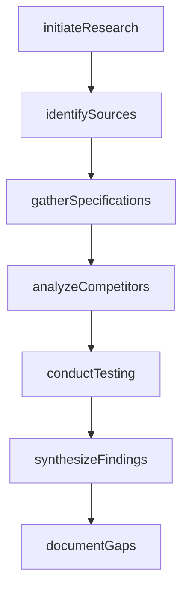
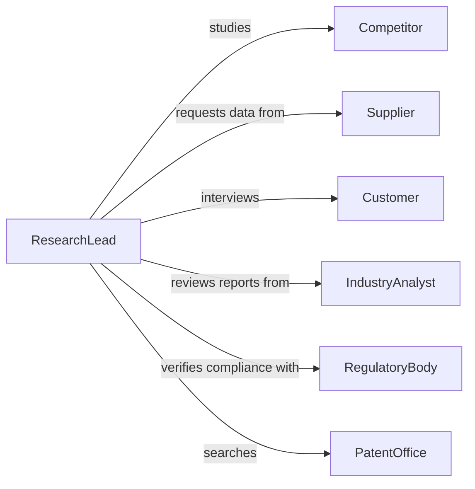

# Conduct Research Gain Information About

> Business-as-Code definition for product and process research. Models information gathering to understand technical specifications, market performance, and operational characteristics.

## Overview

Product and process research involves systematic investigation to understand technical capabilities, competitive positioning, manufacturing methods, and performance characteristics. This definition exposes actions for conducting literature reviews, competitive analysis, technical testing, and knowledge synthesis, with searches for tracking research insights and gaps.

## Actors

| Actor | Description |
|-------|-------------|
| Competitor | Organization whose products or processes are studied |
| Supplier | Provides technical specifications and material data |
| Customer | Offers feedback on product performance and needs |
| IndustryAnalyst | Publishes market research and trend reports |
| RegulatoryBody | Defines compliance requirements and standards |
| PatentOffice | Maintains records of intellectual property |

## Roles

| Role | Description |
|------|-------------|
| ResearchLead | Directs research strategy and priorities |
| TechnicalResearcher | Investigates product specifications and processes |
| MarketAnalyst | Studies competitive landscape and trends |
| LaboratoryTechnician | Conducts physical testing and measurements |

## Entities

| Entity | Description |
|--------|-------------|
| ResearchInitiative | A focused investigation into products or processes |
| InformationSource | Document, database, or expert providing data |
| TechnicalSpecification | Detailed product or process characteristics |
| CompetitiveAnalysis | Comparison of market alternatives |
| TestResult | Data from physical or performance testing |
| KnowledgeGap | Area requiring additional investigation |

## Actions

| Action | Description |
|--------|-------------|
| initiateResearch | Define research objectives and scope |
| identifySources | Locate documents, experts, and data repositories |
| gatherSpecifications | Collect technical details and performance data |
| analyzeCompetitors | Compare products and processes to alternatives |
| conductTesting | Perform physical tests or simulations |
| synthesizeFindings | Integrate information into cohesive knowledge |
| documentGaps | Identify areas requiring further investigation |

## Events

| Event | Description |
|-------|-------------|
| researchInitiated | Investigation objectives have been defined |
| sourcesIdentified | Information sources have been located |
| specificationsGathered | Technical details have been collected |
| competitorsAnalyzed | Market alternatives have been compared |
| testingConducted | Physical testing has been completed |
| findingsSynthesized | Information has been integrated |
| gapsDocumented | Knowledge gaps have been identified |

## Searches

| Search | Description |
|--------|-------------|
| findInitiatives | List research projects by topic or status |
| getSources | Retrieve information sources by type or relevance |
| getSpecifications | Access technical details by product or category |
| getTestResults | Find testing data by method or date |
| getGaps | Identify areas requiring additional research |

## Workflow



## Actor Relationships



## Usage

### Calling Actions

```typescript
import { conductResearchGainInformationAbout } from '@headlessly/conduct-research-gain-information-about'

const research = conductResearchGainInformationAbout()

// Initiate research on a new product area
const initiative = await research.initiateResearch({
  title: 'Advanced Battery Technologies for EVs',
  objectives: [
    'Understand solid-state battery performance',
    'Compare manufacturing processes',
    'Identify cost optimization opportunities'
  ],
  timeline: 90
})

// Identify information sources
await research.identifySources({
  initiativeId: initiative.id,
  sources: [
    { type: 'academic-journal', database: 'IEEE Xplore' },
    { type: 'patent-database', region: 'US' },
    { type: 'industry-report', publisher: 'Gartner' }
  ]
})

// Gather specifications from suppliers
await research.gatherSpecifications({
  initiativeId: initiative.id,
  product: 'lithium-solid-state-cell',
  specifications: {
    energyDensity: 450,
    chargeCycles: 3000,
    operatingTemp: { min: -20, max: 60 }
  }
})

// Conduct competitive analysis
await research.analyzeCompetitors({
  initiativeId: initiative.id,
  competitors: ['CompanyA', 'CompanyB', 'CompanyC'],
  criteria: ['performance', 'cost', 'scalability']
})
```

### Event-Driven Automation

```typescript
// Alert research team when knowledge gaps are identified
research.gapsDocumented(async ({ initiativeId, gaps }) => {
  if (gaps.length > 0) {
    await notify({
      to: 'research-team',
      message: `${gaps.length} knowledge gaps identified in ${initiativeId}`,
      priority: 'high'
    })
  }
})

// Trigger synthesis when testing is complete
research.testingConducted(async ({ initiativeId, testResults }) => {
  const allTests = await research.getTestResults({ initiativeId })
  if (allTests.every(t => t.status === 'complete')) {
    await research.synthesizeFindings({ initiativeId })
  }
})
```
