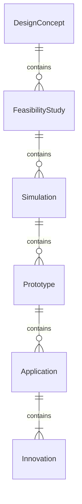
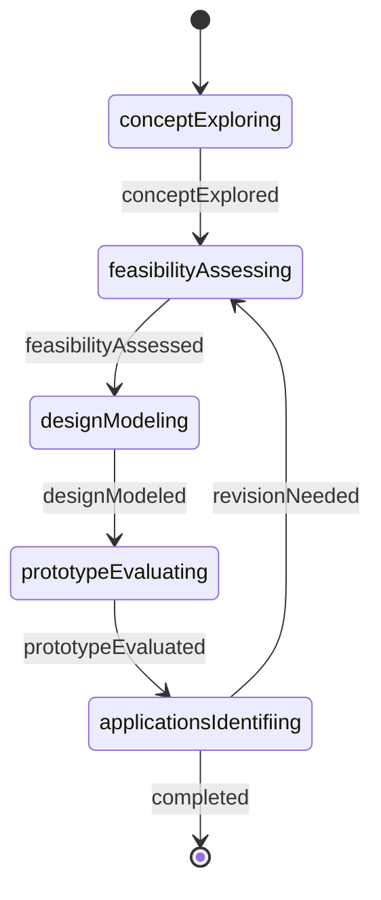
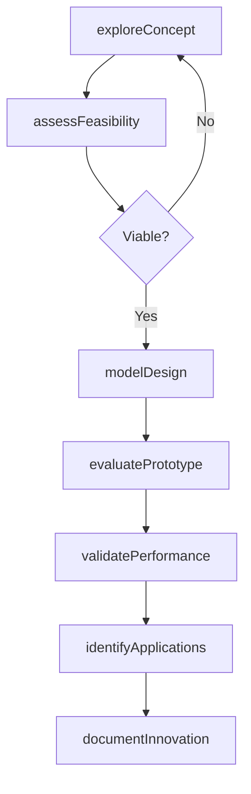
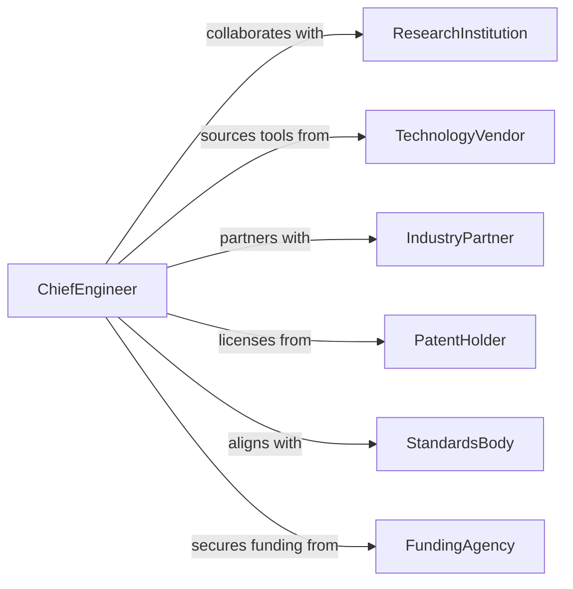

# Research Advanced Engineering Designs Applications

> Business-as-Code definition for advanced engineering design research. Models investigation of cutting-edge engineering solutions, novel applications, and innovative design methodologies.

## Overview

Advanced engineering design research involves exploring state-of-the-art technologies, novel materials, innovative structural approaches, and emerging applications in specialized fields. This definition exposes actions for concept exploration, feasibility analysis, prototype evaluation, and application assessment, with searches for tracking design innovations and technical breakthroughs.

## Actors

| Actor | Description |
|-------|-------------|
| ResearchInstitution | Conducts foundational studies in engineering |
| TechnologyVendor | Develops and supplies advanced engineering tools |
| IndustryPartner | Applies advanced designs in commercial settings |
| PatentHolder | Owns intellectual property for novel designs |
| StandardsBody | Establishes technical specifications and protocols |
| FundingAgency | Provides grants for advanced research |

## Roles

| Role | Description |
|------|-------------|
| ChiefEngineer | Directs advanced design research initiatives |
| DesignResearcher | Investigates novel engineering approaches |
| SimulationSpecialist | Models and validates design concepts |
| MaterialsScientist | Researches advanced material applications |

## Entities

| Entity | Description |
|--------|-------------|
| DesignConcept | Novel engineering approach or configuration |
| FeasibilityStudy | Analysis of technical and economic viability |
| Simulation | Computational model of design performance |
| Prototype | Physical or virtual implementation of design |
| Application | Specific use case for advanced design |
| Innovation | Breakthrough discovery or novel technique |

## Actions

| Action | Description |
|--------|-------------|
| exploreConcept | Investigate novel engineering design approaches |
| assessFeasibility | Evaluate technical and economic viability |
| modelDesign | Create computational simulations of concepts |
| evaluatePrototype | Test physical or virtual implementations |
| identifyApplications | Determine potential use cases for designs |
| validatePerformance | Confirm design meets performance criteria |
| documentInnovation | Record breakthrough discoveries and techniques |

## Events

| Event | Description |
|-------|-------------|
| conceptExplored | Novel design approach has been investigated |
| feasibilityAssessed | Viability analysis has been completed |
| designModeled | Computational simulation has been created |
| prototypeEvaluated | Implementation has been tested |
| applicationsIdentified | Use cases have been determined |
| performanceValidated | Design criteria have been confirmed |
| innovationDocumented | Breakthrough has been recorded |

## Searches

| Search | Description |
|--------|-------------|
| findConcepts | List design concepts by domain or maturity |
| getFeasibilityStudies | Retrieve viability analyses by criteria |
| getSimulations | Access computational models by type |
| getPrototypes | Find tested implementations |
| getApplications | Identify use cases by industry or complexity |

## Entity Relationships



## State Diagram



## Workflow



## Actor Relationships



## Usage

### Calling Actions

```typescript
import { researchAdvancedEngineeringDesignsApplications } from '@headlessly/research-advanced-engineering-designs-applications'

const research = researchAdvancedEngineeringDesignsApplications()

// Explore a novel structural concept
const concept = await research.exploreConcept({
  name: 'Self-Healing Composite Structures',
  domain: 'aerospace',
  novelty: 'embedded microcapsule healing agents',
  theoreticalBasis: 'polymer chemistry and fracture mechanics'
})

// Assess feasibility
const feasibility = await research.assessFeasibility({
  conceptId: concept.id,
  criteria: {
    technical: ['material availability', 'manufacturing complexity'],
    economic: ['cost per unit', 'development timeline'],
    regulatory: ['airworthiness certification']
  }
})

// Model design performance
await research.modelDesign({
  conceptId: concept.id,
  simulationType: 'finite-element-analysis',
  parameters: {
    loadConditions: 'fatigue cycling',
    environmentalFactors: ['temperature', 'humidity'],
    iterations: 10000
  }
})

// Evaluate prototype
await research.evaluatePrototype({
  conceptId: concept.id,
  testType: 'accelerated-life-testing',
  results: {
    healingEfficiency: 0.85,
    strengthRetention: 0.92,
    cyclesBeforeFailure: 50000
  }
})
```

### Event-Driven Automation

```typescript
// Alert stakeholders when innovation is documented
research.innovationDocumented(async ({ conceptId, innovationType }) => {
  await notify({
    to: ['patent-office', 'industry-partners'],
    template: 'innovation-disclosure',
    data: { conceptId, type: innovationType }
  })
})

// Trigger application identification after validation
research.performanceValidated(async ({ conceptId, performanceMetrics }) => {
  if (performanceMetrics.overallScore > 0.8) {
    await research.identifyApplications({ conceptId })
  }
})
```
