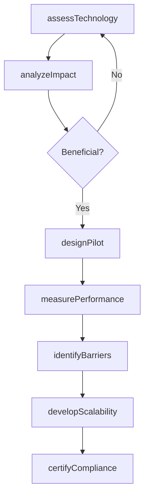
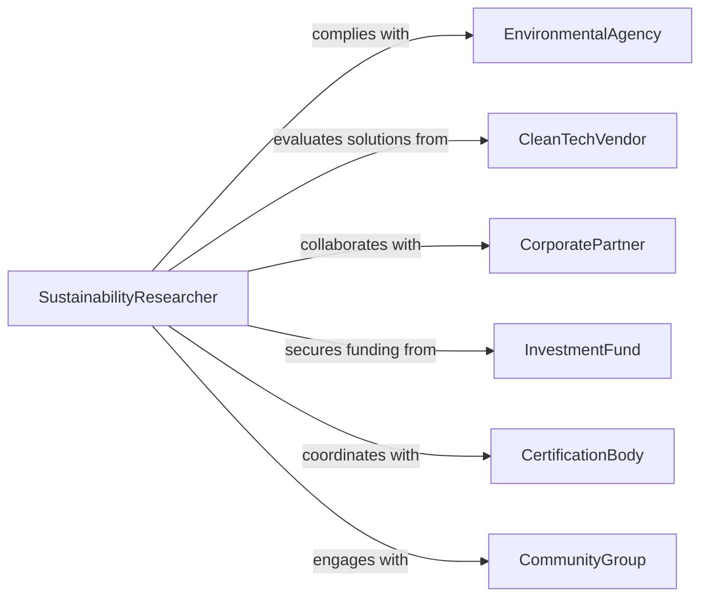

# Research Design Application Green Technologies

> Business-as-Code definition for green technology research. Models investigation of sustainable solutions, renewable energy systems, and environmentally responsible design approaches.

## Overview

Green technology research involves exploring sustainable materials, renewable energy systems, emission reduction techniques, and circular economy principles. This definition exposes actions for technology assessment, environmental impact analysis, pilot testing, and scalability evaluation, with searches for tracking sustainability innovations and adoption pathways.

## Actors

| Actor | Description |
|-------|-------------|
| EnvironmentalAgency | Regulates emissions and sustainability standards |
| CleanTechVendor | Develops and supplies green technology solutions |
| CorporatePartner | Adopts green technologies in operations |
| InvestmentFund | Provides capital for sustainable technology ventures |
| CertificationBody | Verifies environmental claims and standards |
| CommunityGroup | Advocates for sustainable technology adoption |

## Roles

| Role | Description |
|------|-------------|
| SustainabilityResearcher | Investigates green technology opportunities |
| LifecycleAnalyst | Evaluates environmental impact across product lifecycle |
| RenewableEnergySpecialist | Focuses on solar, wind, and alternative energy |
| CircularEconomyDesigner | Develops closed-loop systems and resource recovery |

## Entities

| Entity | Description |
|--------|-------------|
| GreenTechnology | Sustainable solution or environmentally responsible design |
| ImpactAssessment | Analysis of environmental benefits and tradeoffs |
| PilotProject | Small-scale deployment for testing and validation |
| PerformanceMetric | Measurement of sustainability outcomes |
| AdoptionBarrier | Challenge preventing widespread implementation |
| ScalabilityPlan | Strategy for expanding technology deployment |

## Actions

| Action | Description |
|--------|-------------|
| assessTechnology | Evaluate environmental and technical characteristics |
| analyzeImpact | Measure lifecycle environmental effects |
| designPilot | Create small-scale deployment for testing |
| measurePerformance | Track sustainability outcomes and efficiency |
| identifyBarriers | Determine obstacles to adoption |
| developScalability | Create strategies for wider deployment |
| certifyCompliance | Verify adherence to environmental standards |

## Events

| Event | Description |
|-------|-------------|
| technologyAssessed | Green technology characteristics have been evaluated |
| impactAnalyzed | Environmental effects have been measured |
| pilotDesigned | Small-scale deployment has been planned |
| performanceMeasured | Sustainability outcomes have been tracked |
| barriersIdentified | Adoption obstacles have been determined |
| scalabilityDeveloped | Deployment strategies have been created |
| complianceCertified | Environmental standards have been verified |

## Searches

| Search | Description |
|--------|-------------|
| findTechnologies | List green technologies by category or maturity |
| getImpactAssessments | Retrieve environmental analyses by scope |
| getPilotProjects | Access small-scale deployments by status |
| getPerformanceMetrics | View sustainability outcomes by technology |
| getBarriers | Identify adoption obstacles by type |

## Workflow



## Actor Relationships



## Usage

### Calling Actions

```typescript
import { researchDesignApplicationGreenTechnologies } from '@headlessly/research-design-application-green-technologies'

const research = researchDesignApplicationGreenTechnologies()

// Assess a new green technology
const tech = await research.assessTechnology({
  name: 'Algae-Based Bioplastic',
  category: 'sustainable-materials',
  characteristics: {
    biodegradability: 'complete within 90 days',
    renewableContent: 0.95,
    productionEnergy: 'solar-powered'
  }
})

// Analyze environmental impact
const impact = await research.analyzeImpact({
  technologyId: tech.id,
  scope: 'cradle-to-grave',
  metrics: {
    carbonFootprint: -15,
    waterUsage: 0.3,
    landUse: 2.5,
    toxicity: 'minimal'
  }
})

// Design pilot project
await research.designPilot({
  technologyId: tech.id,
  location: 'coastal facility',
  scale: 'small',
  duration: 12,
  partners: ['local-municipality', 'university-lab']
})

// Measure performance
await research.measurePerformance({
  technologyId: tech.id,
  period: 'Q1-2026',
  outcomes: {
    emissionsReduced: 25,
    materialsRecovered: 0.88,
    costPerUnit: 1.2
  }
})
```

### Event-Driven Automation

```typescript
// Alert funding agencies when scalability is developed
research.scalabilityDeveloped(async ({ technologyId, scalabilityPlan }) => {
  await notify({
    to: 'investment-fund',
    template: 'scalability-plan-ready',
    data: { technologyId, plan: scalabilityPlan }
  })
})

// Trigger compliance certification after successful pilot
research.performanceMeasured(async ({ technologyId, outcomes }) => {
  if (outcomes.emissionsReduced > 20) {
    await research.certifyCompliance({ technologyId })
  }
})
```
