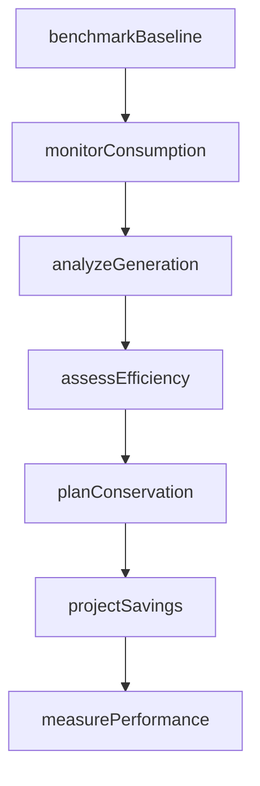
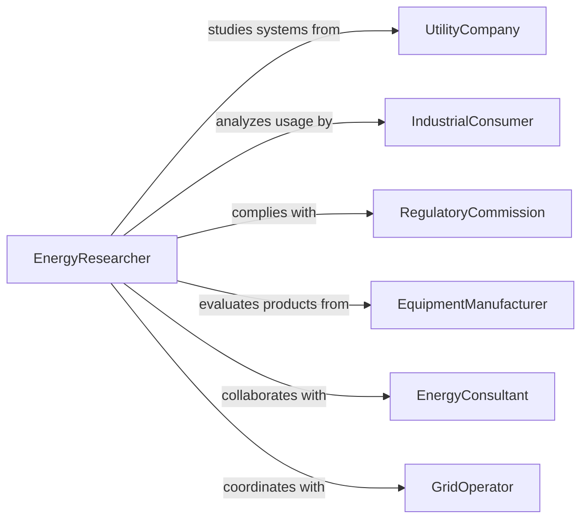

# Research Energy Production Use Conservation

> Business-as-Code definition for energy systems research. Models investigation of generation technologies, consumption patterns, efficiency improvements, and conservation strategies.

## Overview

Energy research involves studying power generation methods, transmission systems, consumption patterns, efficiency technologies, and conservation practices. This definition exposes actions for generation analysis, consumption monitoring, efficiency assessment, and conservation planning, with searches for tracking energy performance and optimization opportunities.

## Actors

| Actor | Description |
|-------|-------------|
| UtilityCompany | Generates and distributes electrical power |
| IndustrialConsumer | Uses significant energy in manufacturing operations |
| RegulatoryCommission | Oversees energy markets and standards |
| EquipmentManufacturer | Produces energy generation and efficiency technologies |
| EnergyConsultant | Advises on optimization and conservation |
| GridOperator | Manages transmission and distribution infrastructure |

## Roles

| Role | Description |
|------|-------------|
| EnergyResearcher | Investigates generation and conservation technologies |
| ConsumptionAnalyst | Studies energy use patterns and trends |
| EfficiencyEngineer | Identifies opportunities for optimization |
| ConservationPlanner | Develops demand reduction strategies |

## Entities

| Entity | Description |
|--------|-------------|
| GenerationSystem | Technology or method for producing energy |
| ConsumptionProfile | Pattern of energy use over time |
| EfficiencyMeasure | Technology or practice that reduces energy use |
| ConservationStrategy | Plan for reducing overall energy demand |
| PerformanceMetric | Measurement of generation or consumption efficiency |
| BaselineStudy | Reference point for measuring improvements |

## Actions

| Action | Description |
|--------|-------------|
| analyzeGeneration | Evaluate power production technologies and performance |
| monitorConsumption | Track energy use patterns across systems |
| assessEfficiency | Identify opportunities for optimization |
| planConservation | Develop strategies to reduce energy demand |
| measurePerformance | Quantify generation or consumption metrics |
| benchmarkBaseline | Establish reference points for comparison |
| projectSavings | Estimate potential reductions from interventions |

## Events

| Event | Description |
|-------|-------------|
| generationAnalyzed | Power production has been evaluated |
| consumptionMonitored | Energy use patterns have been tracked |
| efficiencyAssessed | Optimization opportunities have been identified |
| conservationPlanned | Demand reduction strategies have been developed |
| performanceMeasured | Efficiency metrics have been quantified |
| baselineBenchmarked | Reference points have been established |
| savingsProjected | Potential reductions have been estimated |

## Searches

| Search | Description |
|--------|-------------|
| findGenerationSystems | List power production technologies by type |
| getConsumptionProfiles | Retrieve energy use patterns by facility or period |
| getEfficiencyMeasures | Access optimization technologies by category |
| getConservationStrategies | Find demand reduction plans by sector |
| getPerformanceMetrics | View efficiency measurements by system |

## Workflow



## Actor Relationships



## Usage

### Calling Actions

```typescript
import { researchEnergyProductionUseConservation } from '@headlessly/research-energy-production-use-conservation'

const research = researchEnergyProductionUseConservation()

// Benchmark baseline energy consumption
const baseline = await research.benchmarkBaseline({
  facility: 'Manufacturing Plant A',
  period: '2025',
  consumption: {
    total: 15000000,
    electricity: 12000000,
    naturalGas: 3000000
  },
  costPerKwh: 0.12
})

// Monitor consumption patterns
await research.monitorConsumption({
  facilityId: baseline.facilityId,
  interval: 'hourly',
  duration: 90,
  systems: ['hvac', 'lighting', 'production-equipment', 'compressed-air']
})

// Analyze generation options
await research.analyzeGeneration({
  facilityId: baseline.facilityId,
  technologies: [
    { type: 'rooftop-solar', capacity: 500 },
    { type: 'natural-gas-cogeneration', capacity: 2000 }
  ],
  criteria: ['efficiency', 'cost', 'emissions']
})

// Assess efficiency improvements
const efficiency = await research.assessEfficiency({
  facilityId: baseline.facilityId,
  measures: [
    { category: 'lighting', technology: 'LED-retrofit', cost: 50000 },
    { category: 'hvac', technology: 'variable-speed-drives', cost: 120000 }
  ]
})

// Project savings from conservation
await research.projectSavings({
  facilityId: baseline.facilityId,
  interventions: efficiency.measures,
  timeframe: 10,
  assumedCostIncrease: 0.03
})
```

### Event-Driven Automation

```typescript
// Alert management when significant savings are projected
research.savingsProjected(async ({ facilityId, annualSavings, paybackPeriod }) => {
  if (annualSavings > 100000 && paybackPeriod < 3) {
    await notify({
      to: 'facility-manager',
      template: 'high-value-efficiency-opportunity',
      data: { facilityId, savings: annualSavings, payback: paybackPeriod }
    })
  }
})

// Trigger conservation planning when consumption exceeds baseline
research.consumptionMonitored(async ({ facilityId, currentConsumption, baseline }) => {
  if (currentConsumption > baseline * 1.1) {
    await research.planConservation({ facilityId, urgency: 'high' })
  }
})
```
