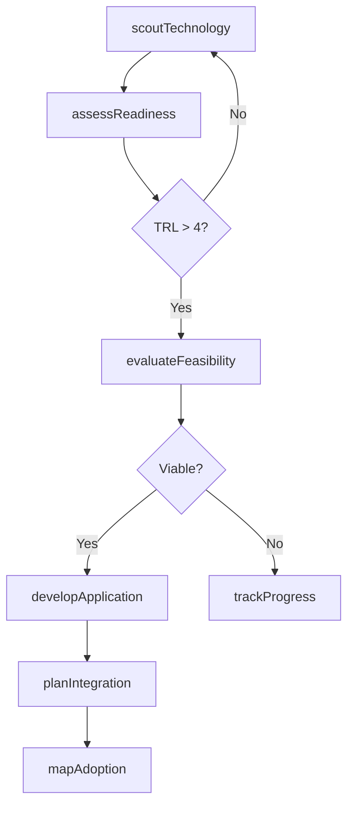
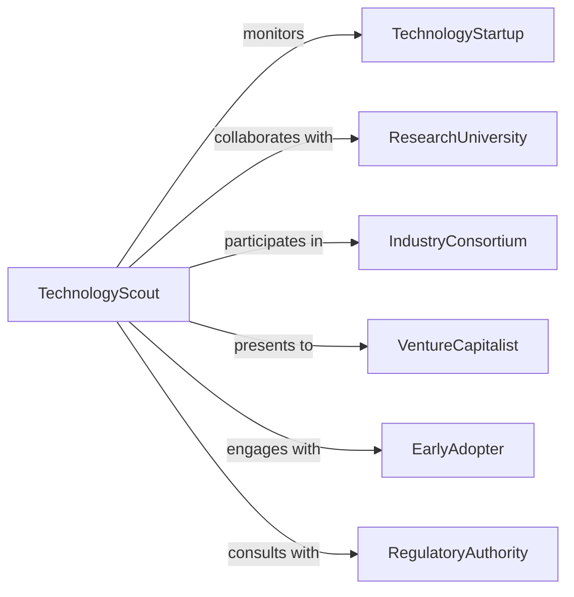

# Research Engineering Applications Emerging Technologies

> Business-as-Code definition for emerging technology research. Models investigation of novel technologies, engineering integration, practical applications, and adoption strategies.

## Overview

Emerging technology research involves identifying nascent innovations, evaluating engineering feasibility, exploring practical applications, and assessing market readiness. This definition exposes actions for technology scouting, feasibility analysis, application development, and adoption planning, with searches for tracking innovation trends and implementation opportunities.

## Actors

| Actor | Description |
|-------|-------------|
| TechnologyStartup | Develops cutting-edge innovations |
| ResearchUniversity | Conducts foundational studies in emerging fields |
| IndustryConsortium | Coordinates technology development and standards |
| VentureCapitalist | Funds early-stage technology ventures |
| EarlyAdopter | Implements emerging technologies in operations |
| RegulatoryAuthority | Establishes safety and compliance frameworks |

## Roles

| Role | Description |
|------|-------------|
| TechnologyScout | Identifies and tracks emerging innovations |
| ApplicationEngineer | Develops practical implementations |
| FeasibilityAnalyst | Evaluates technical and commercial viability |
| AdoptionStrategist | Plans technology integration and rollout |

## Entities

| Entity | Description |
|--------|-------------|
| EmergingTechnology | Novel innovation in early stages of development |
| FeasibilityAssessment | Analysis of technical and economic viability |
| ApplicationScenario | Practical use case for technology |
| IntegrationPlan | Strategy for incorporating technology into systems |
| ReadinessLevel | Maturity assessment based on TRL framework |
| AdoptionRoadmap | Timeline for technology implementation |

## Actions

| Action | Description |
|--------|-------------|
| scoutTechnology | Identify and track emerging innovations |
| evaluateFeasibility | Assess technical and commercial viability |
| developApplication | Create practical use cases and implementations |
| assessReadiness | Determine technology maturity level |
| planIntegration | Design strategy for incorporating technology |
| mapAdoption | Create timeline for implementation |
| trackProgress | Monitor technology development and adoption |

## Events

| Event | Description |
|-------|-------------|
| technologyScouted | Emerging innovation has been identified |
| feasibilityEvaluated | Viability assessment has been completed |
| applicationDeveloped | Practical use case has been created |
| readinessAssessed | Maturity level has been determined |
| integrationPlanned | Incorporation strategy has been designed |
| adoptionMapped | Implementation timeline has been created |
| progressTracked | Development status has been updated |

## Searches

| Search | Description |
|--------|-------------|
| findTechnologies | List emerging innovations by field or maturity |
| getFeasibilityAssessments | Retrieve viability analyses by criteria |
| getApplicationScenarios | Access use cases by industry or complexity |
| getIntegrationPlans | Find incorporation strategies by timeline |
| getReadinessLevels | View maturity assessments by technology |

## Workflow



## Actor Relationships



## Usage

### Calling Actions

```typescript
import { researchEngineeringApplicationsEmergingTechnologies } from '@headlessly/research-engineering-applications-emerging-technologies'

const research = researchEngineeringApplicationsEmergingTechnologies()

// Scout a new emerging technology
const tech = await research.scoutTechnology({
  name: 'Quantum Computing for Optimization',
  field: 'quantum-information',
  source: 'MIT-IBM Watson AI Lab',
  discoveryDate: '2026-01-15',
  potentialImpact: 'high'
})

// Assess technology readiness
const readiness = await research.assessReadiness({
  technologyId: tech.id,
  trl: 5,
  criteria: {
    componentValidation: true,
    subsystemIntegration: false,
    systemPrototype: false
  }
})

// Evaluate feasibility for engineering application
await research.evaluateFeasibility({
  technologyId: tech.id,
  technical: {
    maturity: 'laboratory-proven',
    complexity: 'high',
    dependencies: ['cryogenic-systems', 'quantum-error-correction']
  },
  commercial: {
    costEstimate: 5000000,
    timeToMarket: 36,
    competitiveLandscape: 'emerging'
  }
})

// Develop application scenario
await research.developApplication({
  technologyId: tech.id,
  useCase: 'supply-chain-optimization',
  domain: 'logistics',
  expectedBenefit: 'reduce routing costs by 30%',
  constraints: ['hardware-availability', 'algorithm-development']
})

// Plan integration strategy
await research.planIntegration({
  technologyId: tech.id,
  approach: 'phased-pilot',
  phases: [
    { name: 'proof-of-concept', duration: 6 },
    { name: 'limited-deployment', duration: 12 },
    { name: 'full-production', duration: 18 }
  ]
})
```

### Event-Driven Automation

```typescript
// Alert stakeholders when high-impact technology is scouted
research.technologyScouted(async ({ technologyId, potentialImpact }) => {
  if (potentialImpact === 'high') {
    await notify({
      to: ['venture-capital', 'industry-consortium'],
      template: 'high-impact-technology-identified',
      data: { technologyId }
    })
  }
})

// Trigger integration planning when application is developed
research.applicationDeveloped(async ({ technologyId, expectedBenefit }) => {
  const feasibility = await research.getFeasibilityAssessments({ technologyId })
  if (feasibility.commercial.timeToMarket < 48) {
    await research.planIntegration({ technologyId })
  }
})
```
