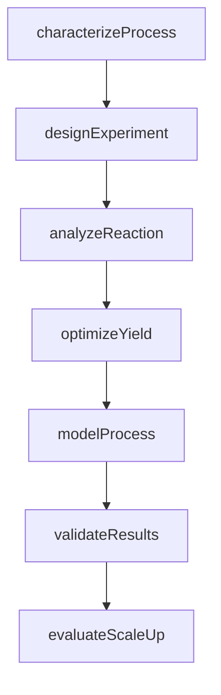
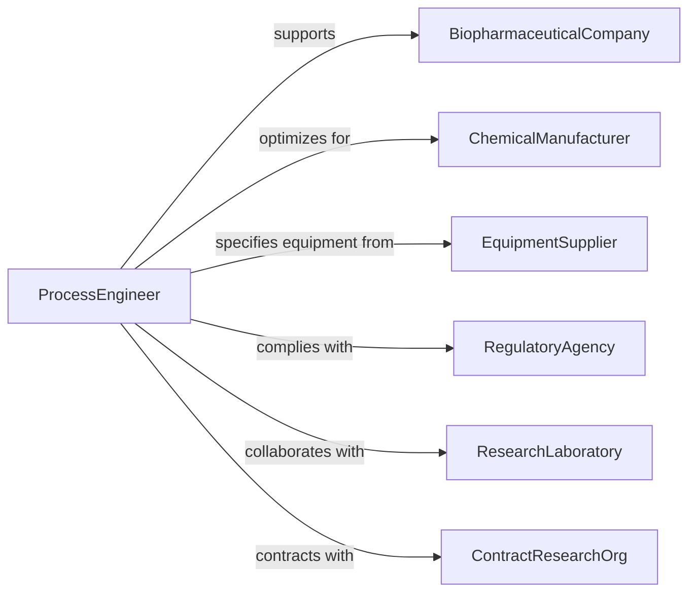

# Research Engineering Aspects Biological Chemical

> Business-as-Code definition for bioprocess and chemical engineering research. Models investigation of biological systems, chemical reactions, process optimization, and scale-up strategies.

## Overview

Bioprocess and chemical engineering research involves studying enzymatic reactions, fermentation systems, chemical synthesis pathways, reactor design, and process optimization. This definition exposes actions for process characterization, reaction analysis, scale-up planning, and optimization, with searches for tracking experimental results and performance metrics.

## Actors

| Actor | Description |
|-------|-------------|
| BiopharmaceuticalCompany | Develops therapeutic products using bioprocesses |
| ChemicalManufacturer | Produces chemicals through synthesis or fermentation |
| EquipmentSupplier | Provides reactors, separators, and process control systems |
| RegulatoryAgency | Enforces safety and environmental standards |
| ResearchLaboratory | Conducts fundamental studies in biochemical engineering |
| ContractResearchOrg | Provides specialized testing and analysis services |

## Roles

| Role | Description |
|------|-------------|
| ProcessEngineer | Designs and optimizes bioprocess and chemical systems |
| BiochemicalResearcher | Investigates enzymatic and metabolic pathways |
| ReactionKineticist | Studies reaction rates and mechanisms |
| ScaleUpSpecialist | Translates lab processes to production scale |

## Entities

| Entity | Description |
|--------|-------------|
| BioProcess | Biological system for producing molecules or materials |
| ChemicalReaction | Transformation of reactants to products |
| ProcessParameter | Operating condition affecting yield or purity |
| ExperimentalRun | Controlled test of process conditions |
| YieldOptimization | Strategy for maximizing product output |
| ScaleUpPlan | Approach for transitioning from lab to production |

## Actions

| Action | Description |
|--------|-------------|
| characterizeProcess | Define biological or chemical system parameters |
| analyzeReaction | Study kinetics, thermodynamics, and mechanisms |
| optimizeYield | Identify conditions maximizing product output |
| designExperiment | Plan controlled tests of process variables |
| evaluateScaleUp | Assess feasibility of production-scale implementation |
| modelProcess | Create computational representation of system |
| validateResults | Confirm reproducibility and statistical significance |

## Events

| Event | Description |
|-------|-------------|
| processCharacterized | System parameters have been defined |
| reactionAnalyzed | Kinetics and mechanisms have been studied |
| yieldOptimized | Conditions maximizing output have been identified |
| experimentDesigned | Controlled tests have been planned |
| scaleUpEvaluated | Production feasibility has been assessed |
| processModeled | Computational representation has been created |
| resultsValidated | Reproducibility has been confirmed |

## Searches

| Search | Description |
|--------|-------------|
| findProcesses | List biological or chemical systems by application |
| getExperimentalRuns | Retrieve test data by conditions or date |
| getYieldOptimizations | Access maximization strategies by product |
| getScaleUpPlans | Find production transition approaches |
| getProcessModels | View computational representations by accuracy |

## Workflow



## Actor Relationships



## Usage

### Calling Actions

```typescript
import { researchEngineeringAspectsBiologicalChemical } from '@headlessly/research-engineering-aspects-biological-chemical'

const research = researchEngineeringAspectsBiologicalChemical()

// Characterize a fermentation process
const process = await research.characterizeProcess({
  name: 'Recombinant Protein Production',
  type: 'microbial-fermentation',
  organism: 'E. coli BL21',
  product: 'therapeutic-enzyme',
  parameters: {
    temperature: { min: 35, max: 39, optimal: 37 },
    pH: { min: 6.8, max: 7.2, optimal: 7.0 },
    dissolvedOxygen: { min: 30, optimal: 40 }
  }
})

// Design experiments to optimize yield
await research.designExperiment({
  processId: process.id,
  methodology: 'response-surface',
  factors: [
    { name: 'inducer-concentration', levels: [0.1, 0.5, 1.0] },
    { name: 'induction-temperature', levels: [30, 35, 40] },
    { name: 'harvest-time', levels: [4, 6, 8] }
  ],
  replicates: 3
})

// Analyze reaction kinetics
await research.analyzeReaction({
  processId: process.id,
  type: 'enzyme-catalyzed',
  kinetics: {
    vmax: 12.5,
    km: 2.3,
    ki: 0.8
  },
  mechanism: 'michaelis-menten'
})

// Optimize yield based on experimental results
const optimization = await research.optimizeYield({
  processId: process.id,
  targetMetric: 'volumetric-productivity',
  constraints: {
    maxSubstrateCost: 150,
    minProductPurity: 0.95
  },
  optimalConditions: {
    inducerConcentration: 0.5,
    inductionTemperature: 35,
    harvestTime: 6
  }
})

// Evaluate scale-up to production
await research.evaluateScaleUp({
  processId: process.id,
  currentScale: 2,
  targetScale: 2000,
  considerations: ['oxygen-transfer', 'mixing-time', 'cooling-capacity']
})
```

### Event-Driven Automation

```typescript
// Alert team when yield optimization is complete
research.yieldOptimized(async ({ processId, targetMetric, improvement }) => {
  if (improvement > 0.2) {
    await notify({
      to: 'process-development-team',
      template: 'significant-yield-improvement',
      data: { processId, metric: targetMetric, improvement }
    })
  }
})

// Trigger scale-up evaluation when results are validated
research.resultsValidated(async ({ processId, reproducibility }) => {
  if (reproducibility > 0.95) {
    await research.evaluateScaleUp({ processId })
  }
})
```
