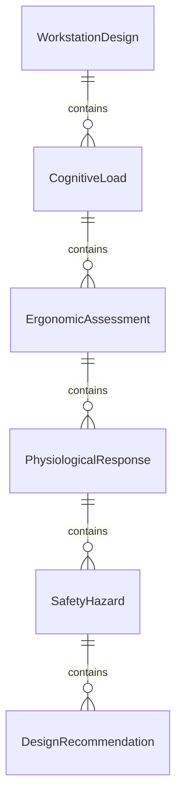
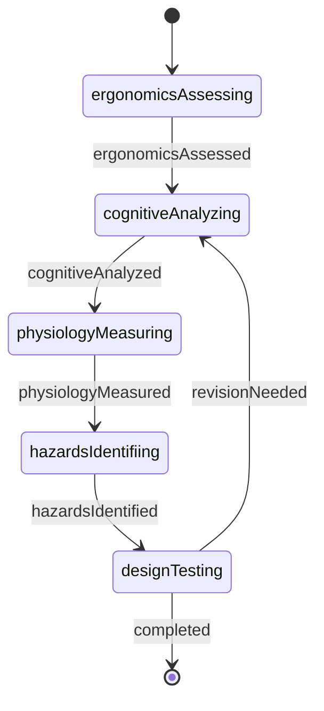
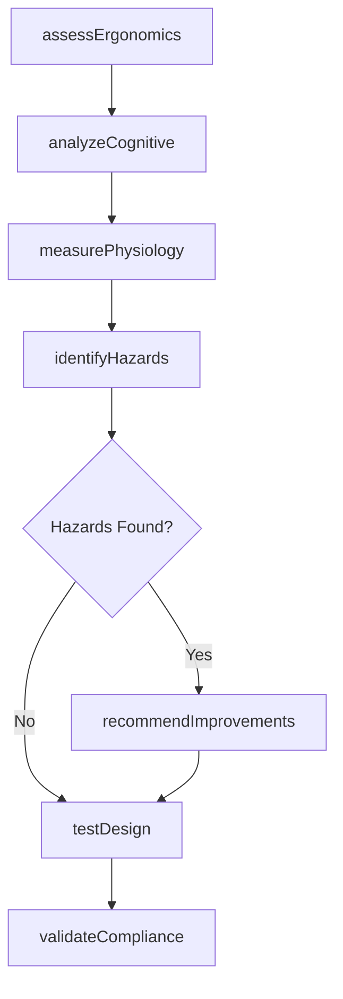
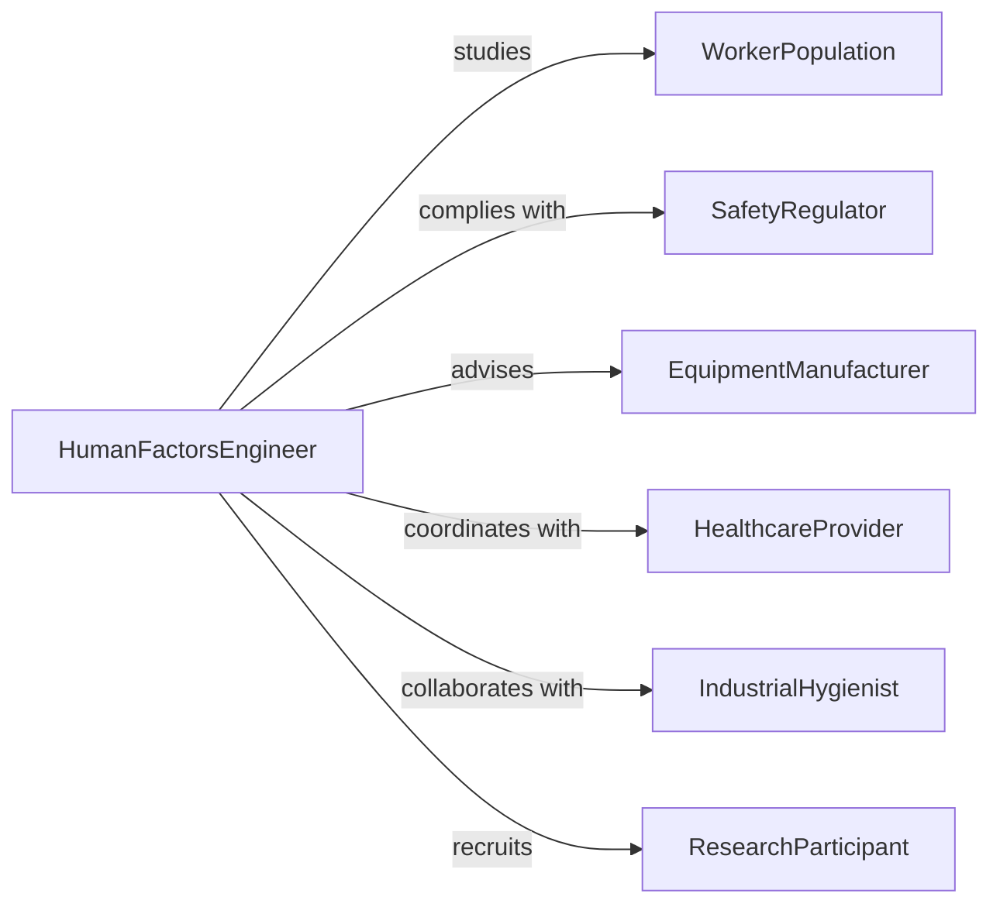

# Research Human Performance Health Factors

> Business-as-Code definition for human factors engineering research. Models investigation of ergonomics, cognitive load, physiological responses, and safety considerations in design.

## Overview

Human factors research involves studying how people interact with systems, equipment, and environments to optimize safety, performance, and well-being. This definition exposes actions for ergonomic assessment, cognitive analysis, physiological testing, and design validation, with searches for tracking human performance data and improvement opportunities.

## Actors

| Actor | Description |
|-------|-------------|
| WorkerPopulation | Employees who use equipment or operate systems |
| SafetyRegulator | Enforces workplace health and safety standards |
| EquipmentManufacturer | Produces tools, machinery, and workstations |
| HealthcareProvider | Treats work-related injuries and conditions |
| IndustrialHygienist | Assesses workplace environmental hazards |
| ResearchParticipant | Volunteers for human factors studies |

## Roles

| Role | Description |
|------|-------------|
| HumanFactorsEngineer | Designs systems optimized for human use |
| ErgonomicsSpecialist | Evaluates physical workspace design |
| CognitiveEngineer | Analyzes mental workload and decision-making |
| PhysiologistResearcher | Studies biological responses to work conditions |

## Entities

| Entity | Description |
|--------|-------------|
| WorkstationDesign | Physical layout of workspace and equipment |
| CognitiveLoad | Mental effort required for task performance |
| ErgonomicAssessment | Evaluation of physical interaction with systems |
| PhysiologicalResponse | Biological reaction to work conditions |
| SafetyHazard | Risk factor for injury or health impact |
| DesignRecommendation | Proposed improvement based on research |

## Actions

| Action | Description |
|--------|-------------|
| assessErgonomics | Evaluate physical workspace and equipment design |
| analyzeCognitive | Study mental workload and information processing |
| measurePhysiology | Track biological responses to work conditions |
| identifyHazards | Detect risks for injury or health impact |
| testDesign | Validate human-system interaction |
| recommendImprovements | Propose design changes based on findings |
| validateCompliance | Verify adherence to safety standards |

## Events

| Event | Description |
|-------|-------------|
| ergonomicsAssessed | Physical workspace has been evaluated |
| cognitiveAnalyzed | Mental workload has been studied |
| physiologyMeasured | Biological responses have been tracked |
| hazardsIdentified | Risks have been detected |
| designTested | Human-system interaction has been validated |
| improvementsRecommended | Design changes have been proposed |
| complianceValidated | Safety standards adherence has been verified |

## Searches

| Search | Description |
|--------|-------------|
| findAssessments | List ergonomic evaluations by workspace or date |
| getCognitiveLoads | Retrieve mental workload measurements by task |
| getPhysiologicalData | Access biological response data by condition |
| getHazards | Find identified risks by severity or type |
| getRecommendations | View proposed improvements by priority |

## Entity Relationships



## State Diagram



## Workflow



## Actor Relationships



## Usage

### Calling Actions

```typescript
import { researchHumanPerformanceHealthFactors } from '@headlessly/research-human-performance-health-factors'

const research = researchHumanPerformanceHealthFactors()

// Assess ergonomics of manufacturing workstation
const assessment = await research.assessErgonomics({
  workstation: 'Assembly Line Station 12',
  population: 'production-workers',
  measurements: {
    reachDistance: { max: 45, actual: 62 },
    liftingHeight: { optimal: 90, actual: 30 },
    repetitiveMotions: { perHour: 480 },
    posture: 'prolonged-standing'
  }
})

// Analyze cognitive load for control panel operators
await research.analyzeCognitive({
  task: 'process-control-monitoring',
  participants: 15,
  metrics: {
    informationDensity: 'high',
    decisionFrequency: 12,
    attentionDuration: 120,
    errorRate: 0.03
  },
  workload: 'moderate-to-high'
})

// Measure physiological responses to environmental conditions
await research.measurePhysiology({
  environment: 'foundry-floor',
  conditions: {
    temperature: 38,
    humidity: 0.65,
    noise: 92
  },
  responses: {
    heartRate: { baseline: 72, working: 105 },
    coreTempIncrease: 1.2,
    sweatRate: 1.5
  }
})

// Identify safety hazards
const hazards = await research.identifyHazards({
  workstationId: assessment.id,
  risks: [
    { type: 'musculoskeletal', severity: 'high', area: 'lower-back' },
    { type: 'repetitive-strain', severity: 'moderate', area: 'wrist' },
    { type: 'heat-stress', severity: 'moderate', area: 'cardiovascular' }
  ]
})

// Recommend improvements
await research.recommendImprovements({
  workstationId: assessment.id,
  recommendations: [
    { category: 'workstation-redesign', description: 'adjust work surface height', priority: 'high' },
    { category: 'equipment', description: 'provide anti-fatigue matting', priority: 'moderate' },
    { category: 'process', description: 'implement rotation schedule', priority: 'high' }
  ]
})
```

### Event-Driven Automation

```typescript
// Alert safety team when high-severity hazards are identified
research.hazardsIdentified(async ({ workstationId, risks }) => {
  const highSeverity = risks.filter(r => r.severity === 'high')
  if (highSeverity.length > 0) {
    await notify({
      to: 'safety-team',
      template: 'high-severity-hazards-detected',
      data: { workstationId, hazards: highSeverity }
    })
  }
})

// Trigger compliance validation after improvements are recommended
research.improvementsRecommended(async ({ workstationId, recommendations }) => {
  const implemented = recommendations.filter(r => r.status === 'implemented')
  if (implemented.length === recommendations.length) {
    await research.validateCompliance({ workstationId })
  }
})
```
