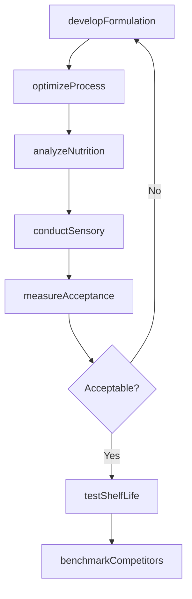
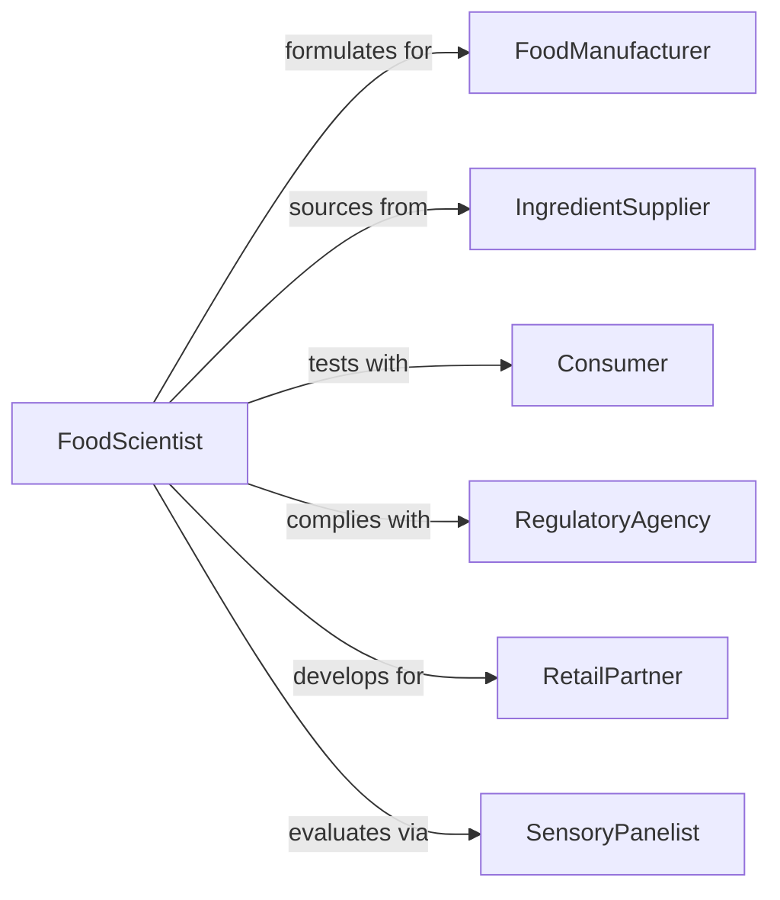

# Research Methods Improve Food Products

> Business-as-Code definition for food product research. Models investigation of formulation, processing, preservation, sensory characteristics, and nutritional enhancement.

## Overview

Food product research involves developing improved formulations, optimizing processing methods, extending shelf life, enhancing sensory appeal, and improving nutritional profiles. This definition exposes actions for formulation testing, process optimization, sensory evaluation, and nutritional analysis, with searches for tracking product improvements and consumer acceptance.

## Actors

| Actor | Description |
|-------|-------------|
| FoodManufacturer | Produces consumer food products at scale |
| IngredientSupplier | Provides raw materials and functional additives |
| Consumer | Purchases and evaluates food products |
| RegulatoryAgency | Enforces food safety and labeling standards |
| RetailPartner | Distributes products through stores or online |
| SensoryPanelist | Evaluates taste, texture, and appearance |

## Roles

| Role | Description |
|------|-------------|
| FoodScientist | Develops and optimizes product formulations |
| ProcessEngineer | Designs and improves manufacturing methods |
| SensoryAnalyst | Conducts consumer and expert taste testing |
| NutritionalBiochemist | Enhances nutritional content and bioavailability |

## Entities

| Entity | Description |
|--------|-------------|
| ProductFormulation | Recipe and ingredient specifications |
| ProcessMethod | Manufacturing technique and parameters |
| SensoryProfile | Taste, texture, aroma, and appearance characteristics |
| NutritionalAnalysis | Macro and micronutrient content |
| ShelfLifeStudy | Evaluation of product stability over time |
| ConsumerAcceptance | Market testing results and feedback |

## Actions

| Action | Description |
|--------|-------------|
| developFormulation | Create or modify product recipe and ingredients |
| optimizeProcess | Improve manufacturing methods and parameters |
| conductSensory | Perform taste, texture, and appearance evaluation |
| analyzeNutrition | Assess macro and micronutrient content |
| testShelfLife | Evaluate product stability and quality retention |
| measureAcceptance | Gather consumer feedback and preferences |
| benchmarkCompetitors | Compare product to market alternatives |

## Events

| Event | Description |
|-------|-------------|
| formulationDeveloped | Recipe has been created or modified |
| processOptimized | Manufacturing method has been improved |
| sensoryyConducted | Evaluation has been performed |
| nutritionAnalyzed | Nutrient content has been assessed |
| shelfLifeTested | Stability evaluation has been completed |
| acceptanceMeasured | Consumer feedback has been gathered |
| competitorsBenchmarked | Market comparison has been completed |

## Searches

| Search | Description |
|--------|-------------|
| findFormulations | List product recipes by category or version |
| getProcessMethods | Retrieve manufacturing techniques by efficiency |
| getSensoryProfiles | Access taste and texture data by product |
| getNutritionalAnalyses | View nutrient content by product or ingredient |
| getAcceptanceData | Find consumer feedback by demographic |

## Workflow



## Actor Relationships



## Usage

### Calling Actions

```typescript
import { researchMethodsImproveFoodProducts } from '@headlessly/research-methods-improve-food-products'

const research = researchMethodsImproveFoodProducts()

// Develop new product formulation
const formulation = await research.developFormulation({
  productName: 'Plant-Based Protein Bar',
  category: 'snack-bar',
  ingredients: [
    { name: 'pea-protein-isolate', percentage: 25 },
    { name: 'almond-butter', percentage: 20 },
    { name: 'dates', percentage: 30 },
    { name: 'dark-chocolate', percentage: 15 },
    { name: 'sea-salt', percentage: 0.5 }
  ],
  targetAttributes: ['high-protein', 'low-sugar', 'allergen-friendly']
})

// Optimize processing method
await research.optimizeProcess({
  formulationId: formulation.id,
  method: 'cold-press',
  parameters: {
    pressure: 3000,
    temperature: 18,
    formingTime: 45
  },
  objectives: ['maintain-nutrient-integrity', 'improve-texture', 'increase-throughput']
})

// Conduct sensory evaluation
const sensory = await research.conductSensory({
  formulationId: formulation.id,
  panelType: 'trained',
  participants: 25,
  attributes: {
    taste: { sweetness: 6.5, bitterness: 2.0 },
    texture: { chewiness: 7.0, crumbliness: 3.5 },
    appearance: { color: 'dark-brown', uniformity: 8.0 }
  }
})

// Analyze nutritional content
await research.analyzeNutrition({
  formulationId: formulation.id,
  perServing: {
    calories: 220,
    protein: 15,
    carbohydrates: 20,
    fiber: 5,
    sugar: 8,
    fat: 10
  },
  micronutrients: { iron: 3.2, calcium: 120, vitaminE: 4.5 }
})

// Measure consumer acceptance
await research.measureAcceptance({
  formulationId: formulation.id,
  sampleSize: 300,
  demographics: ['health-conscious', 'active-lifestyle'],
  overallLiking: 7.8,
  purchaseIntent: 0.72
})
```

### Event-Driven Automation

```typescript
// Alert product team when consumer acceptance is high
research.acceptanceMeasured(async ({ formulationId, overallLiking, purchaseIntent }) => {
  if (overallLiking > 7.5 && purchaseIntent > 0.7) {
    await notify({
      to: 'product-development-team',
      template: 'high-consumer-acceptance',
      data: { formulationId, liking: overallLiking, intent: purchaseIntent }
    })
  }
})

// Trigger shelf life testing when process is optimized
research.processOptimized(async ({ formulationId, objectives }) => {
  const allObjectivesMet = objectives.every(o => o.status === 'achieved')
  if (allObjectivesMet) {
    await research.testShelfLife({ formulationId })
  }
})
```
