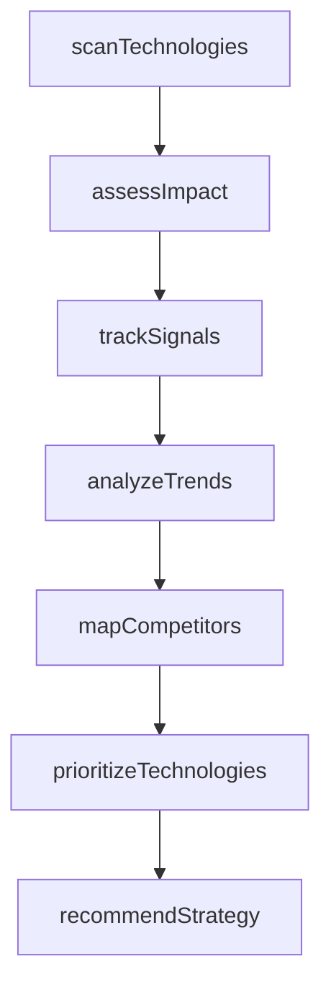
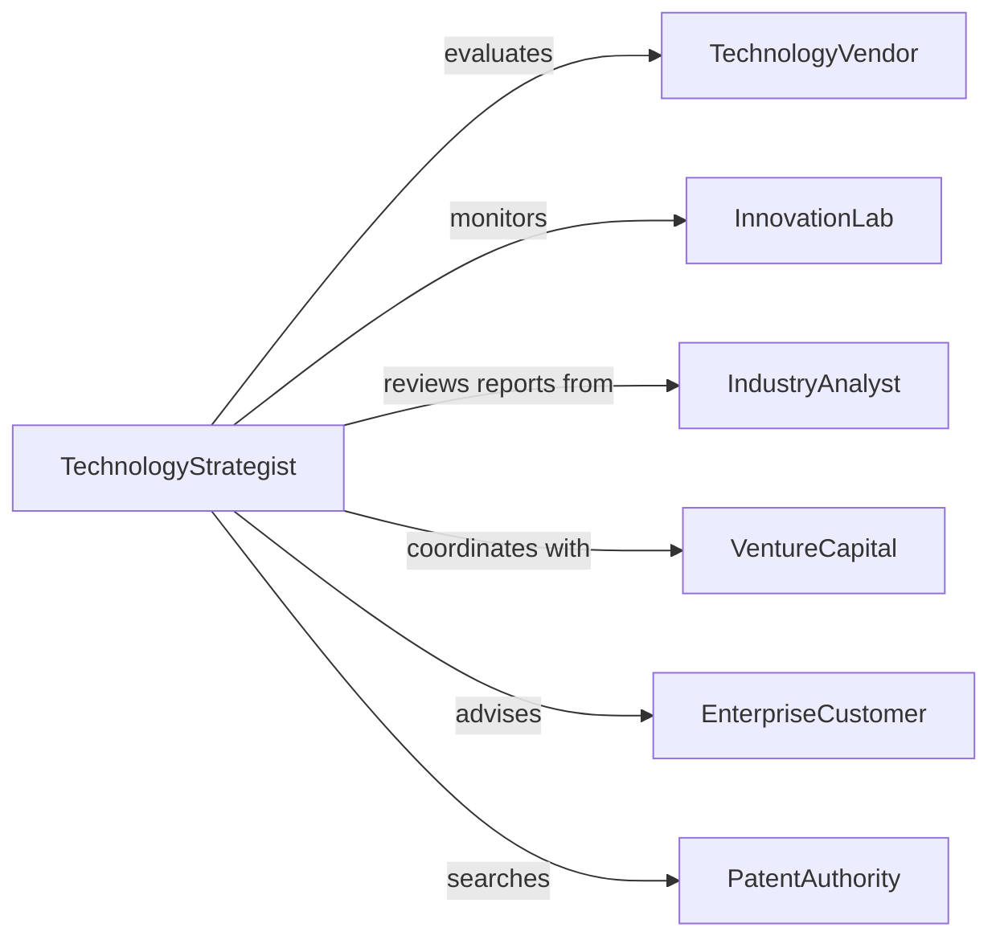

# Research New Technologies

> Business-as-Code definition for technology research. Models identification, evaluation, tracking, and strategic assessment of emerging innovations across all domains.

## Overview

New technology research involves systematically monitoring innovation landscapes, evaluating disruptive potential, assessing adoption readiness, and tracking competitive positioning. This definition exposes actions for technology scanning, impact assessment, trend analysis, and strategic recommendations, with searches for tracking innovation signals and investment opportunities.

## Actors

| Actor | Description |
|-------|-------------|
| TechnologyVendor | Develops and commercializes new innovations |
| InnovationLab | Conducts experimental research in emerging fields |
| IndustryAnalyst | Publishes reports on technology trends and markets |
| VentureCapital | Invests in early-stage technology companies |
| EnterpriseCustomer | Evaluates technologies for business adoption |
| PatentAuthority | Documents and protects intellectual property |

## Roles

| Role | Description |
|------|-------------|
| TechnologyStrategist | Guides organizational technology investment decisions |
| InnovationScout | Monitors and identifies emerging technologies |
| TrendAnalyst | Studies technology adoption patterns and trajectories |
| CompetitiveAnalyst | Tracks competitor technology capabilities |

## Entities

| Entity | Description |
|--------|-------------|
| Technology | Innovation with potential business or technical impact |
| TrendReport | Analysis of technology adoption patterns |
| ImpactAssessment | Evaluation of technology's disruptive potential |
| AdoptionSignal | Indicator of market readiness or uptake |
| CompetitiveLandscape | Overview of technology capabilities by organization |
| StrategicRecommendation | Guidance on technology investment or adoption |

## Actions

| Action | Description |
|--------|-------------|
| scanTechnologies | Monitor innovation sources for new developments |
| assessImpact | Evaluate disruptive potential and business value |
| analyzeTrends | Study adoption patterns and market trajectories |
| trackSignals | Monitor indicators of technology maturation |
| mapCompetitors | Assess technology capabilities across organizations |
| recommendStrategy | Provide guidance on investment or adoption |
| prioritizeTechnologies | Rank innovations by strategic importance |

## Events

| Event | Description |
|-------|-------------|
| technologiesScanned | Innovation sources have been monitored |
| impactAssessed | Disruptive potential has been evaluated |
| trendsAnalyzed | Adoption patterns have been studied |
| signalsTracked | Maturation indicators have been monitored |
| competitorsMapped | Capabilities have been assessed |
| strategyRecommended | Investment guidance has been provided |
| technologiesPrioritized | Innovations have been ranked |

## Searches

| Search | Description |
|--------|-------------|
| findTechnologies | List innovations by domain or maturity stage |
| getImpactAssessments | Retrieve evaluations by disruptive potential |
| getTrendReports | Access adoption analyses by industry |
| getAdoptionSignals | View maturation indicators by technology |
| getRecommendations | Find strategic guidance by priority |

## Workflow



## Actor Relationships



## Usage

### Calling Actions

```typescript
import { researchNewTechnologies } from '@headlessly/research-new-technologies'

const research = researchNewTechnologies()

// Scan for new technologies across multiple domains
const scan = await research.scanTechnologies({
  domains: ['artificial-intelligence', 'quantum-computing', 'biotechnology'],
  sources: [
    { type: 'patent-database', regions: ['US', 'EU', 'CN'] },
    { type: 'academic-journal', databases: ['ArXiv', 'Nature', 'Science'] },
    { type: 'startup-directory', platforms: ['Crunchbase', 'AngelList'] }
  ],
  timeframe: '2026-Q1'
})

// Assess impact of identified technologies
await research.assessImpact({
  technologyId: 'tech-ai-142',
  name: 'Multimodal Foundation Models',
  dimensions: {
    disruptivePotential: 'high',
    timeToMainstream: 24,
    marketSize: 85000000000,
    competitiveAdvantage: 'moderate-to-high'
  }
})

// Track adoption signals
await research.trackSignals({
  technologyId: 'tech-ai-142',
  signals: [
    { type: 'funding-round', amount: 200000000, stage: 'series-C' },
    { type: 'enterprise-pilot', count: 45, industries: ['finance', 'healthcare'] },
    { type: 'patent-filing', count: 120, jurisdictions: ['US', 'EU'] },
    { type: 'academic-citation', count: 3500, yearOverYear: 2.8 }
  ]
})

// Analyze market trends
const trends = await research.analyzeTrends({
  technologyCategory: 'generative-ai',
  period: '2024-2026',
  metrics: {
    adoptionRate: 0.35,
    investmentGrowth: 1.8,
    enterpriseDeployments: 8500,
    revenueGrowth: 2.2
  }
})

// Map competitive landscape
await research.mapCompetitors({
  technologyId: 'tech-ai-142',
  competitors: [
    { organization: 'BigTech-A', capability: 'leader', investment: 'high' },
    { organization: 'Startup-B', capability: 'innovator', investment: 'moderate' },
    { organization: 'Enterprise-C', capability: 'follower', investment: 'low' }
  ]
})

// Recommend strategy based on analysis
await research.recommendStrategy({
  technologyId: 'tech-ai-142',
  recommendation: 'strategic-investment',
  rationale: 'high disruptive potential with moderate time to mainstream',
  actions: ['pilot-deployment', 'partnership-exploration', 'talent-acquisition'],
  timeline: 18
})
```

### Event-Driven Automation

```typescript
// Alert executives when high-impact technology is identified
research.impactAssessed(async ({ technologyId, dimensions }) => {
  if (dimensions.disruptivePotential === 'high' && dimensions.timeToMainstream < 36) {
    await notify({
      to: 'executive-team',
      template: 'high-impact-technology-identified',
      data: { technologyId, impact: dimensions }
    })
  }
})

// Trigger competitive mapping when strong adoption signals detected
research.signalsTracked(async ({ technologyId, signals }) => {
  const strongSignals = signals.filter(s =>
    (s.type === 'enterprise-pilot' && s.count > 30) ||
    (s.type === 'funding-round' && s.amount > 100000000)
  )
  if (strongSignals.length > 0) {
    await research.mapCompetitors({ technologyId })
  }
})
```
