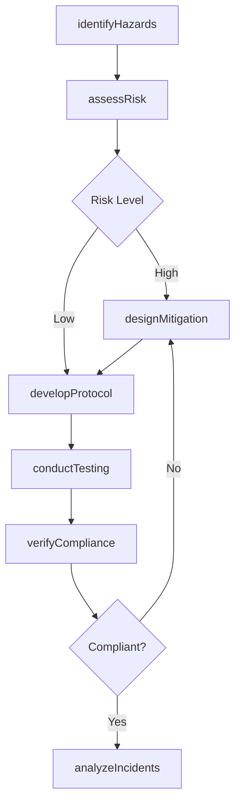
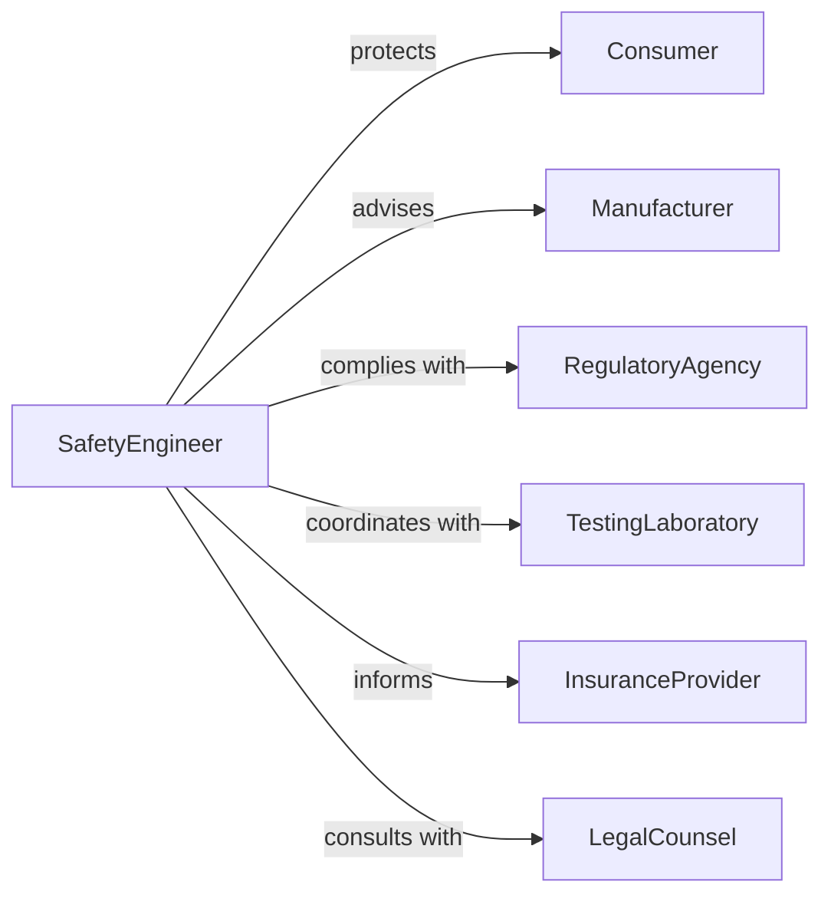

# Research Product Safety

> Business-as-Code definition for product safety research. Models investigation of hazards, testing protocols, risk mitigation, regulatory compliance, and incident analysis.

## Overview

Product safety research involves identifying potential hazards, conducting safety testing, evaluating risk mitigation measures, ensuring regulatory compliance, and analyzing incidents. This definition exposes actions for hazard identification, safety testing, risk assessment, and compliance verification, with searches for tracking safety data and improvement opportunities.

## Actors

| Actor | Description |
|-------|-------------|
| Consumer | End user exposed to product risks |
| Manufacturer | Produces and distributes products to market |
| RegulatoryAgency | Enforces product safety standards and recalls |
| TestingLaboratory | Conducts independent safety evaluations |
| InsuranceProvider | Assesses liability and coverage for products |
| LegalCounsel | Advises on safety compliance and liability |

## Roles

| Role | Description |
|------|-------------|
| SafetyEngineer | Designs safety features and mitigation strategies |
| TestingCoordinator | Manages safety evaluation protocols |
| RiskAnalyst | Assesses probability and severity of hazards |
| RegulatorySpecialist | Ensures compliance with safety standards |

## Entities

| Entity | Description |
|--------|-------------|
| SafetyHazard | Potential source of harm to users or environment |
| TestProtocol | Standardized procedure for safety evaluation |
| RiskAssessment | Analysis of hazard probability and severity |
| MitigationStrategy | Design or process change to reduce risk |
| ComplianceReport | Documentation of regulatory adherence |
| IncidentRecord | Documentation of safety failures or injuries |

## Actions

| Action | Description |
|--------|-------------|
| identifyHazards | Detect potential sources of harm in product design |
| developProtocol | Create standardized safety testing procedures |
| conductTesting | Execute safety evaluations under controlled conditions |
| assessRisk | Analyze probability and severity of hazards |
| designMitigation | Create strategies to reduce or eliminate risks |
| verifyCompliance | Confirm adherence to regulatory standards |
| analyzeIncidents | Investigate safety failures and root causes |

## Events

| Event | Description |
|-------|-------------|
| hazardsIdentified | Potential harms have been detected |
| protocolDeveloped | Testing procedures have been created |
| testingConducted | Safety evaluations have been executed |
| riskAssessed | Hazard severity has been analyzed |
| mitigationDesigned | Risk reduction strategies have been created |
| complianceVerified | Regulatory adherence has been confirmed |
| incidentsAnalyzed | Safety failures have been investigated |

## Searches

| Search | Description |
|--------|-------------|
| findHazards | List potential harms by product or severity |
| getTestProtocols | Retrieve evaluation procedures by standard |
| getRiskAssessments | Access hazard analyses by probability or impact |
| getMitigationStrategies | Find risk reduction approaches by effectiveness |
| getIncidentRecords | View safety failures by product or date |

## Workflow



## Actor Relationships



## Usage

### Calling Actions

```typescript
import { researchProductSafety } from '@headlessly/research-product-safety'

const research = researchProductSafety()

// Identify hazards in new product design
const hazards = await research.identifyHazards({
  productId: 'prod-smart-appliance-440',
  category: 'consumer-electronics',
  hazards: [
    { type: 'electrical-shock', source: 'exposed-contacts', severity: 'high' },
    { type: 'thermal-burn', source: 'heating-element', severity: 'moderate' },
    { type: 'mechanical-injury', source: 'moving-parts', severity: 'low' }
  ]
})

// Assess risk for each identified hazard
await research.assessRisk({
  productId: 'prod-smart-appliance-440',
  hazardId: hazards.hazards[0].id,
  analysis: {
    probability: 'rare',
    severity: 'serious-injury',
    riskScore: 12,
    riskLevel: 'moderate'
  }
})

// Design mitigation strategies
const mitigation = await research.designMitigation({
  productId: 'prod-smart-appliance-440',
  hazardId: hazards.hazards[0].id,
  strategies: [
    { approach: 'design-modification', description: 'add insulation barriers', effectiveness: 0.95 },
    { approach: 'warning-label', description: 'electrical hazard notice', effectiveness: 0.40 },
    { approach: 'user-instruction', description: 'safe operation guide', effectiveness: 0.60 }
  ],
  recommendedApproach: 'design-modification'
})

// Develop testing protocol
await research.developProtocol({
  productId: 'prod-smart-appliance-440',
  standard: 'UL-60335',
  tests: [
    { name: 'dielectric-voltage-withstand', duration: 60, voltage: 1250 },
    { name: 'leakage-current', maxCurrent: 0.5 },
    { name: 'abnormal-operation', scenarios: ['blocked-ventilation', 'component-failure'] }
  ]
})

// Conduct safety testing
const testing = await research.conductTesting({
  productId: 'prod-smart-appliance-440',
  protocolId: 'protocol-ul60335',
  results: [
    { test: 'dielectric-voltage-withstand', outcome: 'pass', margin: 15 },
    { test: 'leakage-current', outcome: 'pass', measured: 0.35 },
    { test: 'abnormal-operation', outcome: 'pass', observations: 'thermal-cutoff-activated' }
  ]
})

// Verify regulatory compliance
await research.verifyCompliance({
  productId: 'prod-smart-appliance-440',
  jurisdiction: 'north-america',
  standards: ['UL-60335', 'CSA-C22.2'],
  certificationBody: 'UL-LLC',
  status: 'certified'
})
```

### Event-Driven Automation

```typescript
// Alert product team when high-risk hazards are identified
research.hazardsIdentified(async ({ productId, hazards }) => {
  const highRisk = hazards.filter(h => h.severity === 'high')
  if (highRisk.length > 0) {
    await notify({
      to: 'product-safety-team',
      template: 'high-risk-hazards-detected',
      data: { productId, hazards: highRisk },
      priority: 'urgent'
    })
  }
})

// Trigger incident analysis when testing fails
research.testingConducted(async ({ productId, results }) => {
  const failures = results.filter(r => r.outcome === 'fail')
  if (failures.length > 0) {
    await research.analyzeIncidents({
      productId,
      incidentType: 'test-failure',
      failures
    })
  }
})
```
