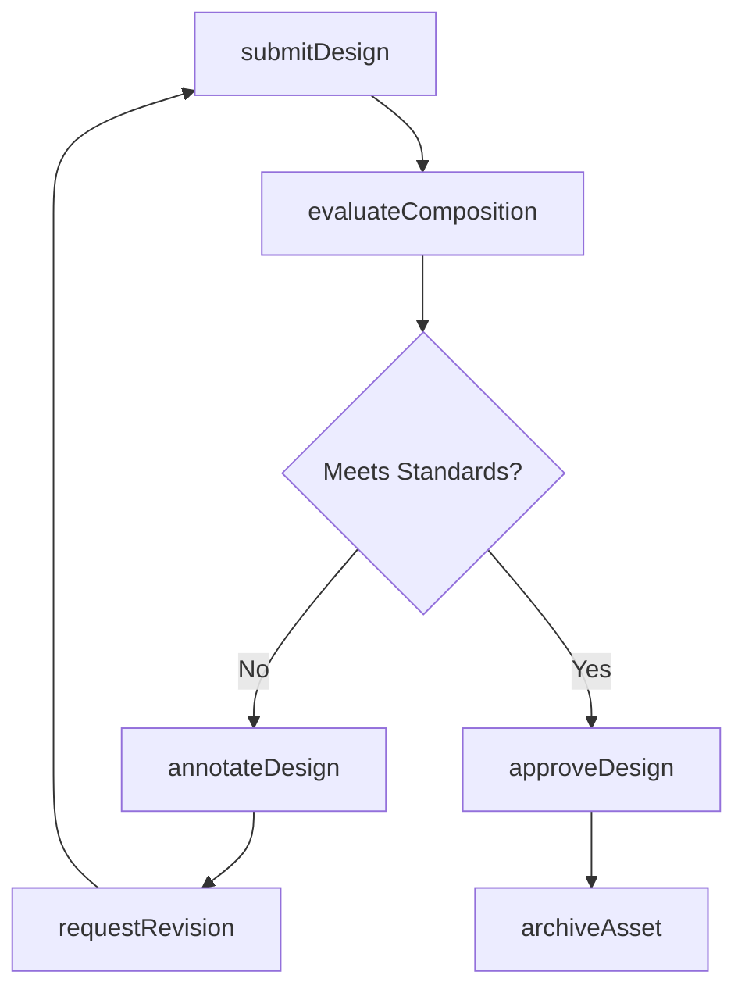
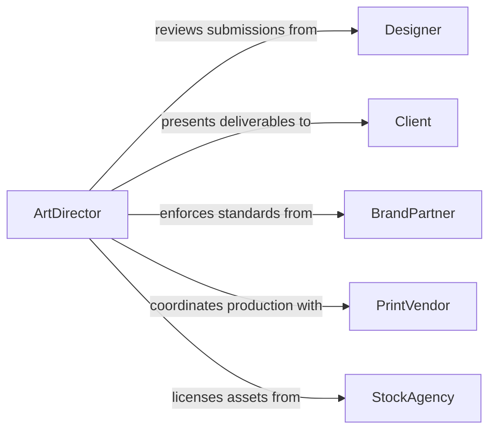

# Review Art and Design Materials

> Business-as-Code definition for reviewing art and design materials. Models the evaluation workflow from initial submission through critique, revision tracking, and final approval of visual and graphic assets.

## Overview

Reviewing art and design materials involves systematically evaluating visual assets, graphic compositions, illustrations, and design deliverables for quality, brand consistency, and project alignment. This definition exposes actions for each phase of the review lifecycle, events for workflow automation, and searches for retrieving design assets and review history.

## Actors

| Actor | Description |
|-------|-------------|
| Designer | Creates and submits art or design materials for review |
| Client | Provides creative briefs and approves final deliverables |
| PrintVendor | Produces physical reproductions of approved designs |
| StockAgency | Licenses imagery and artwork used in compositions |
| BrandPartner | Collaborates on co-branded design initiatives |
| RegulatoryBody | Enforces advertising and labeling standards |

## Roles

| Role | Description |
|------|-------------|
| ArtDirector | Leads the creative review process and sets quality standards |
| GraphicReviewer | Evaluates design assets against project specifications |
| BrandManager | Ensures materials align with brand guidelines |
| ProductionCoordinator | Manages the pipeline from review to final output |

## Entities

| Entity | Description |
|--------|-------------|
| DesignAsset | A visual file such as an illustration, layout, or mockup |
| ReviewSession | A structured evaluation of one or more design assets |
| Annotation | A comment or markup attached to a specific area of a design |
| RevisionRequest | A formal request for changes to a submitted design |
| BrandGuideline | A set of rules governing visual identity and style |
| ApprovalRecord | Documentation of a final sign-off on a design asset |
| DesignBrief | A specification document outlining project requirements |

## Actions

| Action | Description |
|--------|-------------|
| submitDesign | Upload a design asset for review consideration |
| evaluateComposition | Assess layout, color, typography, and visual hierarchy |
| annotateDesign | Attach feedback comments to specific regions of an asset |
| requestRevision | Formally ask a designer to modify a submitted asset |
| approveDesign | Sign off on a design asset as meeting quality standards |
| rejectDesign | Decline a design asset that does not meet specifications |
| compareVersions | Place two revisions side by side for visual comparison |
| archiveAsset | Move an approved or deprecated asset to long-term storage |

## Events

| Event | Description |
|-------|-------------|
| designSubmitted | A new design asset has been uploaded for review |
| compositionEvaluated | A design asset has been assessed for quality |
| designAnnotated | Feedback has been attached to a design asset |
| revisionRequested | A modification request has been issued to the designer |
| designApproved | A design asset has been formally approved |
| designRejected | A design asset has been declined |
| versionsCompared | Two design revisions have been compared |
| assetArchived | An asset has been moved to archival storage |

## Searches

| Search | Description |
|--------|-------------|
| findDesignAssets | Retrieve design assets by project, status, or file type |
| getReviewHistory | List past reviews and annotations for a given asset |
| getRevisionRequests | Find open or completed revision requests by designer or project |
| getPendingApprovals | List assets awaiting sign-off from reviewers |
| searchAnnotations | Find annotations by keyword, reviewer, or date range |

## Workflow



## Actor Relationships



## Usage

### Calling Actions

```typescript
import { reviewArtDesignMaterials } from '@headlessly/review-art-design-materials'

const reviews = reviewArtDesignMaterials()

// Submit a new design asset for review
const asset = await reviews.submitDesign({
  projectId: 'campaign-q3-2026',
  fileName: 'hero-banner-v2.psd',
  fileUrl: 'https://assets.example.com/hero-banner-v2.psd',
  designer: 'jsmith'
})

// Evaluate the composition against brand guidelines
const evaluation = await reviews.evaluateComposition({
  assetId: asset.id,
  criteria: ['colorAccuracy', 'typographyConsistency', 'layoutBalance']
})

// Request a revision if needed
await reviews.requestRevision({
  assetId: asset.id,
  notes: 'Adjust headline kerning and increase contrast on CTA button'
})
```

### Event-Driven Automation

```typescript
// Notify the art director when a new design is submitted
reviews.designSubmitted(async ({ assetId, projectId, designer }) => {
  await notify({
    to: 'art-director',
    message: `New design submitted by ${designer} for project ${projectId}`
  })
})

// Auto-archive assets after approval
reviews.designApproved(async ({ assetId, approvedBy }) => {
  await reviews.archiveAsset({ assetId, archivedBy: approvedBy })
})
```
