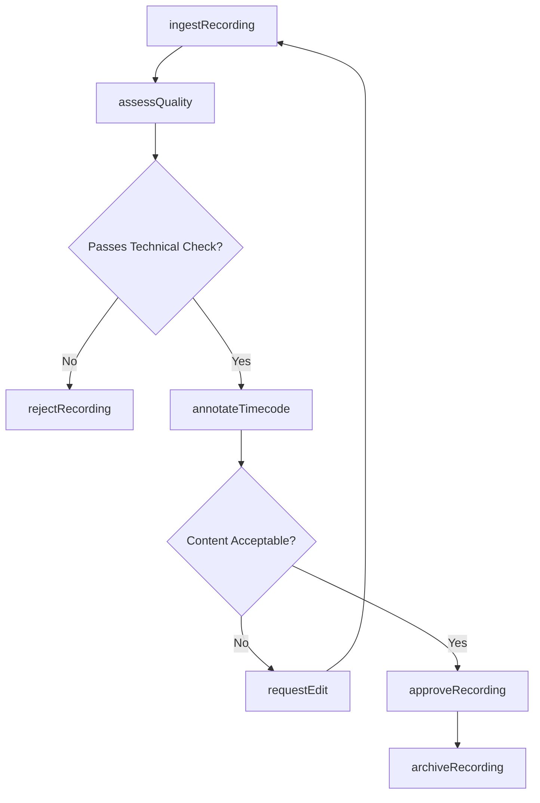
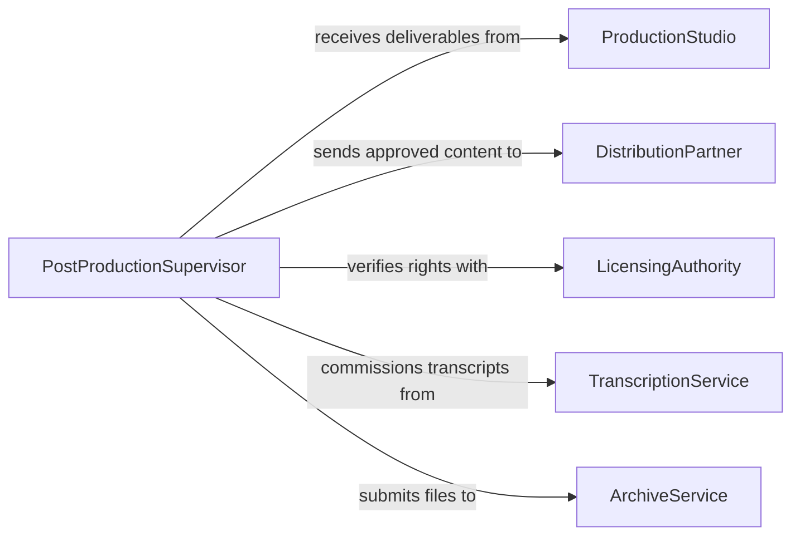

# Review Audio or Video Recordings

> Business-as-Code definition for reviewing audio or video recordings. Models the evaluation workflow from media ingestion through quality assessment, annotation, and approval for distribution or archival.

## Overview

Reviewing audio or video recordings involves systematically evaluating media content for technical quality, artistic merit, compliance with production standards, and suitability for intended use. This includes assessing sound levels, visual clarity, editing continuity, and content accuracy. This definition exposes actions for each phase of media review, events for progress tracking, and searches for retrieving recordings and review history.

## Actors

| Actor | Description |
|-------|-------------|
| ProductionStudio | Delivers raw or edited audio and video recordings for review |
| DistributionPartner | Receives approved recordings for broadcast or streaming |
| LicensingAuthority | Grants or restricts usage rights for recorded content |
| TranscriptionService | Provides text transcripts of audio and video content |
| QualityAssuranceLab | Performs technical assessments of media file integrity |
| ArchiveService | Stores approved recordings for long-term preservation |

## Roles

| Role | Description |
|------|-------------|
| MediaReviewer | Evaluates recordings for content quality and accuracy |
| AudioEngineer | Assesses sound quality, levels, and mixing balance |
| PostProductionSupervisor | Oversees the review pipeline from rough cut to final master |
| ComplianceOfficer | Verifies recordings meet regulatory and content standards |

## Entities

| Entity | Description |
|--------|-------------|
| Recording | An audio or video media file under review |
| ReviewSession | A structured evaluation of one or more recordings |
| TimecodeAnnotation | A comment anchored to a specific point or range in a recording |
| QualityReport | A technical assessment of audio levels, resolution, and encoding |
| TranscriptDocument | A text representation of spoken content in a recording |
| ApprovalDecision | A formal pass or fail determination for a reviewed recording |
| RevisionNote | A request for changes to a specific segment of a recording |
| MediaAssetRecord | Metadata and cataloging information for a recording |

## Actions

| Action | Description |
|--------|-------------|
| ingestRecording | Import a media file into the review pipeline |
| assessQuality | Evaluate technical attributes such as audio levels and resolution |
| annotateTimecode | Attach feedback to a specific timecode in a recording |
| requestEdit | Issue a revision request for a segment of the recording |
| approveRecording | Sign off on a recording as meeting all standards |
| rejectRecording | Decline a recording that fails quality or compliance checks |
| generateTranscript | Produce a text transcript from the audio track |
| archiveRecording | Move an approved recording to long-term storage |

## Events

| Event | Description |
|-------|-------------|
| recordingIngested | A media file has been imported into the review system |
| qualityAssessed | Technical evaluation of a recording has been completed |
| timecodeAnnotated | Feedback has been attached to a specific timecode |
| editRequested | A revision request has been issued for a recording segment |
| recordingApproved | A recording has been formally approved |
| recordingRejected | A recording has failed review |
| transcriptGenerated | A text transcript has been produced |
| recordingArchived | An approved recording has been sent to archival storage |

## Searches

| Search | Description |
|--------|-------------|
| findRecordings | Search recordings by project, date, format, or status |
| getAnnotations | Retrieve timecode annotations for a given recording |
| getQualityReports | Find technical assessments by recording or reviewer |
| getPendingReviews | List recordings awaiting evaluation |
| searchTranscripts | Search transcript text across recordings by keyword |

## Workflow



## Actor Relationships



## Usage

### Calling Actions

```typescript
import { reviewAudioVideoRecordings } from '@headlessly/review-audio-video-recordings'

const reviews = reviewAudioVideoRecordings()

// Ingest a new video recording for review
const recording = await reviews.ingestRecording({
  projectId: 'documentary-2026',
  title: 'Interview - Dr. Chen',
  mediaUrl: 'https://media.example.com/interview-chen-raw.mp4',
  format: 'ProRes 422'
})

// Assess technical quality
const quality = await reviews.assessQuality({
  recordingId: recording.id,
  checks: ['audioLevels', 'resolution', 'colorSpace', 'encoding']
})

// Annotate a specific timecode with feedback
await reviews.annotateTimecode({
  recordingId: recording.id,
  timecode: '00:14:32',
  note: 'Background noise spike - consider noise reduction or cutaway'
})
```

### Event-Driven Automation

```typescript
// Auto-generate transcripts when a recording is ingested
reviews.recordingIngested(async ({ recordingId, title }) => {
  await reviews.generateTranscript({ recordingId })
})

// Notify distribution when a recording is approved
reviews.recordingApproved(async ({ recordingId, projectId, title }) => {
  await notify({
    to: 'distribution-team',
    message: `Recording approved: ${title} is ready for delivery`
  })
})
```
