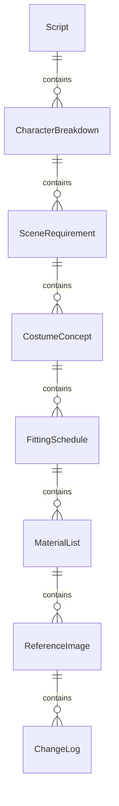
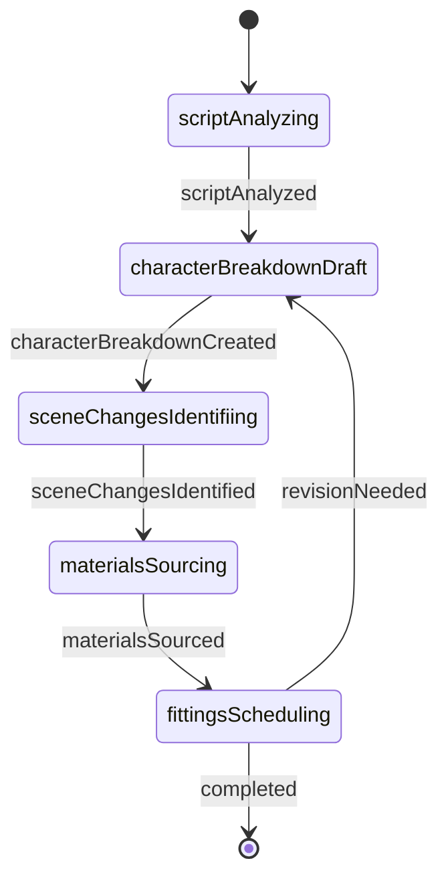
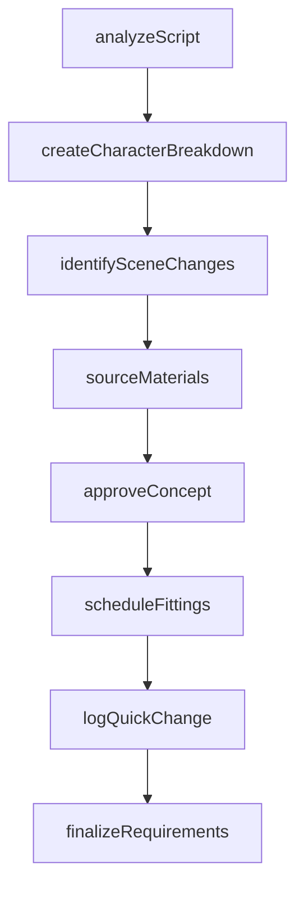
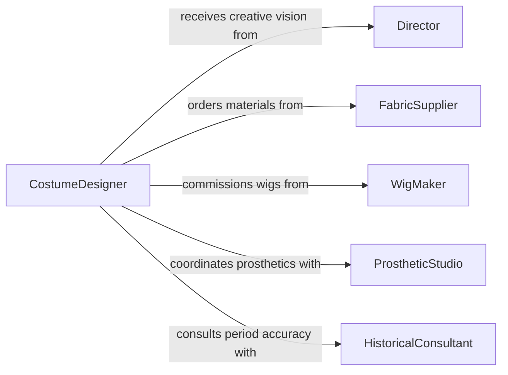

# Review Production Information to Determine Costume Requirements

> Business-as-Code definition for reviewing production information to determine costume and makeup requirements. Models the workflow from script analysis through character breakdown, wardrobe planning, and final fitting coordination.

## Overview

Reviewing production information for costume and makeup requirements involves analyzing scripts, storyboards, director notes, and historical references to identify the wardrobe, prosthetics, and cosmetic needs of each character and scene. This definition exposes actions for extracting requirements from production materials, events for tracking costume preparation milestones, and searches for locating production assets and character specifications.

## Actors

| Actor | Description |
|-------|-------------|
| Director | Provides the creative vision and approves costume and makeup concepts |
| FabricSupplier | Provides textiles, trims, and materials for costume construction |
| WigMaker | Creates custom hairpieces and wigs for character looks |
| ProstheticStudio | Fabricates special effects prosthetics and appliances |
| CosmeticVendor | Supplies professional-grade makeup and application tools |
| HistoricalConsultant | Advises on period-accurate costume and grooming details |

## Roles

| Role | Description |
|------|-------------|
| CostumeDesigner | Leads the analysis of production materials for wardrobe needs |
| MakeupSupervisor | Determines cosmetic and prosthetic requirements per character |
| WardrobeCoordinator | Manages fittings, alterations, and costume logistics |
| ScriptBreakdownArtist | Extracts scene-by-scene costume and makeup references from scripts |

## Entities

| Entity | Description |
|--------|-------------|
| Script | The production screenplay or stage play text |
| CharacterBreakdown | A profile of costume and makeup needs for each character |
| SceneRequirement | Wardrobe and makeup specifications for a given scene |
| CostumeConcept | A design sketch or mood board for a character look |
| FittingSchedule | A timeline of wardrobe fitting appointments for cast members |
| MaterialList | An inventory of fabrics, cosmetics, and supplies needed |
| ReferenceImage | A historical or stylistic image used for design inspiration |
| ChangeLog | A record of costume quick-changes between scenes |

## Actions

| Action | Description |
|--------|-------------|
| analyzeScript | Parse script pages to identify costume and makeup cues |
| createCharacterBreakdown | Build a detailed profile of each character's wardrobe and makeup |
| identifySceneChanges | Map costume transitions across scenes and acts |
| sourceMaterials | Locate fabrics, cosmetics, and prosthetics needed for the production |
| scheduleFittings | Plan fitting sessions with cast members and wardrobe staff |
| approveConcept | Sign off on a costume or makeup design concept |
| logQuickChange | Record a rapid costume transition between scenes |
| finalizeRequirements | Lock the complete costume and makeup specification for production |

## Events

| Event | Description |
|-------|-------------|
| scriptAnalyzed | Script has been parsed for costume and makeup cues |
| characterBreakdownCreated | A character costume and makeup profile has been built |
| sceneChangesIdentified | Costume transitions have been mapped across the production |
| materialsSourced | Required fabrics, cosmetics, or prosthetics have been located |
| fittingsScheduled | Fitting appointments have been planned for the cast |
| conceptApproved | A costume or makeup concept has been signed off |
| quickChangeLogged | A rapid costume transition has been documented |
| requirementsFinalized | The full costume and makeup specification is locked |

## Searches

| Search | Description |
|--------|-------------|
| findCharacterBreakdowns | Retrieve character profiles by production, role, or scene |
| getSceneRequirements | List costume and makeup needs for a given scene |
| getMaterialLists | Retrieve materials required by production or character |
| getFittingSchedules | Find fitting appointments by cast member or date |
| searchReferenceImages | Locate reference images by period, style, or character |

## Entity Relationships



## State Diagram



## Workflow



## Actor Relationships



## Usage

### Calling Actions

```typescript
import { reviewProductionInformationDetermineCostume } from '@headlessly/review-production-information-determine-costume'

const production = reviewProductionInformationDetermineCostume()

// Analyze a script for costume and makeup cues
const analysis = await production.analyzeScript({
  productionId: 'hamlet-2026',
  scriptUrl: 'https://scripts.example.com.ai/hamlet-revised.pdf',
  acts: [1, 2, 3, 4, 5]
})

// Create a character breakdown for the lead role
const breakdown = await production.createCharacterBreakdown({
  productionId: 'hamlet-2026',
  character: 'Hamlet',
  scenes: analysis.scenesForCharacter('Hamlet'),
  periodReference: 'Elizabethan'
})

// Schedule fittings for the cast
await production.scheduleFittings({
  productionId: 'hamlet-2026',
  fittings: [
    { castMember: 'actor-001', character: 'Hamlet', date: '2026-03-10' },
    { castMember: 'actor-002', character: 'Ophelia', date: '2026-03-11' }
  ]
})
```

### Event-Driven Automation

```typescript
// Notify wardrobe when a script has been analyzed
production.scriptAnalyzed(async ({ productionId, totalScenes }) => {
  await notify({
    to: 'wardrobe-team',
    message: `Script analysis complete for ${productionId}: ${totalScenes} scenes identified`
  })
})

// Auto-source materials after character breakdown is created
production.characterBreakdownCreated(async ({ productionId, character, materialNeeds }) => {
  await production.sourceMaterials({
    productionId,
    character,
    items: materialNeeds
  })
})
```
