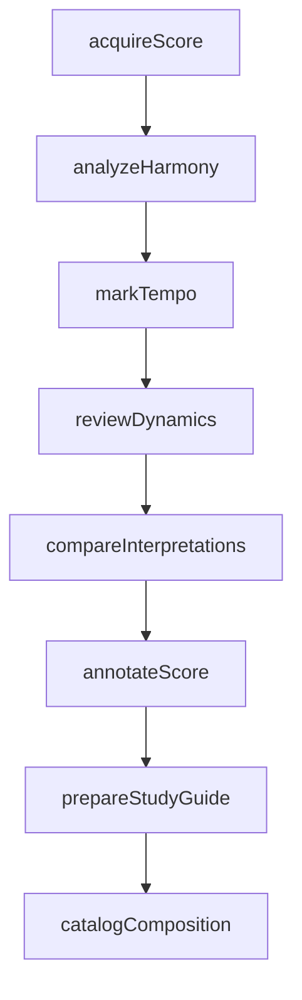
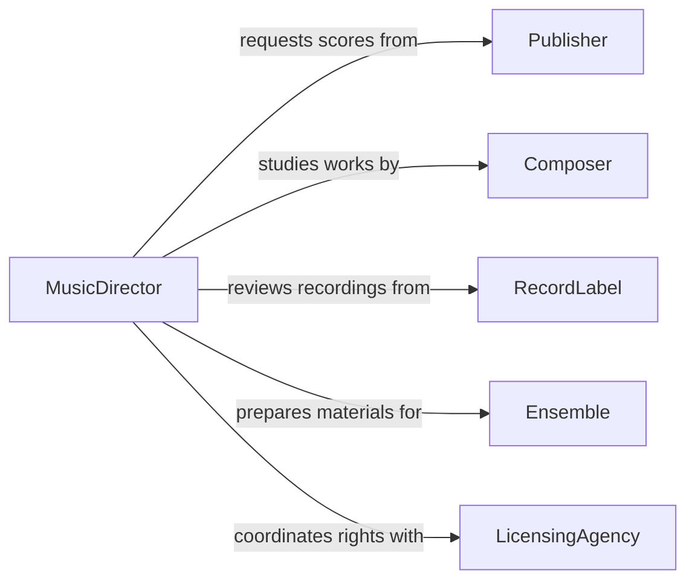

# Study Details of Musical Compositions

> Business-as-Code definition for studying the details of musical compositions. Models the analytical workflow from score acquisition through structural analysis, interpretation planning, and performance preparation.

## Overview

Studying the details of musical compositions involves examining scores, arrangements, and recordings to understand harmonic structure, tempo markings, dynamics, orchestration, and stylistic context. This definition exposes actions for analyzing musical works, events for tracking study progress, and searches for locating compositions and their metadata.

## Actors

| Actor | Description |
|-------|-------------|
| Composer | Creates original musical works or commissions arrangements |
| Publisher | Distributes scores, parts, and licensing for musical works |
| RecordLabel | Provides reference recordings of compositions |
| Ensemble | Performs the composition and requires study materials |
| LicensingAgency | Manages performance rights and mechanical licenses |
| Arranger | Adapts compositions for different instrumentations or settings |

## Roles

| Role | Description |
|------|-------------|
| MusicDirector | Oversees the study and interpretation of compositions |
| ScoreAnalyst | Examines harmonic, melodic, and rhythmic structures |
| Rehearsalpianist | Assists in reading through and preparing compositions |
| Librarian | Manages the acquisition and cataloging of scores and parts |

## Entities

| Entity | Description |
|--------|-------------|
| Score | The written notation of a musical composition |
| Part | An individual instrument or voice line extracted from a score |
| Movement | A self-contained section within a larger musical work |
| TempoMarking | A directive indicating the speed of a passage |
| DynamicMarking | A notation indicating volume or intensity changes |
| HarmonicAnalysis | A breakdown of chord progressions and tonal centers |
| PerformanceNote | An annotation capturing interpretive decisions |
| ReferenceRecording | An audio recording used as a study aid |

## Actions

| Action | Description |
|--------|-------------|
| acquireScore | Obtain a score or set of parts for study |
| analyzeHarmony | Examine chord progressions, modulations, and tonal centers |
| markTempo | Identify and annotate tempo changes throughout the work |
| reviewDynamics | Study volume and intensity markings across the score |
| compareInterpretations | Evaluate multiple recordings or editions side by side |
| annotateScore | Add rehearsal marks, bowings, or interpretive notes |
| catalogComposition | Register a composition in the library with full metadata |
| prepareStudyGuide | Compile analytical notes and context for rehearsal use |

## Events

| Event | Description |
|-------|-------------|
| scoreAcquired | A score has been obtained and is ready for study |
| harmonyAnalyzed | Harmonic analysis of a composition has been completed |
| tempoMarked | Tempo markings have been identified and annotated |
| dynamicsReviewed | Dynamic markings have been studied and documented |
| interpretationsCompared | Multiple recordings or editions have been evaluated |
| scoreAnnotated | Interpretive notes have been added to the score |
| compositionCataloged | A composition has been registered in the library |
| studyGuidePrepped | A study guide has been compiled for rehearsal |

## Searches

| Search | Description |
|--------|-------------|
| findCompositions | Search compositions by composer, era, key, or instrumentation |
| getScoreParts | Retrieve individual parts for a given composition |
| getHarmonicAnalyses | Find completed analyses by composition or analyst |
| searchAnnotations | Locate score annotations by keyword, movement, or measure |
| getReferenceRecordings | Find reference recordings for a specific composition |

## Workflow



## Actor Relationships



## Usage

### Calling Actions

```typescript
import { studyDetailsMusicalCompositions } from '@headlessly/study-details-musical-compositions'

const study = studyDetailsMusicalCompositions()

// Acquire a score for an upcoming performance
const score = await study.acquireScore({
  composer: 'Stravinsky',
  title: 'The Rite of Spring',
  edition: 'Boosey & Hawkes revised',
  format: 'fullScore'
})

// Perform harmonic analysis on a specific movement
const analysis = await study.analyzeHarmony({
  scoreId: score.id,
  movement: 'Part I: Adoration of the Earth',
  measures: { start: 1, end: 75 }
})

// Annotate the score with rehearsal decisions
await study.annotateScore({
  scoreId: score.id,
  annotations: [
    { measure: 13, note: 'Subito piano, watch for balance with winds' },
    { measure: 28, note: 'Accelerando begins here, cue percussion' }
  ]
})
```

### Event-Driven Automation

```typescript
// Notify the ensemble librarian when a new score is acquired
study.scoreAcquired(async ({ scoreId, title, composer }) => {
  await notify({
    to: 'librarian',
    message: `New score ready for distribution: ${title} by ${composer}`
  })
})

// Auto-generate study guides after analysis completion
study.harmonyAnalyzed(async ({ scoreId, movement }) => {
  await study.prepareStudyGuide({ scoreId, movement })
})
```
