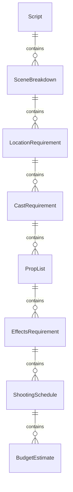
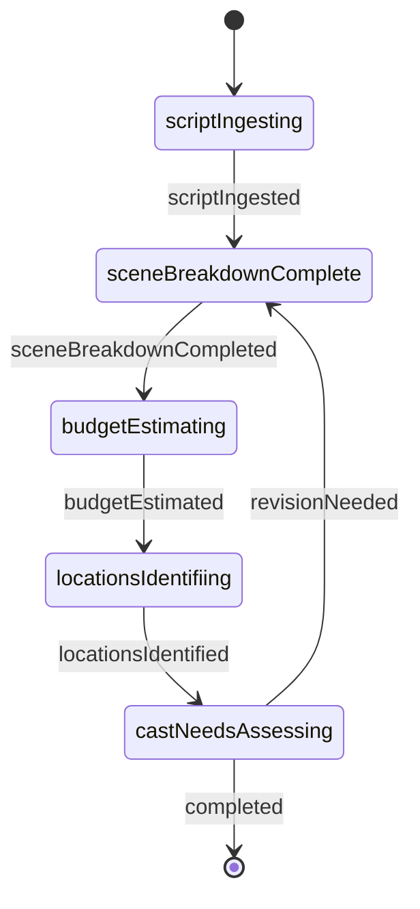
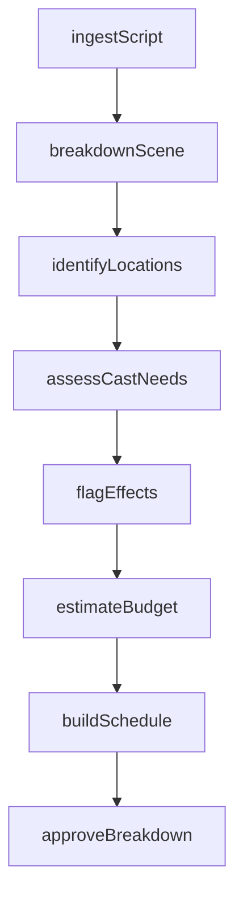
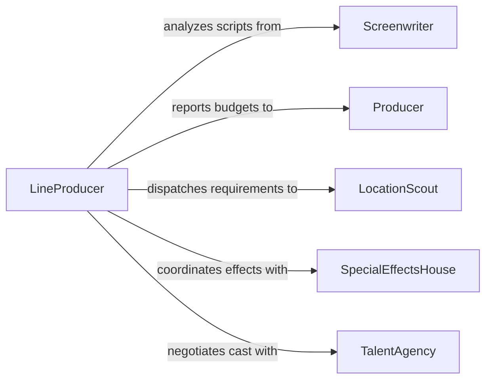

# Study Scripts to Determine Project Requirements

> Business-as-Code definition for studying scripts to determine project requirements. Models the workflow from script intake through scene breakdown, resource estimation, and production planning.

## Overview

Studying scripts to determine project requirements involves reading and analyzing screenplays, teleplays, or stage scripts to extract technical, creative, and logistical needs for a production. This includes identifying location requirements, cast size, special effects, set construction, props, and scheduling constraints. This definition exposes actions for systematic script analysis, events for milestone tracking, and searches for retrieving breakdown data.

## Actors

| Actor | Description |
|-------|-------------|
| Screenwriter | Authors or revises the script being analyzed |
| Producer | Commissions the project and sets budgetary constraints |
| LocationScout | Identifies and secures filming or performance locations |
| SpecialEffectsHouse | Provides visual or practical effects based on script needs |
| TalentAgency | Represents cast members required by the script |
| InsuranceProvider | Underwrites production risks identified during script analysis |

## Roles

| Role | Description |
|------|-------------|
| LineProducer | Translates script requirements into budget and schedule |
| FirstAssistantDirector | Breaks down the script into a shooting schedule |
| ScriptSupervisor | Tracks continuity and identifies logistical dependencies |
| ProductionDesigner | Determines set, prop, and visual requirements from the script |

## Entities

| Entity | Description |
|--------|-------------|
| Script | The screenplay or teleplay document under analysis |
| SceneBreakdown | A detailed listing of requirements for each scene |
| LocationRequirement | A specification for a filming or performance venue |
| CastRequirement | The number and type of performers needed per scene |
| PropList | An inventory of physical objects required by the script |
| EffectsRequirement | A specification for practical or digital effects in a scene |
| ShootingSchedule | A sequenced plan of scenes organized for production efficiency |
| BudgetEstimate | A cost projection derived from script requirements |

## Actions

| Action | Description |
|--------|-------------|
| ingestScript | Import a script document and parse it into structured scenes |
| breakdownScene | Extract cast, location, prop, and effects needs for a scene |
| estimateBudget | Calculate preliminary costs based on identified requirements |
| identifyLocations | Determine venue needs for interior, exterior, and special scenes |
| assessCastNeeds | Catalog principal, supporting, and background performer requirements |
| flagEffects | Mark scenes requiring practical or digital effects work |
| buildSchedule | Organize scenes into a production-efficient shooting order |
| approveBreakdown | Sign off on the completed script breakdown for production |

## Events

| Event | Description |
|-------|-------------|
| scriptIngested | A script has been imported and parsed into scenes |
| sceneBreakdownCompleted | Requirements for a scene have been fully extracted |
| budgetEstimated | A preliminary cost projection has been generated |
| locationsIdentified | Venue needs have been determined for all scenes |
| castNeedsAssessed | Performer requirements have been cataloged |
| effectsFlagged | Scenes requiring effects work have been marked |
| scheduleBuilt | A shooting schedule has been assembled from the breakdown |
| breakdownApproved | The completed script breakdown has been signed off |

## Searches

| Search | Description |
|--------|-------------|
| findSceneBreakdowns | Retrieve breakdowns by production, scene number, or location |
| getCastRequirements | List performer needs by role type or scene |
| getEffectsRequirements | Find scenes flagged for practical or digital effects |
| getPropLists | Retrieve prop inventories by scene or department |
| getLocationRequirements | Search venue specifications by scene type or geography |

## Entity Relationships



## State Diagram



## Workflow



## Actor Relationships



## Usage

### Calling Actions

```typescript
import { studyScriptsDetermineProjectRequirements } from '@headlessly/study-scripts-determine-project-requirements'

const scripts = studyScriptsDetermineProjectRequirements()

// Ingest a new screenplay for analysis
const script = await scripts.ingestScript({
  title: 'Meridian',
  format: 'screenplay',
  url: 'https://scripts.example.com.ai/meridian-draft-3.fdx',
  version: 3
})

// Break down a specific scene
const breakdown = await scripts.breakdownScene({
  scriptId: script.id,
  sceneNumber: 42,
  elements: ['cast', 'locations', 'props', 'effects', 'vehicles']
})

// Estimate the budget from all breakdowns
const budget = await scripts.estimateBudget({
  scriptId: script.id,
  rateCard: 'los-angeles-2026',
  contingency: 0.10
})
```

### Event-Driven Automation

```typescript
// Alert the production designer when a scene breakdown is completed
scripts.sceneBreakdownCompleted(async ({ scriptId, sceneNumber, requirements }) => {
  await notify({
    to: 'production-design',
    message: `Scene ${sceneNumber} breakdown ready: ${requirements.length} elements identified`
  })
})

// Auto-build the schedule once all scenes are broken down
scripts.budgetEstimated(async ({ scriptId, totalScenes, estimatedCost }) => {
  await scripts.buildSchedule({
    scriptId,
    optimizeFor: 'locationProximity'
  })
})
```
