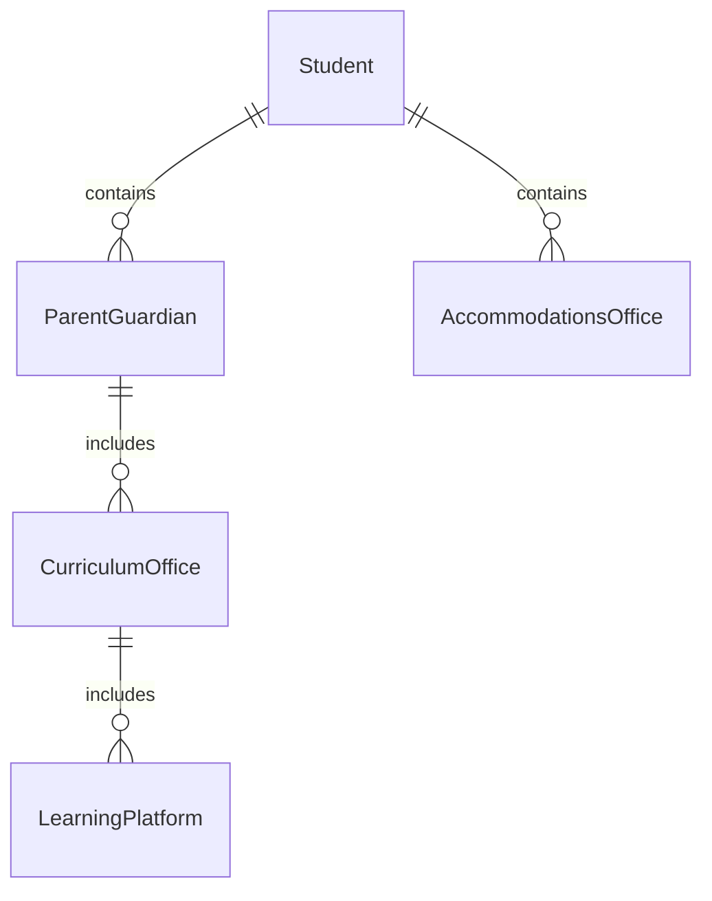
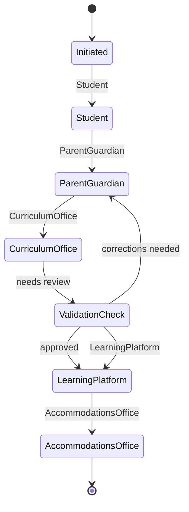
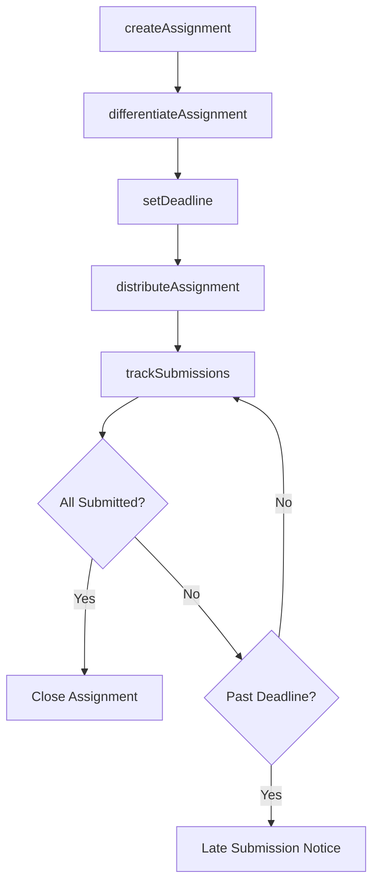
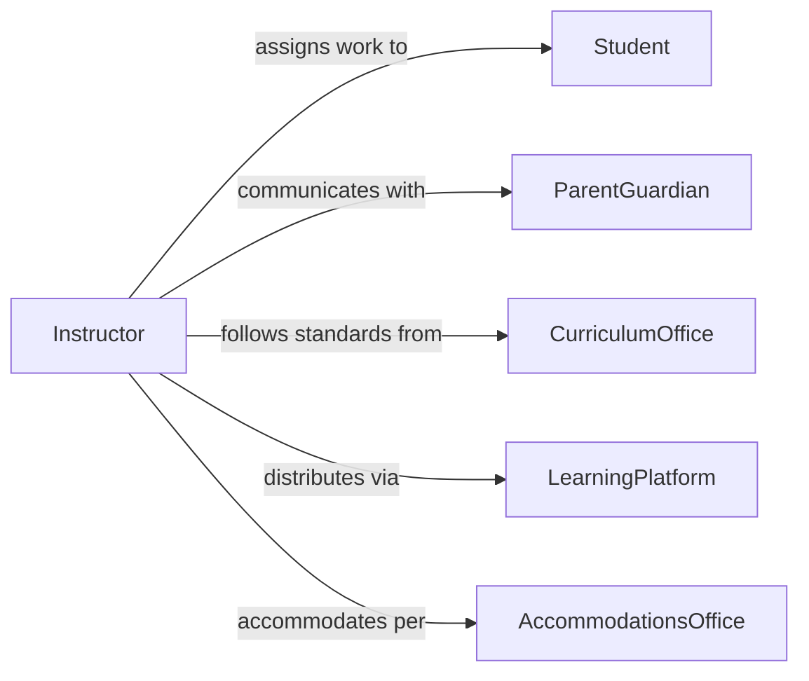

# Assign Class Work Students

> Business-as-Code definition for assigning class work to students. Models the distribution of homework, projects, readings, and assessments across courses including differentiation for learning levels and accommodation needs.

## Overview

Assigning class work to students involves creating, distributing, and tracking academic assignments including homework, projects, laboratory exercises, readings, and assessments. This definition provides actions for designing assignments, differentiating tasks by learning level, setting deadlines, and tracking submission status. It enables automation of assignment distribution, late submission monitoring, and workload balancing across courses.

## Actors

| Actor | Description |
|-------|-------------|
| Student | Individual receiving and completing assigned class work |
| ParentGuardian | Reviews and supports student assignment completion |
| CurriculumOffice | Sets academic standards and approved assignment frameworks |
| LearningPlatform | Digital system hosting assignment distribution and submission |
| AccommodationsOffice | Provides modified assignment requirements for students with needs |

## Roles

| Role | Description |
|------|-------------|
| Instructor | Creates and distributes class assignments to students |
| TeachingAssistant | Supports assignment distribution and monitors submissions |
| DepartmentChair | Reviews assignment alignment with curriculum standards |
| SpecialEducationCoordinator | Ensures assignments accommodate individual learning plans |

## Entities

| Entity | Description |
|--------|-------------|
| Assignment | A defined piece of class work with instructions and deadline |
| Rubric | Evaluation criteria for grading an assignment |
| SubmissionRecord | Documentation of a student turning in completed work |
| AccommodationPlan | Modified assignment requirements for a student with learning needs |
| CourseCalendar | Schedule of assignments and deadlines across a term |
| WorkloadAnalysis | Assessment of total assignment volume across a student's courses |

## Actions

| Action | Description |
|--------|-------------|
| createAssignment | Design a class work task with instructions, rubric, and deadline |
| distributeAssignment | Publish the assignment to enrolled students |
| differentiateAssignment | Modify assignment parameters for different learning levels |
| setDeadline | Establish submission due dates with late policy terms |
| trackSubmissions | Monitor which students have turned in completed work |
| balanceWorkload | Coordinate assignment timing to avoid overloading students |

## Events

| Event | Description |
|-------|-------------|
| assignmentCreated | A class work task has been designed and prepared |
| assignmentDistributed | The assignment has been published to students |
| assignmentDifferentiated | Modified versions have been created for learning levels |
| deadlineSet | A submission due date has been established |
| submissionReceived | A student has turned in completed work |
| lateSubmissionDetected | A student has missed the assignment deadline |

## Searches

| Search | Description |
|--------|-------------|
| getAssignments | Retrieve class work by course, type, or date range |
| getSubmissionStatus | Check which students have or have not submitted work |
| findLateSubmissions | List overdue assignments by student or course |
| getWorkloadSummary | Review total assignment volume per student across courses |
| getAccommodations | Retrieve modified requirements for students with learning plans |


## Entity Relationships



## State Diagram



## Workflow



## Actor Relationships



## Usage

### Calling Actions

```typescript
import { assignClassWorkStudents } from '@headlessly/assign-class-work-students'

const classwork = assignClassWorkStudents()

// Create an assignment
const assignment = await classwork.createAssignment({
  course: 'AP-Biology-Period-3',
  title: 'Cellular Respiration Lab Report',
  type: 'lab-report',
  instructions: 'Write a formal lab report analyzing the results of the cellular respiration experiment.',
  rubric: ['hypothesis', 'methodology', 'data-analysis', 'conclusion'],
  points: 100
})

// Differentiate for accommodation students
await classwork.differentiateAssignment({
  assignmentId: assignment.id,
  modifications: [
    { studentGroup: 'extended-time', deadlineExtension: 3, unit: 'days' },
    { studentGroup: 'simplified-format', instructions: 'Complete the guided lab report template.' }
  ]
})

// Check submission status
const status = await classwork.getSubmissionStatus({
  assignmentId: assignment.id,
  course: 'AP-Biology-Period-3'
})
```

### Event-Driven Automation

```typescript
// Notify parents of late submissions
classwork.lateSubmissionDetected(async ({ studentId, assignmentTitle, dueDate }) => {
  await notify({
    to: 'parent-guardian',
    message: `${studentId} has not submitted "${assignmentTitle}" due ${dueDate}`
  })
})

// Auto-balance workload across courses
classwork.assignmentCreated(async ({ course, dueDate }) => {
  const workload = await classwork.getWorkloadSummary({ date: dueDate })
  if (workload.averageAssignmentsDue > 3) {
    await notify({
      to: 'instructor',
      message: `Students have ${workload.averageAssignmentsDue} assignments due on ${dueDate}. Consider adjusting the deadline.`
    })
  }
})
```
