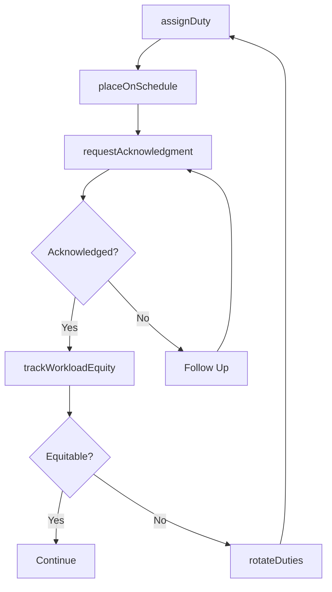
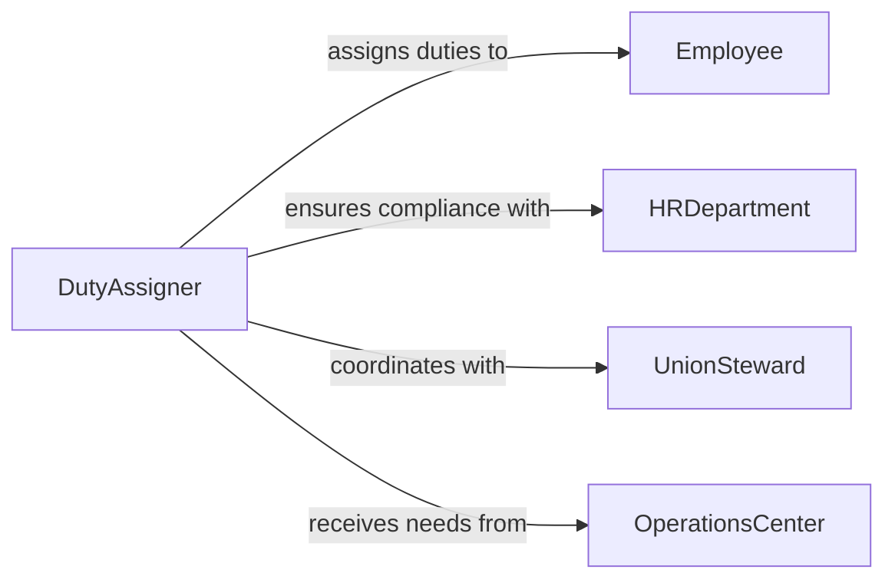

# Assign Duties Work Schedules Employees

> Business-as-Code definition for assigning duties or work schedules to employees. Models the direct allocation of job responsibilities, task assignments, and schedule placements to individual workers.

## Overview

Assigning duties or work schedules to employees involves directly allocating specific job responsibilities, tasks, and shift placements to individual workers based on operational needs, qualifications, and fairness considerations. This definition provides actions for defining duty requirements, matching employees to assignments, communicating allocations, and handling reassignment requests. It enables automation of duty rotation, workload equity tracking, and assignment acknowledgment workflows.

## Actors

| Actor | Description |
|-------|-------------|
| Employee | Worker receiving duty assignments and schedule placements |
| HRDepartment | Ensures assignments comply with employment contracts and policies |
| UnionSteward | Monitors duty assignments for adherence to collective bargaining terms |
| OperationsCenter | Communicates real-time operational needs driving assignment changes |

## Roles

| Role | Description |
|------|-------------|
| DutyAssigner | Directly allocates tasks and schedule placements to employees |
| OperationsSupervisor | Defines operational requirements that drive duty assignments |
| EquityMonitor | Ensures fair distribution of desirable and undesirable assignments |
| ReassignmentHandler | Processes employee requests for duty or schedule changes |

## Entities

| Entity | Description |
|--------|-------------|
| DutyAssignment | A specific responsibility allocated to an individual employee |
| SchedulePlacement | An employee placed into a specific shift or time slot |
| DutyRoster | Complete list of assignments across a team for a period |
| ReassignmentRequest | An employee request to change an assigned duty or schedule |
| WorkloadEquityReport | Analysis of assignment distribution fairness across employees |
| AssignmentAcknowledgment | Employee confirmation of receiving and accepting an assignment |

## Actions

| Action | Description |
|--------|-------------|
| assignDuty | Allocate a specific task or responsibility to an employee |
| placeOnSchedule | Assign an employee to a specific shift or time slot |
| rotateDuties | Cycle assignments across employees for fairness and development |
| processReassignment | Handle an employee request to change an assigned duty |
| trackWorkloadEquity | Monitor the fairness of assignment distribution |
| requestAcknowledgment | Require employee confirmation of an assignment |

## Events

| Event | Description |
|-------|-------------|
| dutyAssigned | A task or responsibility has been allocated to an employee |
| schedulePlaced | An employee has been assigned to a shift or time slot |
| dutiesRotated | Assignments have been cycled across employees |
| reassignmentProcessed | An employee duty change request has been handled |
| workloadImbalanceDetected | Assignment distribution is uneven across employees |
| assignmentAcknowledged | An employee has confirmed receipt of an assignment |

## Searches

| Search | Description |
|--------|-------------|
| getDutyRoster | Retrieve complete assignment list by team, date, or shift |
| getEmployeeDuties | Check assignments for a specific employee by period |
| findPendingAcknowledgments | List assignments awaiting employee confirmation |
| getWorkloadEquity | Review assignment distribution fairness across employees |
| findOpenReassignments | List pending duty change requests |

## Workflow



## Actor Relationships



## Usage

### Calling Actions

```typescript
import { assignDutiesWorkSchedulesEmployees } from '@headlessly/assign-duties-work-schedules-employees'

const duties = assignDutiesWorkSchedulesEmployees()

// Assign a specific duty
await duties.assignDuty({
  employee: 'officer-badge-4412',
  duty: 'patrol-district-7',
  shift: 'evening',
  date: '2026-04-10',
  specialInstructions: 'Focus on school zone enforcement'
})

// Place employees on schedule
await duties.placeOnSchedule({
  team: 'patrol-division',
  week: '2026-04-13',
  placements: [
    { employee: 'officer-badge-4412', shifts: ['mon-evening', 'tue-evening', 'wed-off'] },
    { employee: 'officer-badge-4415', shifts: ['mon-day', 'tue-day', 'wed-evening'] }
  ]
})

// Check workload equity
const equity = await duties.getWorkloadEquity({
  team: 'patrol-division',
  period: '2026-04',
  metrics: ['night-shifts', 'weekend-duties', 'overtime-hours']
})
```

### Event-Driven Automation

```typescript
// Alert on workload imbalance
duties.workloadImbalanceDetected(async ({ team, employee, metric, deviation }) => {
  await notify({
    to: 'equity-monitor',
    message: `Workload imbalance in ${team}: ${employee} has ${deviation}% more ${metric} than average`
  })
})

// Follow up on unacknowledged assignments
duties.dutyAssigned(async ({ employee, duty, assignedAt }) => {
  setTimeout(async () => {
    const pending = await duties.findPendingAcknowledgments({ employee })
    if (pending.length > 0) {
      await notify({
        to: employee,
        message: `Please acknowledge your duty assignment: ${duty}`
      })
    }
  }, 4 * 60 * 60 * 1000) // 4 hours
})
```
