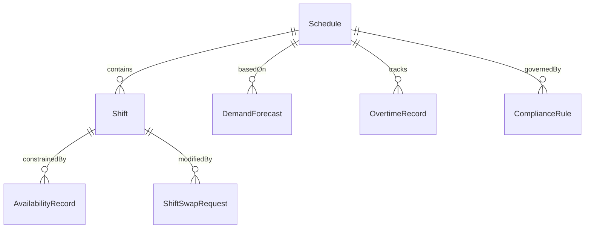
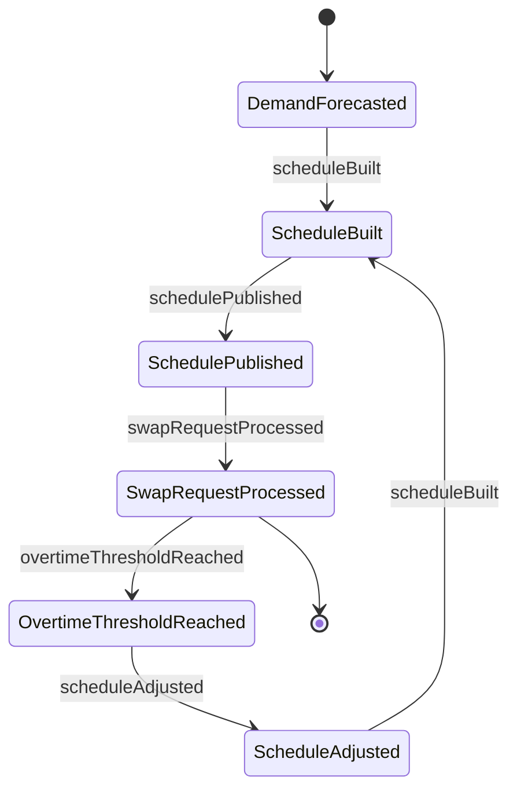
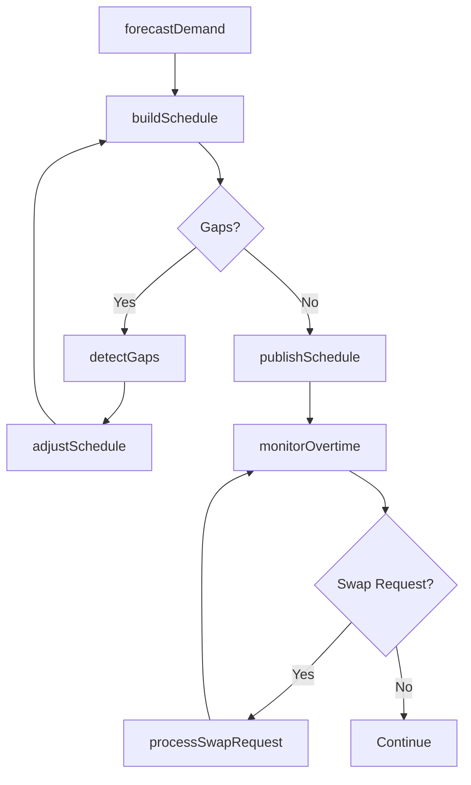
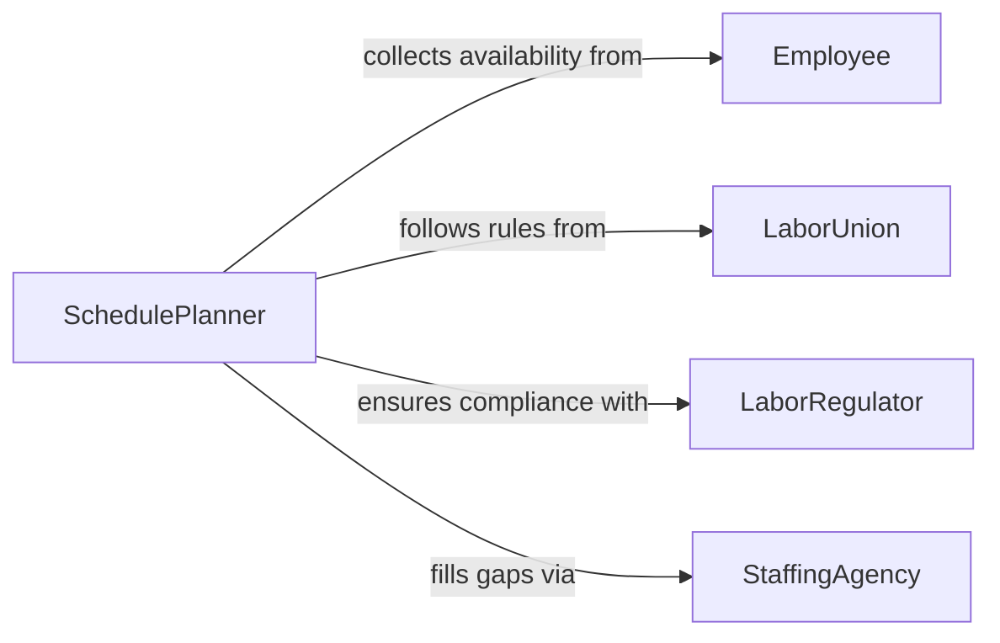

# Plan Employee Work Schedules

> Business-as-Code definition for planning employee work schedules. Models the creation and optimization of workforce schedules based on demand forecasting, availability, and labor regulations.

## Overview

Planning employee work schedules involves creating, optimizing, and publishing workforce schedules that align staffing levels with operational demand while complying with labor regulations and respecting employee availability. This definition provides actions for forecasting labor needs, building schedules, managing shift swaps, and tracking compliance. It enables automation of schedule generation, gap detection, and overtime monitoring.

## Actors

| Actor | Description |
|-------|-------------|
| Employee | Worker whose availability and preferences inform schedule creation |
| LaborUnion | Negotiates scheduling rules and shift requirements |
| LaborRegulator | Enforces scheduling laws including rest periods and overtime limits |
| StaffingAgency | Provides temporary workers to fill schedule gaps |

## Roles

| Role | Description |
|------|-------------|
| SchedulePlanner | Creates and optimizes workforce schedules |
| DepartmentManager | Defines staffing requirements for their area |
| HRCoordinator | Ensures schedule compliance with labor policies |
| ShiftSupervisor | Manages real-time schedule adjustments during operations |

## Entities

| Entity | Description |
|--------|-------------|
| Schedule | A published work schedule covering a defined period |
| Shift | A specific time block assigned to one or more employees |
| AvailabilityRecord | Employee-submitted availability and time-off preferences |
| DemandForecast | Predicted staffing needs based on business volume |
| ShiftSwapRequest | Employee request to exchange shifts with a colleague |
| OvertimeRecord | Tracked hours exceeding standard schedule thresholds |
| ComplianceRule | Labor regulation or policy governing scheduling practices |

## Actions

| Action | Description |
|--------|-------------|
| forecastDemand | Predict staffing needs based on historical and projected demand |
| buildSchedule | Generate a work schedule from demand, availability, and rules |
| publishSchedule | Distribute the finalized schedule to employees |
| processSwapRequest | Review and approve an employee shift swap request |
| detectGaps | Identify uncovered shifts or understaffed periods |
| monitorOvertime | Track employee hours against overtime thresholds |
| adjustSchedule | Modify a published schedule to address changes |

## Events

| Event | Description |
|-------|-------------|
| demandForecasted | Staffing predictions have been generated |
| scheduleBuilt | A work schedule has been generated |
| schedulePublished | The finalized schedule has been distributed to employees |
| swapRequestProcessed | A shift swap request has been reviewed |
| gapDetected | An uncovered shift or staffing shortage has been identified |
| overtimeThresholdReached | An employee has approached or exceeded overtime limits |
| scheduleAdjusted | A published schedule has been modified |

## Searches

| Search | Description |
|--------|-------------|
| getSchedule | Retrieve published schedules by period or department |
| findGaps | List uncovered shifts or understaffed periods |
| getEmployeeAvailability | Check availability records for scheduling |
| getOvertimeStatus | Retrieve overtime hours by employee or department |
| findSwapRequests | List pending shift swap requests |


## Entity Relationships



## State Diagram



## Workflow



## Actor Relationships



## Usage

### Calling Actions

```typescript
import { planEmployeeWorkSchedules } from '@headlessly/plan-employee-work-schedules'

const scheduling = planEmployeeWorkSchedules()

// Forecast demand for next week
const forecast = await scheduling.forecastDemand({
  department: 'customer-support',
  week: '2026-04-06',
  source: 'historical-and-bookings'
})

// Build the schedule
const schedule = await scheduling.buildSchedule({
  department: 'customer-support',
  week: '2026-04-06',
  demand: forecast,
  rules: ['8-hour-max-shift', '12-hour-rest-between-shifts']
})

// Publish to employees
await scheduling.publishSchedule({
  scheduleId: schedule.id,
  notifyEmployees: true
})
```

### Event-Driven Automation

```typescript
// Auto-alert on overtime threshold
scheduling.overtimeThresholdReached(async ({ employeeId, hoursWorked, limit }) => {
  await notify({
    to: 'department-manager',
    message: `${employeeId} at ${hoursWorked}h of ${limit}h overtime limit`
  })
})

// Auto-fill gaps with staffing agency
scheduling.gapDetected(async ({ shift, date, department }) => {
  await notify({
    to: 'staffing-agency',
    message: `Coverage needed: ${department} on ${date}, ${shift}`
  })
})
```
