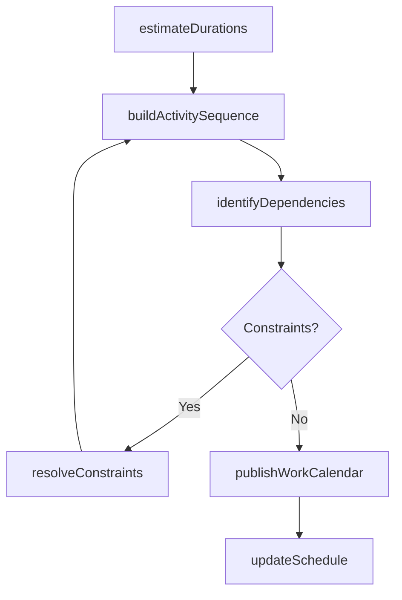
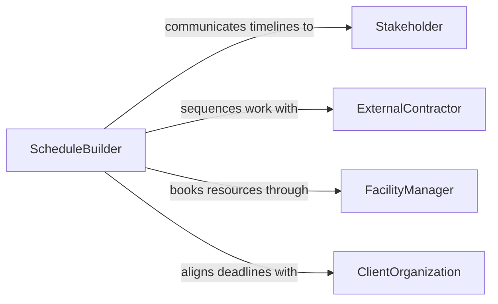

# Prepare Activity Work Schedules

> Business-as-Code definition for preparing activity or work schedules. Models the creation and management of task timelines, activity sequences, and work calendars for projects, programs, and recurring operations.

## Overview

Preparing activity or work schedules involves creating timelines and calendars that sequence tasks, allocate time blocks, and establish deadlines for operational or project activities. This definition provides actions for building task sequences, estimating durations, identifying scheduling dependencies, and publishing work calendars. It enables automation of timeline generation, dependency analysis, and deadline notification workflows.

## Actors

| Actor | Description |
|-------|-------------|
| Stakeholder | Individual or group affected by the activity schedule |
| ExternalContractor | Third party whose work must be sequenced within the schedule |
| FacilityManager | Controls access to rooms, equipment, and spaces required by activities |
| ClientOrganization | External party with deliverable deadlines that drive scheduling |

## Roles

| Role | Description |
|------|-------------|
| ScheduleBuilder | Creates and sequences activity timelines |
| ProjectLead | Defines task priorities and approves schedule drafts |
| TimeEstimator | Provides duration estimates for planned activities |
| CalendarAdministrator | Maintains shared calendars and resolves booking conflicts |

## Entities

| Entity | Description |
|--------|-------------|
| ActivitySchedule | A sequenced timeline of tasks with start and end dates |
| TaskDependency | A prerequisite relationship between two scheduled activities |
| TimeBlock | A reserved period for a specific activity or set of tasks |
| DurationEstimate | Projected time required to complete an activity |
| ScheduleConstraint | A limitation such as resource availability or deadline that shapes the timeline |
| WorkCalendar | A shared calendar showing planned activities across teams |

## Actions

| Action | Description |
|--------|-------------|
| buildActivitySequence | Define the order and timing of tasks in a schedule |
| estimateDurations | Project time requirements for each planned activity |
| identifyDependencies | Map prerequisite relationships between scheduled tasks |
| resolveConstraints | Adjust the schedule to accommodate resource and deadline limitations |
| publishWorkCalendar | Distribute the finalized activity schedule to participants |
| updateSchedule | Modify an existing schedule to reflect changes in scope or timing |

## Events

| Event | Description |
|-------|-------------|
| activitySequenceBuilt | Task order and timing have been defined |
| durationsEstimated | Time requirements for activities have been projected |
| dependenciesIdentified | Prerequisite relationships have been mapped |
| constraintsResolved | The schedule has been adjusted for limitations |
| workCalendarPublished | The finalized schedule has been distributed |
| scheduleUpdated | An existing schedule has been modified |

## Searches

| Search | Description |
|--------|-------------|
| getActivitySchedule | Retrieve task timelines by project, team, or period |
| findDependencies | List prerequisite relationships for scheduled activities |
| getConstraints | Identify limitations affecting the current schedule |
| getUpcomingDeadlines | List approaching activity completion dates |
| getCalendarConflicts | Find overlapping time blocks or resource bookings |

## Workflow



## Actor Relationships



## Usage

### Calling Actions

```typescript
import { prepareActivityWorkSchedules } from '@headlessly/prepare-activity-work-schedules'

const scheduler = prepareActivityWorkSchedules()

// Build an activity sequence for a construction phase
const schedule = await scheduler.buildActivitySequence({
  project: 'building-renovation-phase-2',
  activities: [
    { name: 'Demolition', duration: 5, unit: 'days' },
    { name: 'Framing', duration: 10, unit: 'days', dependsOn: 'Demolition' },
    { name: 'Electrical Rough-in', duration: 7, unit: 'days', dependsOn: 'Framing' },
    { name: 'Plumbing Rough-in', duration: 7, unit: 'days', dependsOn: 'Framing' },
    { name: 'Inspection', duration: 2, unit: 'days', dependsOn: ['Electrical Rough-in', 'Plumbing Rough-in'] }
  ],
  startDate: '2026-05-01'
})

// Publish the work calendar
await scheduler.publishWorkCalendar({
  scheduleId: schedule.id,
  recipients: ['project-team', 'general-contractor', 'building-inspector']
})

// Check upcoming deadlines
const deadlines = await scheduler.getUpcomingDeadlines({
  project: 'building-renovation-phase-2',
  withinDays: 14
})
```

### Event-Driven Automation

```typescript
// Alert on approaching deadlines
scheduler.workCalendarPublished(async ({ scheduleId, activities }) => {
  for (const activity of activities) {
    if (activity.daysUntilDeadline <= 3) {
      await notify({
        to: activity.assignee,
        message: `Activity "${activity.name}" due in ${activity.daysUntilDeadline} days`
      })
    }
  }
})

// Auto-reschedule downstream tasks when delays occur
scheduler.scheduleUpdated(async ({ scheduleId, changedActivities }) => {
  for (const activity of changedActivities) {
    if (activity.delayed) {
      await scheduler.resolveConstraints({
        scheduleId,
        affectedActivities: activity.dependents,
        reason: `${activity.name} delayed by ${activity.delayDays} days`
      })
    }
  }
})
```
