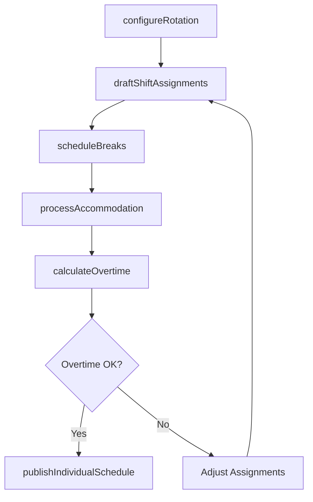
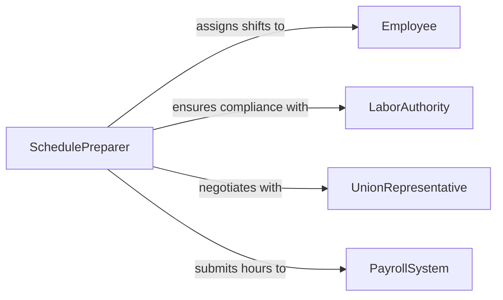

# Prepare Employee Work Schedules

> Business-as-Code definition for preparing employee work schedules. Models the drafting and distribution of individual employee shift assignments, break times, and rotation patterns.

## Overview

Preparing employee work schedules involves drafting individual shift assignments, setting break periods, managing rotation patterns, and distributing schedules to employees. This definition provides actions for creating shift rosters, managing rotation cycles, accommodating accommodation requests, and publishing individual schedules. It enables automation of rotation pattern generation, break compliance tracking, and individual schedule notification workflows.

## Actors

| Actor | Description |
|-------|-------------|
| Employee | Individual worker whose shift times and duties are being scheduled |
| LaborAuthority | Enforces break requirements, maximum hours, and scheduling fairness |
| UnionRepresentative | Advocates for employee scheduling rights per collective agreements |
| PayrollSystem | Receives scheduled hours for compensation processing |

## Roles

| Role | Description |
|------|-------------|
| SchedulePreparer | Drafts individual employee shift assignments |
| ShiftCoordinator | Manages rotation patterns and shift swaps |
| ComplianceChecker | Verifies schedules meet labor law and contract requirements |
| EmployeeRelationsLead | Handles accommodation requests and scheduling grievances |

## Entities

| Entity | Description |
|--------|-------------|
| ShiftAssignment | A specific work period assigned to an individual employee |
| RotationPattern | A recurring cycle of shift types for an employee or team |
| BreakSchedule | Mandated rest periods within a shift |
| AccommodationRequest | An employee request for schedule modification due to personal needs |
| ScheduleTemplate | A reusable pattern for generating recurring employee schedules |
| OvertimeProjection | Estimated hours beyond standard schedule for an employee |

## Actions

| Action | Description |
|--------|-------------|
| draftShiftAssignments | Create individual employee shift allocations |
| configureRotation | Set up recurring shift rotation patterns for teams |
| scheduleBreaks | Assign mandated rest periods within each shift |
| processAccommodation | Review and apply employee schedule modification requests |
| calculateOvertime | Project overtime hours based on scheduled assignments |
| publishIndividualSchedule | Distribute personalized schedule to each employee |

## Events

| Event | Description |
|-------|-------------|
| shiftAssignmentsDrafted | Individual employee shifts have been allocated |
| rotationConfigured | Recurring shift patterns have been set up |
| breaksScheduled | Mandated rest periods have been assigned |
| accommodationProcessed | An employee schedule modification has been applied |
| overtimeProjected | Estimated excess hours have been calculated |
| individualSchedulePublished | A personalized schedule has been sent to an employee |

## Searches

| Search | Description |
|--------|-------------|
| getShiftAssignments | Retrieve individual employee shifts by date or period |
| getRotationPattern | Check current rotation cycle for a team or employee |
| findOvertimeRisks | List employees approaching overtime thresholds |
| getPendingAccommodations | Retrieve unprocessed schedule modification requests |
| getBreakCompliance | Verify scheduled break periods meet regulatory requirements |

## Workflow



## Actor Relationships



## Usage

### Calling Actions

```typescript
import { prepareEmployeeWorkSchedules } from '@headlessly/prepare-employee-work-schedules'

const schedules = prepareEmployeeWorkSchedules()

// Draft shift assignments for the week
await schedules.draftShiftAssignments({
  team: 'nursing-unit-3B',
  week: '2026-04-13',
  employees: [
    { id: 'nurse-201', shifts: ['mon-day', 'tue-day', 'wed-day', 'thu-off', 'fri-evening'] },
    { id: 'nurse-202', shifts: ['mon-evening', 'tue-evening', 'wed-off', 'thu-day', 'fri-day'] }
  ]
})

// Configure rotation pattern
await schedules.configureRotation({
  team: 'nursing-unit-3B',
  pattern: ['day', 'day', 'evening', 'evening', 'off', 'off', 'night'],
  cycleLength: 7,
  startDate: '2026-04-01'
})

// Check overtime risks
const risks = await schedules.findOvertimeRisks({
  team: 'nursing-unit-3B',
  week: '2026-04-13',
  threshold: 40
})
```

### Event-Driven Automation

```typescript
// Alert on overtime projection
schedules.overtimeProjected(async ({ employeeId, projectedHours, limit }) => {
  if (projectedHours > limit) {
    await notify({
      to: 'shift-coordinator',
      message: `Employee ${employeeId} projected at ${projectedHours}h, exceeds ${limit}h limit`
    })
  }
})

// Notify employee on schedule publication
schedules.individualSchedulePublished(async ({ employeeId, week, shifts }) => {
  await notify({
    to: employeeId,
    message: `Your schedule for week of ${week} is ready: ${shifts.length} shifts assigned`
  })
})
```
