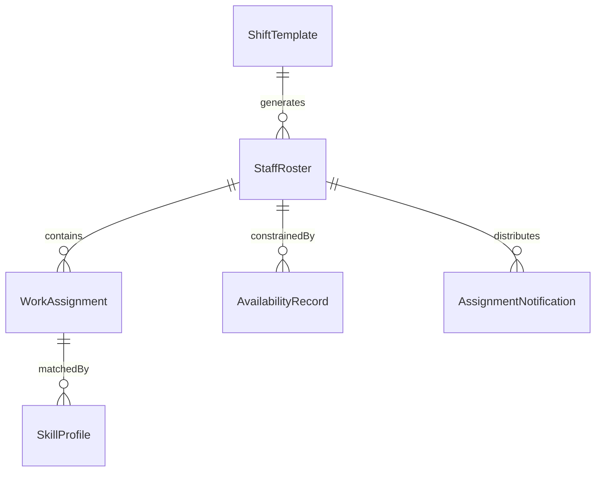
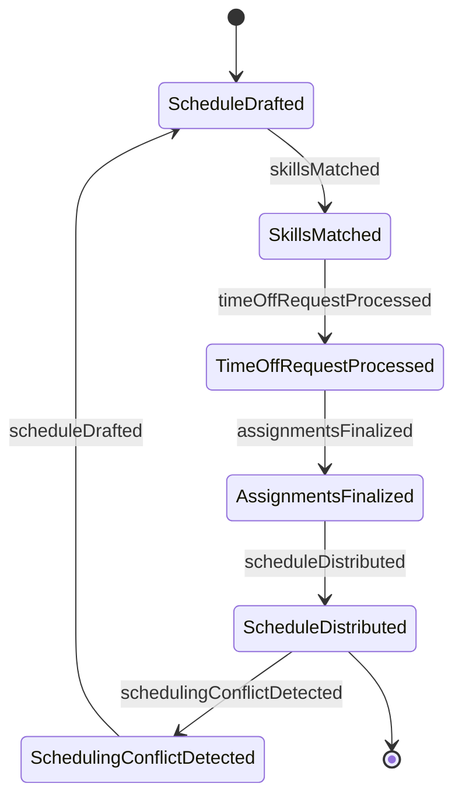
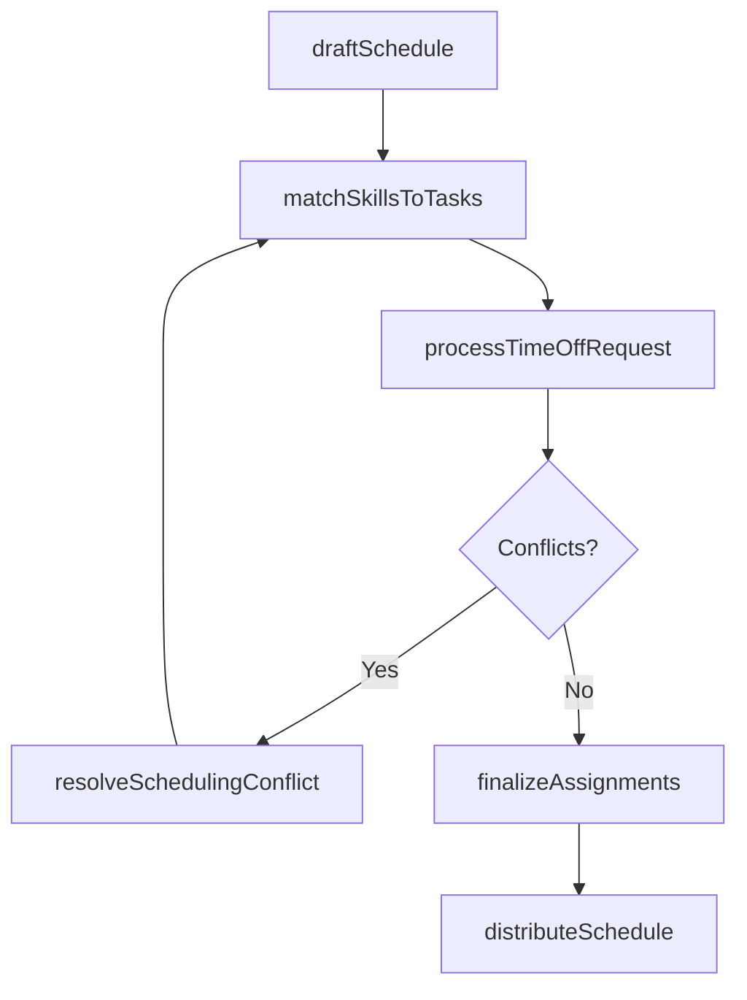
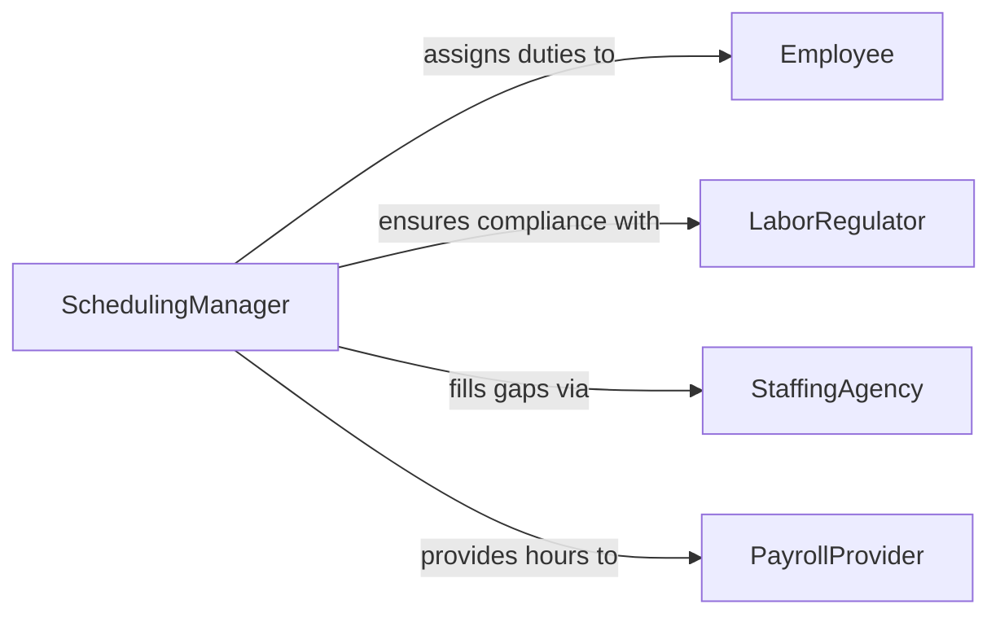

# Prepare Staff Schedules Work Assignments

> Business-as-Code definition for preparing staff schedules or work assignments. Models the creation and distribution of work rosters, task allocations, and duty assignments across teams and shifts.

## Overview

Preparing staff schedules or work assignments involves creating duty rosters, allocating tasks to team members, and distributing assignment information to staff. This definition provides actions for drafting schedules, matching staff skills to task requirements, handling time-off requests, and distributing finalized assignments. It enables automation of schedule drafting, skill-based matching, and assignment notification workflows.

## Actors

| Actor | Description |
|-------|-------------|
| Employee | Staff member receiving schedule and work assignment information |
| LaborRegulator | Enforces labor laws governing scheduling practices |
| StaffingAgency | Provides temporary workers when internal staff is unavailable |
| PayrollProvider | Processes compensation based on scheduled and actual hours |

## Roles

| Role | Description |
|------|-------------|
| SchedulingManager | Creates and distributes staff schedules and assignments |
| TeamSupervisor | Defines task requirements and approves assignment allocations |
| HRAdministrator | Ensures schedules comply with labor policies and contracts |
| TimeOffCoordinator | Processes leave requests and maintains availability records |

## Entities

| Entity | Description |
|--------|-------------|
| StaffRoster | A published list of employee assignments by shift and date |
| WorkAssignment | A specific task or duty allocated to a staff member |
| AvailabilityRecord | Employee-submitted schedule preferences and time-off requests |
| SkillProfile | Documented competencies and certifications for task matching |
| ShiftTemplate | A reusable pattern defining standard shift times and roles |
| AssignmentNotification | Communication sent to staff about their scheduled duties |

## Actions

| Action | Description |
|--------|-------------|
| draftSchedule | Create an initial staff roster based on requirements and availability |
| matchSkillsToTasks | Align employee competencies with assignment requirements |
| processTimeOffRequest | Review and approve employee leave or schedule preferences |
| finalizeAssignments | Lock in work allocations and prepare for distribution |
| distributeSchedule | Send assignment notifications to all affected staff |
| resolveSchedulingConflict | Address overlapping assignments or insufficient coverage |

## Events

| Event | Description |
|-------|-------------|
| scheduleDrafted | An initial staff roster has been created |
| skillsMatched | Employee competencies have been aligned with task requirements |
| timeOffRequestProcessed | An employee leave request has been reviewed |
| assignmentsFinalized | Work allocations have been locked in |
| scheduleDistributed | Assignment notifications have been sent to staff |
| schedulingConflictDetected | An overlap or coverage gap has been identified |

## Searches

| Search | Description |
|--------|-------------|
| getStaffRoster | Retrieve published schedules by date, shift, or team |
| getAvailability | Check employee availability and pending time-off requests |
| findUnfilledShifts | List shifts without adequate staff assignments |
| getSkillProfiles | Review employee competencies for task matching |
| getAssignmentHistory | Retrieve past work allocations by employee or period |


## Entity Relationships



## State Diagram



## Workflow



## Actor Relationships



## Usage

### Calling Actions

```typescript
import { prepareStaffSchedulesWorkAssignments } from '@headlessly/prepare-staff-schedules-work-assignments'

const scheduling = prepareStaffSchedulesWorkAssignments()

// Draft a weekly schedule
const draft = await scheduling.draftSchedule({
  team: 'retail-floor',
  week: '2026-04-13',
  shifts: ['morning', 'afternoon', 'evening'],
  minimumStaff: { morning: 4, afternoon: 5, evening: 3 }
})

// Match skills to specialized tasks
await scheduling.matchSkillsToTasks({
  scheduleId: draft.id,
  tasks: [
    { name: 'cash-register', requiredSkill: 'pos-certified' },
    { name: 'inventory-receiving', requiredSkill: 'forklift-licensed' }
  ]
})

// Distribute the finalized schedule
await scheduling.distributeSchedule({
  scheduleId: draft.id,
  channels: ['email', 'mobile-app'],
  advanceNoticeDays: 7
})
```

### Event-Driven Automation

```typescript
// Alert on scheduling conflicts
scheduling.schedulingConflictDetected(async ({ shift, date, issue }) => {
  await notify({
    to: 'scheduling-manager',
    message: `Scheduling conflict on ${date} ${shift}: ${issue}`
  })
})

// Auto-notify staff on schedule publication
scheduling.scheduleDistributed(async ({ scheduleId, team, affectedEmployees }) => {
  for (const employee of affectedEmployees) {
    await notify({
      to: employee.id,
      message: `Your schedule for ${team} has been published. Check your assignments.`
    })
  }
})
```
