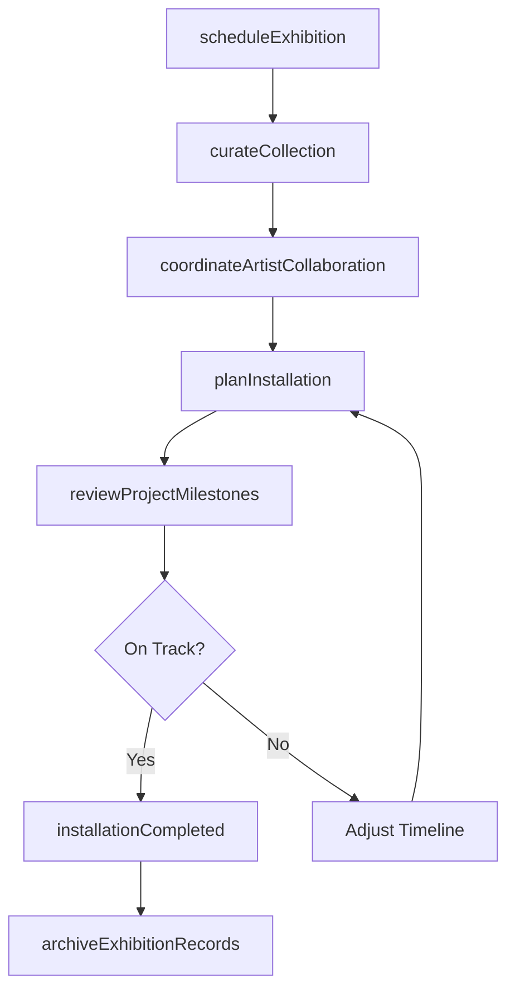
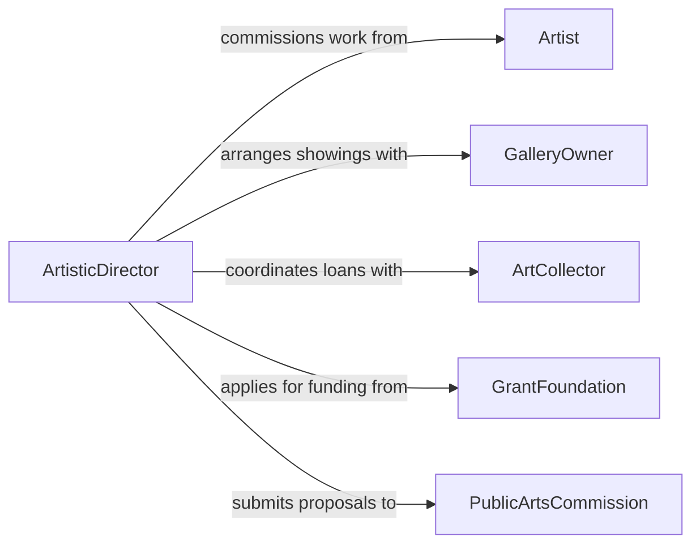

# Coordinate Artistic Activities

> Business-as-Code definition for coordinating artistic activities. Models the planning, scheduling, and oversight of creative projects including visual arts exhibitions, design collaborations, public art installations, and gallery programming.

## Overview

Coordinating artistic activities involves managing the logistical, creative, and administrative dimensions of art projects across studios, galleries, museums, and public spaces. This definition provides actions for scheduling exhibitions, coordinating artist collaborations, managing installation timelines, curating collections, and overseeing creative production workflows. It enables automation of exhibition scheduling, artist communication, installation milestone tracking, and collection cataloging.

## Actors

| Actor | Description |
|-------|-------------|
| Artist | Creates original works for exhibition, commission, or collaboration |
| GalleryOwner | Provides exhibition space and manages sales of artworks |
| ArtCollector | Acquires artworks and lends pieces for exhibitions |
| GrantFoundation | Provides funding for artistic projects and public commissions |
| PublicArtsCommission | Oversees public art installations and community art initiatives |
| ArtShipper | Handles specialized transport and crating of artworks |

## Roles

| Role | Description |
|------|-------------|
| ArtisticDirector | Sets the creative vision and oversees all artistic programming |
| ExhibitionCoordinator | Manages logistics for exhibitions from planning through installation |
| Curator | Selects and arranges works for exhibitions and collections |
| StudioManager | Coordinates day-to-day operations of artist studios and workshops |

## Entities

| Entity | Description |
|--------|-------------|
| Exhibition | A curated presentation of artworks in a specific venue and timeframe |
| ArtisticProject | A defined creative undertaking with scope, timeline, and budget |
| Commission | A contracted agreement for the creation of an original artwork |
| InstallationPlan | Technical and logistical requirements for mounting an exhibition |
| CollectionCatalog | An inventory of artworks with provenance and condition records |
| ArtistAgreement | Contract defining terms for an artist's participation in a project |

## Actions

| Action | Description |
|--------|-------------|
| scheduleExhibition | Plan dates, venue, and programming for an art showing |
| coordinateArtistCollaboration | Organize joint creative efforts between multiple artists |
| planInstallation | Define technical requirements and timeline for mounting artworks |
| curateCollection | Select and arrange works for exhibition or acquisition |
| manageCommission | Oversee the creation of a contracted original artwork |
| reviewProjectMilestones | Assess progress against artistic project timelines |
| archiveExhibitionRecords | Catalog documentation from completed exhibitions |

## Events

| Event | Description |
|-------|-------------|
| exhibitionScheduled | Dates and venue for an art showing have been confirmed |
| collaborationInitiated | A joint creative project between artists has been launched |
| installationCompleted | Artworks have been mounted and the exhibition space is ready |
| collectionCurated | Works have been selected and arranged for presentation |
| commissionApproved | A contracted artwork creation has been formally authorized |
| projectMilestoneReached | An artistic project has achieved a defined progress checkpoint |
| exhibitionClosed | An art showing has concluded and deinstallation can begin |

## Searches

| Search | Description |
|--------|-------------|
| getExhibitions | List exhibitions by venue, date range, or status |
| findAvailableArtists | Search artists by medium, availability, or past collaborations |
| getInstallationSchedule | Retrieve mounting timelines and technical requirements |
| getCollectionInventory | Browse cataloged artworks by medium, artist, or provenance |
| getProjectStatus | Check progress of active artistic projects and commissions |

## Workflow



## Actor Relationships



## Usage

### Calling Actions

```typescript
import { coordinateArtisticActivities } from '@headlessly/coordinate-artistic-activities'

const arts = coordinateArtisticActivities()

// Schedule a new exhibition
const exhibition = await arts.scheduleExhibition({
  title: 'Urban Landscapes: Contemporary Perspectives',
  venue: 'downtown-gallery',
  dates: { opening: '2026-09-05', closing: '2026-11-15' },
  artists: ['artist-chen', 'artist-rodriguez', 'artist-okafor'],
  medium: 'mixed-media'
})

// Plan the installation
await arts.planInstallation({
  exhibitionId: exhibition.id,
  requirements: {
    wallSpace: '240-linear-feet',
    lighting: 'track-led-adjustable',
    pedestals: 8,
    caseDisplays: 3
  },
  installDates: { start: '2026-08-28', end: '2026-09-04' }
})

// Review project milestones
const status = await arts.getProjectStatus({
  exhibitionId: exhibition.id,
  includeCommissions: true
})
```

### Event-Driven Automation

```typescript
// Notify artists when exhibition is scheduled
arts.exhibitionScheduled(async ({ exhibitionId, title, artists, dates }) => {
  for (const artist of artists) {
    await notify({
      to: artist,
      message: `Your work has been selected for "${title}" opening ${dates.opening}. Installation begins ${dates.installStart}.`
    })
  }
})

// Archive records when exhibition closes
arts.exhibitionClosed(async ({ exhibitionId, title }) => {
  await arts.archiveExhibitionRecords({
    exhibitionId,
    include: ['attendance', 'sales', 'press-coverage', 'installation-photos']
  })
})
```
