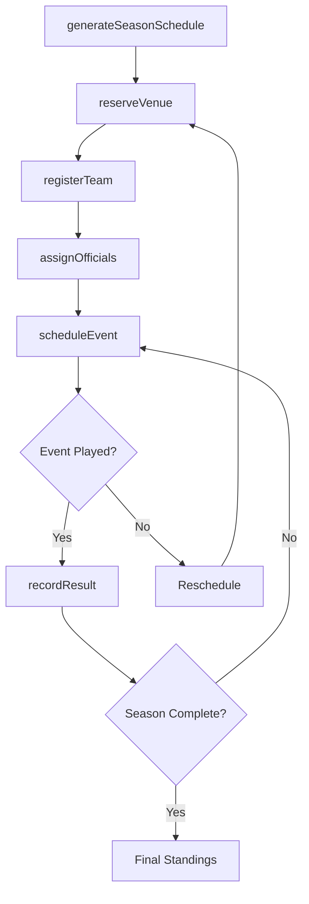
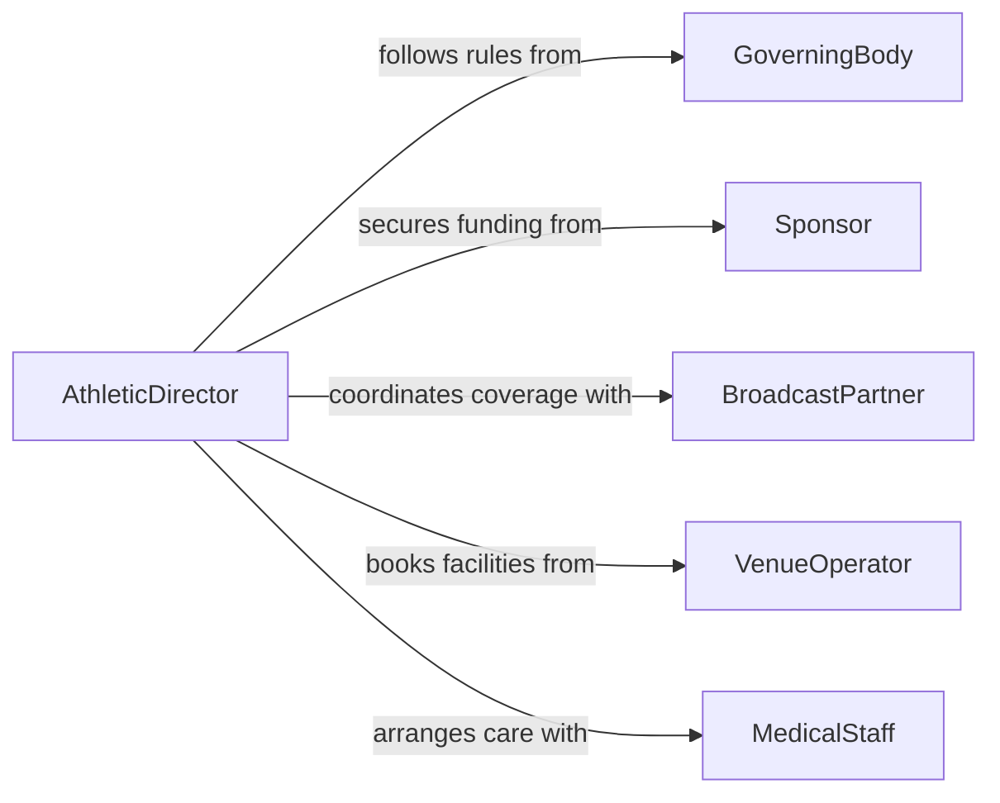

# Coordinate Athletic or Sporting Events and Activities

> Business-as-Code definition for coordinating athletic or sporting events and activities. Models the planning, logistics, and execution of competitive sporting events, athletic programs, tournaments, and recreational activities.

## Overview

Coordinating athletic or sporting events and activities involves managing the scheduling, logistics, officiating, venue preparation, and participant coordination for competitive and recreational athletic programs. This definition provides actions for scheduling games and tournaments, assigning officials, managing team registrations, coordinating venue operations, and tracking results. It enables automation of schedule generation, official assignment, score reporting, and participant communication workflows.

## Actors

| Actor | Description |
|-------|-------------|
| GoverningBody | Sports league or federation setting rules and sanctioning events |
| Sponsor | Provides financial support or branding for events and programs |
| BroadcastPartner | Provides media coverage of sporting events |
| VenueOperator | Manages the facility where athletic events are held |
| MedicalStaff | Provides injury assessment and emergency care at events |
| OfficialAssigningAuthority | Assigns referees, umpires, and judges to events |

## Roles

| Role | Description |
|------|-------------|
| AthleticDirector | Oversees all sporting programs and event operations |
| EventCoordinator | Manages logistics for individual games, meets, or tournaments |
| TournamentDirector | Plans and executes multi-day competitive events |
| TeamManager | Handles roster management and team logistics |
| SchedulingCoordinator | Builds game schedules and manages venue reservations |

## Entities

| Entity | Description |
|--------|-------------|
| SportingEvent | A scheduled competitive or exhibition athletic contest |
| Tournament | A multi-game competition structure with brackets or pools |
| GameSchedule | The calendar of contests for a season or event |
| TeamRoster | The registered list of athletes for a team or program |
| OfficialAssignment | Designation of referees or judges to a specific event |
| VenueReservation | A confirmed booking of a facility for an athletic event |
| EventResult | The official score and outcome of a completed contest |
| AthleteRegistration | A participant's enrollment in a program or event |

## Actions

| Action | Description |
|--------|-------------|
| scheduleEvent | Set date, time, venue, and participants for an athletic contest |
| createTournamentBracket | Build the competition structure for a multi-game event |
| assignOfficials | Designate referees, umpires, or judges for a contest |
| registerTeam | Enroll a team and its roster in a league or tournament |
| reserveVenue | Book a facility for an upcoming athletic event |
| recordResult | Enter the official score and outcome of a completed contest |
| generateSeasonSchedule | Build the full calendar of games for a competitive season |

## Events

| Event | Description |
|-------|-------------|
| eventScheduled | An athletic contest has been set with date, time, and venue |
| tournamentBracketCreated | The competition structure for a multi-game event has been built |
| officialsAssigned | Referees or judges have been designated for a contest |
| teamRegistered | A team has been enrolled in a league or tournament |
| venueReserved | A facility has been booked for an athletic event |
| resultRecorded | The official outcome of a completed contest has been entered |
| eventPostponed | A scheduled contest has been delayed to a later date |

## Searches

| Search | Description |
|--------|-------------|
| getUpcomingEvents | List scheduled contests by sport, date range, or venue |
| getTournamentStandings | Retrieve win-loss records and rankings within a tournament |
| getOfficialAssignments | Check referee or judge assignments by event or official |
| findAvailableVenues | Search facilities by sport, capacity, and date availability |
| getSeasonResults | Retrieve game outcomes and statistics for a competitive season |

## Workflow



## Actor Relationships



## Usage

### Calling Actions

```typescript
import { coordinateAthleticSportingEventsActivities } from '@headlessly/coordinate-athletic-sporting-events-activities'

const athletics = coordinateAthleticSportingEventsActivities()

// Generate a season schedule
const schedule = await athletics.generateSeasonSchedule({
  league: 'metro-basketball-conference',
  season: 'spring-2026',
  teams: ['eagles', 'hawks', 'tigers', 'wolves', 'bears', 'lions'],
  format: 'round-robin',
  gamesPerWeek: 3
})

// Create a tournament bracket
const bracket = await athletics.createTournamentBracket({
  tournament: 'regional-championship-2026',
  format: 'single-elimination',
  seeds: [
    { seed: 1, team: 'eagles' },
    { seed: 2, team: 'hawks' },
    { seed: 3, team: 'tigers' },
    { seed: 4, team: 'wolves' }
  ]
})

// Record a game result
await athletics.recordResult({
  eventId: 'game-2026-0415-eagles-hawks',
  homeTeam: 'eagles',
  awayTeam: 'hawks',
  score: { home: 87, away: 82 },
  attendance: 3200
})
```

### Event-Driven Automation

```typescript
// Notify teams when event is scheduled
athletics.eventScheduled(async ({ eventId, homeTeam, awayTeam, date, venue }) => {
  await notify({
    to: [homeTeam, awayTeam],
    message: `Game scheduled: ${homeTeam} vs ${awayTeam} at ${venue} on ${date}`
  })
})

// Auto-update standings when result is recorded
athletics.resultRecorded(async ({ eventId, homeTeam, awayTeam, score }) => {
  const winner = score.home > score.away ? homeTeam : awayTeam
  await notify({
    to: 'league-office',
    message: `Result: ${homeTeam} ${score.home} - ${awayTeam} ${score.away}. Standings updated.`
  })
})
```
