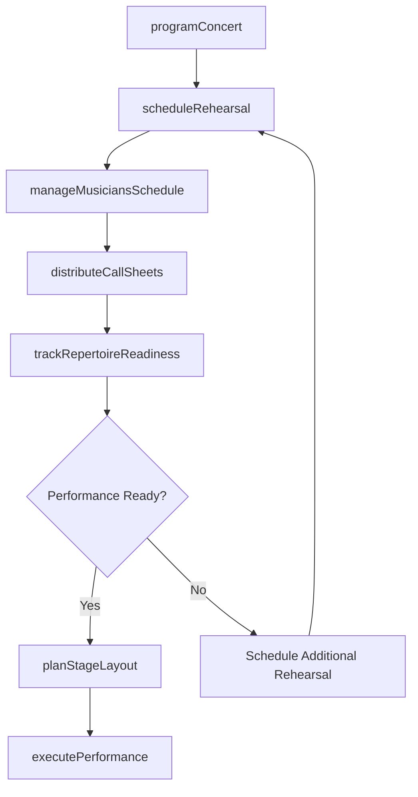
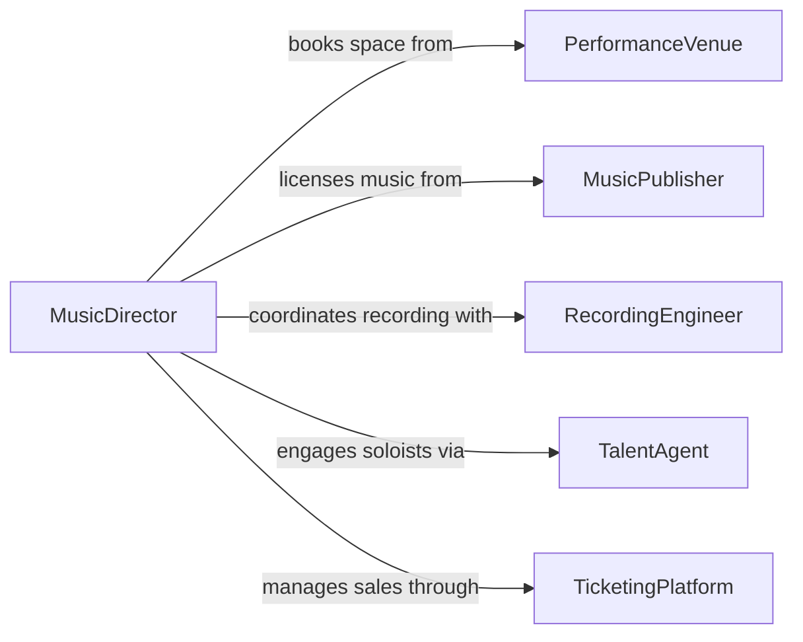

# Coordinate Musical Rehearsals or Performances

> Business-as-Code definition for coordinating musical rehearsals or performances. Models the scheduling, preparation, and execution of rehearsals, concerts, recitals, and touring productions for orchestras, bands, choirs, and solo performers.

## Overview

Coordinating musical rehearsals or performances involves managing the complex logistics of bringing musicians, conductors, venues, technical crews, and audiences together for live music events. This definition provides actions for scheduling rehearsal blocks, booking performance venues, managing musician availability, coordinating technical production requirements, and tracking repertoire preparation. It enables automation of rehearsal scheduling, call sheet distribution, venue logistics coordination, and performance readiness tracking.

## Actors

| Actor | Description |
|-------|-------------|
| PerformanceVenue | Provides the concert hall, theater, or event space for performances |
| MusicPublisher | Licenses sheet music and performance rights for repertoire |
| RecordingEngineer | Provides audio capture services for rehearsals and performances |
| TalentAgent | Represents guest soloists and visiting artists for engagements |
| TicketingPlatform | Manages ticket sales and audience access for events |
| InstrumentTechnician | Provides tuning, repair, and maintenance of instruments |

## Roles

| Role | Description |
|------|-------------|
| MusicDirector | Sets the artistic vision and leads musical interpretation |
| RehearsalManager | Coordinates scheduling and logistics for all rehearsal sessions |
| StageManager | Oversees technical production and backstage operations |
| LibrarianManager | Manages sheet music distribution, markings, and returns |
| PersonnelManager | Handles musician scheduling, substitutes, and seating assignments |

## Entities

| Entity | Description |
|--------|-------------|
| RehearsalSession | A scheduled practice period for a musical ensemble or section |
| Concert | A public performance event with defined program and audience |
| Repertoire | The collection of musical works programmed for performance |
| CallSheet | Notification specifying who is needed, when, and where for a session |
| StageLayout | Technical diagram of performer positions, equipment, and sound setup |
| PerformanceSeason | A defined period of programmed concerts and events |
| MusicianRoster | The active list of performers in an ensemble with instrument assignments |

## Actions

| Action | Description |
|--------|-------------|
| scheduleRehearsal | Set date, time, location, and personnel for a practice session |
| programConcert | Define the repertoire, soloists, and running order for a performance |
| distributeCallSheets | Send session notifications to required musicians and crew |
| planStageLayout | Design performer positions, monitor placements, and sound setup |
| trackRepertoireReadiness | Monitor preparation progress for each programmed work |
| manageMusiciansSchedule | Coordinate availability, substitutions, and seating assignments |
| executePerformance | Oversee the live execution of a concert or recital |

## Events

| Event | Description |
|-------|-------------|
| rehearsalScheduled | A practice session has been set with date, time, and personnel |
| concertProgrammed | Repertoire and running order for a performance have been defined |
| callSheetsDistributed | Session notifications have been sent to musicians and crew |
| stageLayoutFinalized | Performer positions and technical setup have been confirmed |
| repertoireReady | All programmed works have reached performance-ready status |
| performanceCompleted | A concert or recital has been successfully executed |
| rehearsalCancelled | A scheduled practice session has been called off |

## Searches

| Search | Description |
|--------|-------------|
| getRehearsalSchedule | List upcoming practice sessions by ensemble, date, or venue |
| getConcertSeason | Retrieve programmed performances for a defined season |
| getMusicianAvailability | Check performer scheduling and conflict status |
| getRepertoireStatus | Review preparation progress by work, section, or ensemble |
| findVenueAvailability | Search performance spaces by date, capacity, and acoustics |

## Workflow



## Actor Relationships



## Usage

### Calling Actions

```typescript
import { coordinateMusicalRehearsalsPerformances } from '@headlessly/coordinate-musical-rehearsals-performances'

const music = coordinateMusicalRehearsalsPerformances()

// Program a concert
const concert = await music.programConcert({
  title: 'Season Opening Gala',
  date: '2026-10-03',
  venue: 'symphony-hall',
  repertoire: [
    { work: 'Beethoven Symphony No. 5', duration: '35-minutes' },
    { work: 'Rachmaninoff Piano Concerto No. 2', duration: '33-minutes', soloist: 'guest-pianist-nakamura' }
  ]
})

// Schedule rehearsals
await music.scheduleRehearsal({
  concertId: concert.id,
  sessions: [
    { date: '2026-09-28', time: '10:00', duration: '3-hours', type: 'sectional-strings' },
    { date: '2026-09-30', time: '10:00', duration: '3-hours', type: 'full-orchestra' },
    { date: '2026-10-02', time: '19:00', duration: '2.5-hours', type: 'dress-rehearsal' }
  ]
})

// Check repertoire readiness
const status = await music.getRepertoireStatus({
  concertId: concert.id,
  breakdownBy: 'section'
})
```

### Event-Driven Automation

```typescript
// Distribute call sheets when rehearsal is scheduled
music.rehearsalScheduled(async ({ sessionId, date, type, personnel }) => {
  await music.distributeCallSheets({
    sessionId,
    musicians: personnel,
    details: { date, type, callTime: '30-minutes-before' }
  })
})

// Notify music director when all repertoire is ready
music.repertoireReady(async ({ concertId, title }) => {
  await notify({
    to: 'music-director',
    message: `All repertoire for "${title}" has reached performance-ready status. Dress rehearsal may proceed.`
  })
})
```
