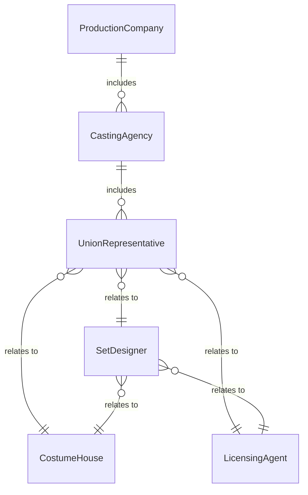
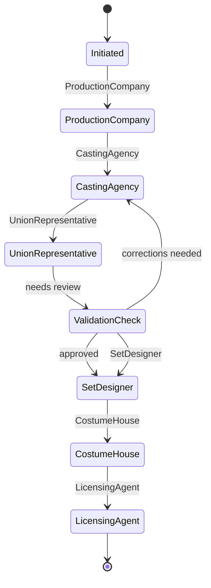
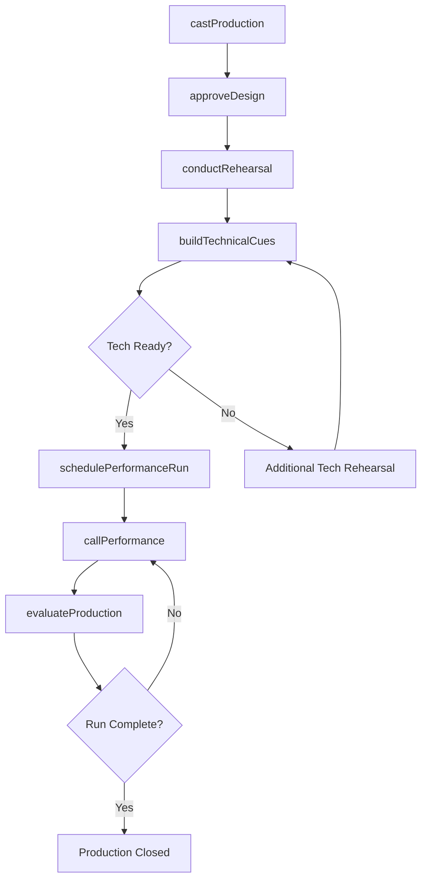
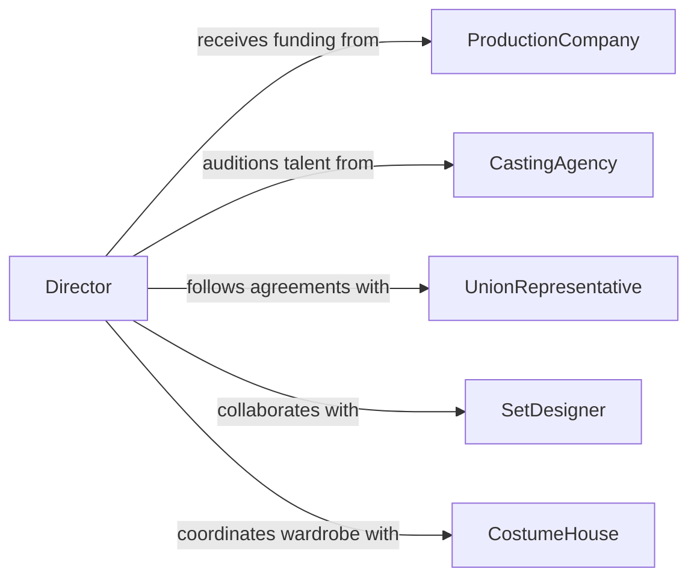

# Direct Productions or Performances

> Business-as-Code definition for directing productions or performances. Models the creative leadership and operational oversight of theater, film, television, and live entertainment productions from pre-production through closing.

## Overview

Directing productions or performances involves leading the creative vision, casting, rehearsal process, technical integration, and live execution of theatrical, film, television, and live entertainment presentations. This definition provides actions for casting performers, conducting rehearsals, integrating technical elements, managing production schedules, and overseeing live performances. It enables automation of audition scheduling, rehearsal tracking, technical cue management, and performance reporting workflows.

## Actors

| Actor | Description |
|-------|-------------|
| ProductionCompany | Finances and produces the show or film project |
| CastingAgency | Provides talent submissions and audition coordination |
| UnionRepresentative | Enforces labor agreements for performers and crew |
| SetDesigner | Creates the physical environment for the production |
| CostumeHouse | Provides wardrobe design, construction, and rental |
| LicensingAgent | Grants performance rights for scripts, music, and choreography |

## Roles

| Role | Description |
|------|-------------|
| Director | Leads the creative vision and guides all artistic decisions |
| AssistantDirector | Manages rehearsal logistics and coordinates between departments |
| StageManager | Calls cues and oversees backstage operations during performances |
| ProductionManager | Controls budget, schedule, and logistical resources |
| Choreographer | Creates and teaches movement sequences for the production |

## Entities

| Entity | Description |
|--------|-------------|
| Production | A defined theatrical, film, or entertainment project with scope and budget |
| CastList | The assigned performers for each role in a production |
| RehearsalSchedule | The calendar of practice sessions organized by scene or department |
| TechnicalCueSheet | Sequenced list of lighting, sound, and scenic changes during a show |
| ProductionBudget | Financial plan covering all costs from pre-production through closing |
| PerformanceRun | The series of scheduled shows for a production |
| BlockingNotes | Documented stage movement and positioning for performers |

## Actions

| Action | Description |
|--------|-------------|
| castProduction | Select performers for roles through auditions and callbacks |
| conductRehearsal | Lead a practice session focused on scene work or technical integration |
| buildTechnicalCues | Create the sequence of lighting, sound, and scenic changes |
| approveDesign | Review and authorize set, costume, and technical design elements |
| schedulePerformanceRun | Set dates and times for the series of public performances |
| callPerformance | Execute real-time cueing and oversight during a live show |
| evaluateProduction | Review performance quality and make adjustments for future shows |

## Events

| Event | Description |
|-------|-------------|
| productionCast | Performers have been selected and assigned to roles |
| rehearsalCompleted | A scheduled practice session has been conducted |
| technicalCuesBuilt | The sequence of production cues has been created |
| designApproved | Set, costume, or technical designs have been authorized |
| performanceRunScheduled | The series of public shows has been set |
| openingNightCompleted | The first public performance has been executed |
| productionClosed | The final performance has concluded and strike can begin |

## Searches

| Search | Description |
|--------|-------------|
| getCastList | Retrieve performer assignments by production or role |
| getRehearsalSchedule | List practice sessions by date, scene, or department |
| getTechnicalCues | Review the cue sequence for a specific performance |
| getProductionBudget | Check spending against budget by department or category |
| getPerformanceHistory | Retrieve past show records including attendance and reviews |


## Entity Relationships



## State Diagram



## Workflow



## Actor Relationships



## Usage

### Calling Actions

```typescript
import { directProductionsPerformances } from '@headlessly/direct-productions-performances'

const production = directProductionsPerformances()

// Cast a production
const cast = await production.castProduction({
  show: 'A Midsummer Nights Dream',
  roles: [
    { role: 'Titania', auditionSlots: 12, callbackDate: '2026-03-15' },
    { role: 'Oberon', auditionSlots: 10, callbackDate: '2026-03-15' },
    { role: 'Puck', auditionSlots: 15, callbackDate: '2026-03-16' }
  ],
  auditionDates: ['2026-03-10', '2026-03-11', '2026-03-12']
})

// Build technical cues
await production.buildTechnicalCues({
  show: 'A Midsummer Nights Dream',
  act: 1,
  cues: [
    { number: 'LX-101', type: 'lighting', action: 'fade-to-blue-wash', trigger: 'Titania-entrance' },
    { number: 'SQ-201', type: 'sound', action: 'forest-ambience-in', trigger: 'scene-change' },
    { number: 'FY-301', type: 'fly', action: 'lower-forest-drop', trigger: 'blackout' }
  ]
})

// Check rehearsal progress
const schedule = await production.getRehearsalSchedule({
  show: 'A Midsummer Nights Dream',
  week: '2026-04-W2',
  department: 'all'
})
```

### Event-Driven Automation

```typescript
// Notify cast when production is cast
production.productionCast(async ({ show, castList }) => {
  for (const member of castList) {
    await notify({
      to: member.performer,
      message: `Congratulations! You have been cast as ${member.role} in "${show}". First rehearsal details to follow.`
    })
  }
})

// Auto-evaluate after opening night
production.openingNightCompleted(async ({ show, attendance, technicalIssues }) => {
  await notify({
    to: 'director',
    message: `Opening night of "${show}" complete. Attendance: ${attendance}. Technical issues: ${technicalIssues.length}.`
  })
})
```
