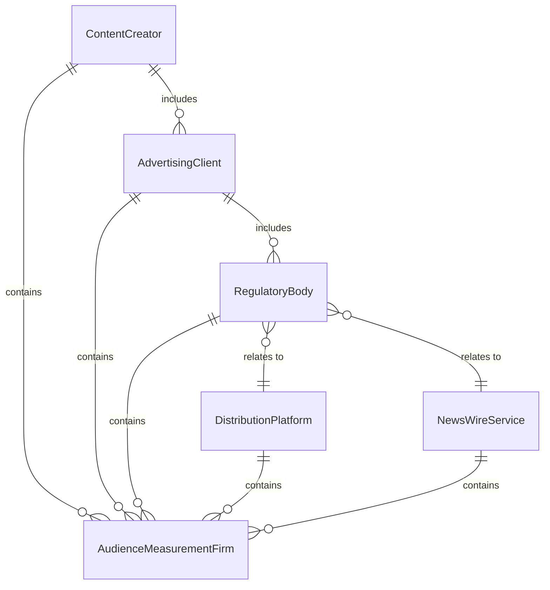
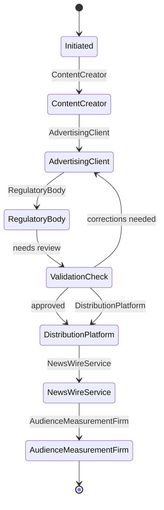
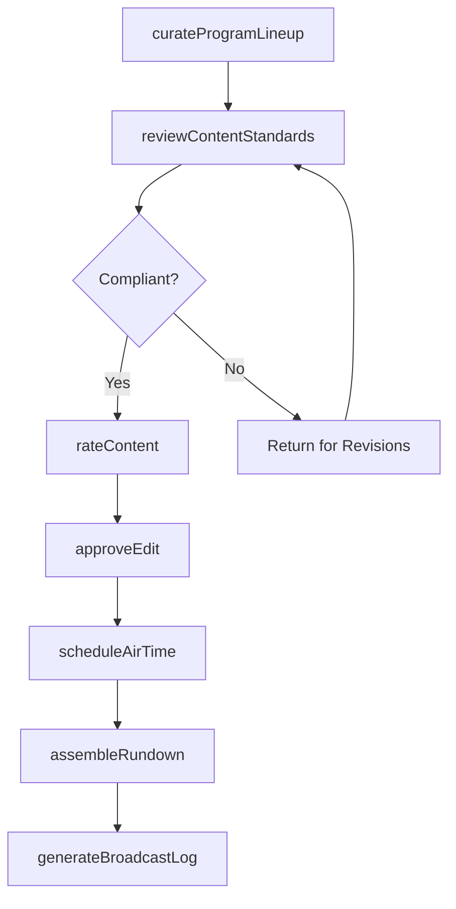
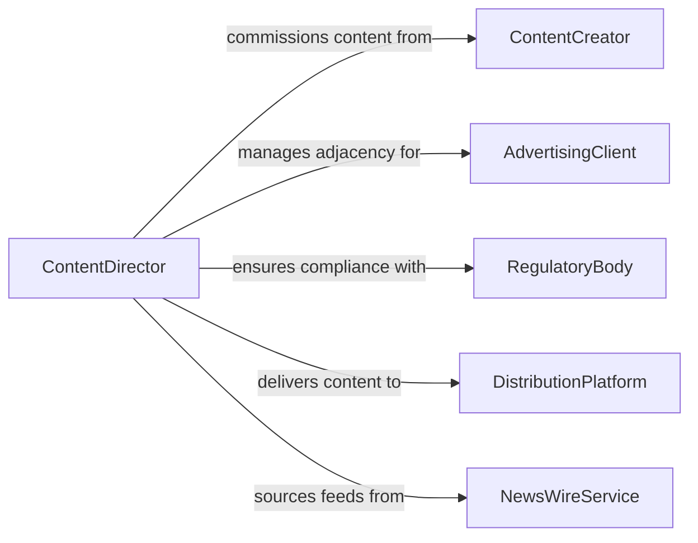

# Manage Content of Broadcasts or Presentations

> Business-as-Code definition for managing content of broadcasts or presentations. Models the editorial oversight, scheduling, and quality control of media content across television, radio, streaming, podcast, and live presentation channels.

## Overview

Managing content of broadcasts or presentations involves overseeing the editorial selection, sequencing, quality review, and scheduling of media content for distribution across broadcast, streaming, and live presentation channels. This definition provides actions for curating program lineups, reviewing content for standards compliance, scheduling air times, managing rundowns, and approving final edits. It enables automation of content scheduling, standards review routing, rundown assembly, and broadcast log generation.

## Actors

| Actor | Description |
|-------|-------------|
| ContentCreator | Produces original programming, segments, or media assets |
| AdvertisingClient | Purchases airtime and requires content adjacency standards |
| RegulatoryBody | Enforces broadcast standards for decency, accuracy, and fairness |
| DistributionPlatform | Delivers content to audiences via cable, satellite, or streaming |
| NewsWireService | Provides syndicated content and breaking news feeds |
| AudienceMeasurementFirm | Tracks viewership, listenership, and engagement metrics |

## Roles

| Role | Description |
|------|-------------|
| ContentDirector | Sets editorial direction and approves all programming decisions |
| ProgramScheduler | Builds and manages the broadcast schedule and dayparting strategy |
| StandardsEditor | Reviews content for compliance with broadcast regulations |
| RundownProducer | Assembles the segment-by-segment structure for live programs |
| MediaAssetManager | Catalogs, stores, and retrieves media files for broadcast use |

## Entities

| Entity | Description |
|--------|-------------|
| ProgramSchedule | The ordered lineup of shows and segments across time slots |
| MediaAsset | A video, audio, or graphic file ready for broadcast or presentation |
| Rundown | The segment-by-segment plan for a live broadcast or presentation |
| StandardsReview | An assessment of content against regulatory and editorial guidelines |
| AirTimeSlot | A specific date and time window allocated for content broadcast |
| BroadcastLog | The official record of what aired and when during a broadcast period |
| ContentRating | Classification of content based on audience suitability |

## Actions

| Action | Description |
|--------|-------------|
| curateProgramLineup | Select and sequence content for a broadcast period |
| reviewContentStandards | Assess media against regulatory and editorial guidelines |
| scheduleAirTime | Assign content to specific broadcast time slots |
| assembleRundown | Build the segment structure for a live program |
| approveEdit | Authorize the final version of a media asset for broadcast |
| generateBroadcastLog | Create the official record of aired content and timing |
| rateContent | Classify programming for audience suitability |

## Events

| Event | Description |
|-------|-------------|
| programLineupCurated | Content has been selected and sequenced for a broadcast period |
| contentStandardsReviewed | Media has been assessed against regulatory guidelines |
| airTimeScheduled | Content has been assigned to a specific broadcast slot |
| rundownAssembled | The segment structure for a live program has been built |
| editApproved | The final version of a media asset has been authorized |
| broadcastLogGenerated | The official record of aired content has been created |
| contentFlagged | Media has been identified as requiring additional review or changes |

## Searches

| Search | Description |
|--------|-------------|
| getProgramSchedule | Retrieve the content lineup for a channel, date, or daypart |
| getMediaAssets | Search available content by format, topic, or creation date |
| findPendingReviews | List content awaiting standards review or editorial approval |
| getBroadcastLog | Retrieve the official record of what aired during a period |
| getAudienceMetrics | Check viewership and engagement data by program or time slot |


## Entity Relationships



## State Diagram



## Workflow



## Actor Relationships



## Usage

### Calling Actions

```typescript
import { manageContentBroadcastsPresentations } from '@headlessly/manage-content-broadcasts-presentations'

const broadcast = manageContentBroadcastsPresentations()

// Curate the evening program lineup
await broadcast.curateProgramLineup({
  channel: 'main-broadcast',
  date: '2026-05-15',
  daypart: 'primetime',
  programs: [
    { slot: '20:00', title: 'Evening News Hour', duration: '60-minutes' },
    { slot: '21:00', title: 'Documentary Series: Climate Futures', duration: '60-minutes' },
    { slot: '22:00', title: 'Late Night Interview', duration: '60-minutes' }
  ]
})

// Assemble a live show rundown
await broadcast.assembleRundown({
  program: 'Evening News Hour',
  date: '2026-05-15',
  segments: [
    { order: 1, title: 'Top Stories', duration: '12-minutes', anchor: 'primary' },
    { order: 2, title: 'Weather Forecast', duration: '4-minutes', anchor: 'weather' },
    { order: 3, title: 'Business Report', duration: '8-minutes', anchor: 'business' },
    { order: 4, title: 'Feature Story', duration: '10-minutes', correspondent: 'field-reporter-1' }
  ]
})

// Check pending content reviews
const pending = await broadcast.findPendingReviews({
  channel: 'main-broadcast',
  reviewType: 'standards',
  status: 'awaiting-review'
})
```

### Event-Driven Automation

```typescript
// Alert when content is flagged during review
broadcast.contentFlagged(async ({ assetId, title, issue, severity }) => {
  await notify({
    to: 'standards-editor',
    message: `Content flagged: "${title}" - ${issue} (severity: ${severity}). Review required before air.`
  })
})

// Auto-generate broadcast log after programming airs
broadcast.broadcastLogGenerated(async ({ channel, date, programs }) => {
  await notify({
    to: 'program-scheduler',
    message: `Broadcast log for ${channel} on ${date} finalized. ${programs.length} programs logged.`
  })
})
```
