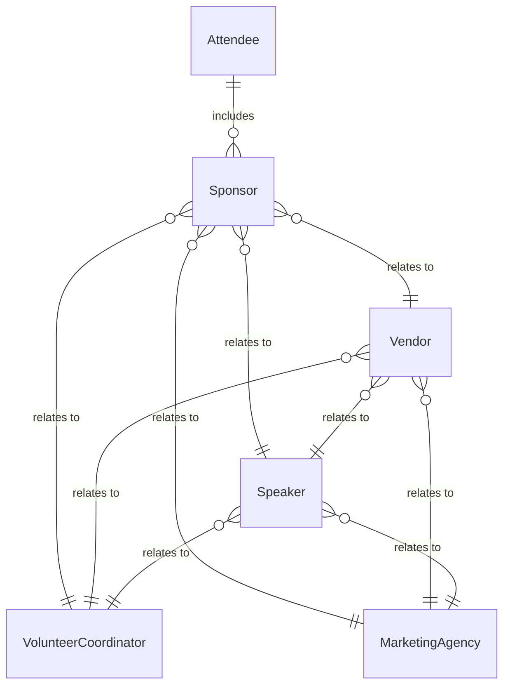
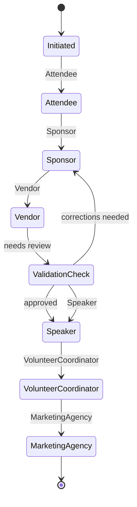
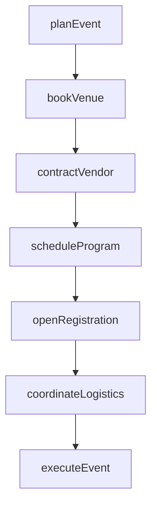
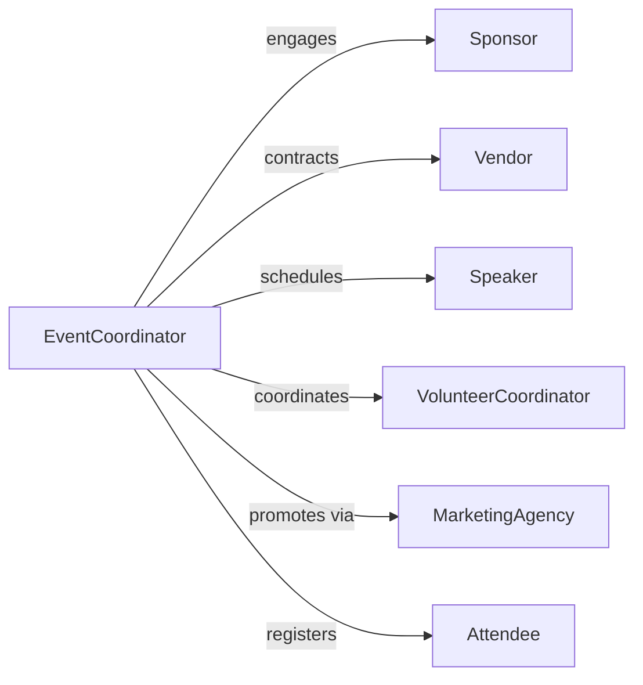

# Coordinate Special Events Programs

> Business-as-Code definition for special event and program coordination. Models the planning, execution, and management of conferences, galas, festivals, and community programs.

## Overview

Special event and program coordination involves managing venues, schedules, vendors, registrations, and logistics for corporate events, fundraisers, conferences, and community programs. This definition exposes actions for event planning workflows, event triggers for milestone notifications, and searches for attendee and vendor management.

## Actors

| Actor | Description |
|-------|-------------|
| Attendee | Individual registered to participate in the event |
| Sponsor | Organization providing financial support for the event |
| Vendor | Caterer, venue, or supplier contracted for event services |
| Speaker | Presenter or performer scheduled for the program |
| VolunteerCoordinator | Organizes and manages event volunteers |
| MarketingAgency | Promotes the event through various channels |

## Roles

| Role | Description |
|------|-------------|
| EventCoordinator | Oversees all aspects of event planning and execution |
| VenueManager | Secures and manages event locations |
| RegistrationLead | Handles attendee registration and ticketing |
| LogisticsManager | Coordinates equipment, materials, and schedules |
| ProgramDirector | Develops event agenda and speaker lineup |

## Entities

| Entity | Description |
|--------|-------------|
| Event | A scheduled special event or program |
| Registration | Attendee enrollment with ticket and preferences |
| Venue | Location booked for the event |
| VendorContract | Agreement with service providers |
| Schedule | Timeline of event activities and sessions |
| Budget | Financial plan for event revenue and expenses |

## Actions

| Action | Description |
|--------|-------------|
| planEvent | Initialize a new event with date, venue, and objectives |
| bookVenue | Reserve a location for the event |
| contractVendor | Engage catering, AV, or other service providers |
| openRegistration | Begin accepting attendee sign-ups |
| scheduleProgram | Define agenda, sessions, and speaker slots |
| coordinateLogistics | Arrange equipment, signage, and materials |
| executeEvent | Run the event on the scheduled date |

## Events

| Event | Description |
|-------|-------------|
| eventPlanned | A new event has been initialized |
| venueBooked | Event location has been reserved |
| vendorContracted | Service provider agreement has been signed |
| registrationOpened | Attendee sign-ups are now active |
| programScheduled | Event agenda and sessions have been finalized |
| logisticsCoordinated | Equipment and materials have been arranged |
| eventExecuted | The event has been successfully conducted |

## Searches

| Search | Description |
|--------|-------------|
| findEvents | List events by date, type, or status |
| getRegistrations | Retrieve attendee sign-ups by event or ticket type |
| getVendors | Find contracted service providers by category |
| getSchedule | View event agenda and session details |
| getBudget | Check event financial plan and spending |


## Entity Relationships



## State Diagram



## Workflow



## Actor Relationships



## Usage

### Calling Actions

```typescript
import { coordinateSpecialEventsPrograms } from '@headlessly/coordinate-special-events-programs'

const events = coordinateSpecialEventsPrograms()

// Plan a new conference
const event = await events.planEvent({
  name: 'Annual Tech Summit 2026',
  date: '2026-09-15',
  type: 'conference',
  expectedAttendees: 500
})

// Book venue and contract vendors
await events.bookVenue({
  eventId: event.id,
  venueName: 'Downtown Convention Center',
  capacity: 600,
  date: '2026-09-15'
})

await events.contractVendor({
  eventId: event.id,
  vendorName: 'Premier Catering',
  service: 'food-beverage',
  amount: 15000
})

// Open registration
await events.openRegistration({
  eventId: event.id,
  ticketTypes: [
    { name: 'General Admission', price: 299, capacity: 400 },
    { name: 'VIP', price: 599, capacity: 100 }
  ]
})
```

### Event-Driven Automation

```typescript
// Send confirmation emails when registration opens
events.registrationOpened(async ({ eventId, ticketTypes }) => {
  await notify({
    to: 'marketing-team',
    message: `Registration is now live for event ${eventId}`
  })
})

// Alert logistics team when program is scheduled
events.programScheduled(async ({ eventId, sessions }) => {
  await events.coordinateLogistics({
    eventId,
    items: sessions.map(s => ({
      type: 'av-equipment',
      session: s.name,
      requirements: s.techNeeds
    }))
  })
})
```
