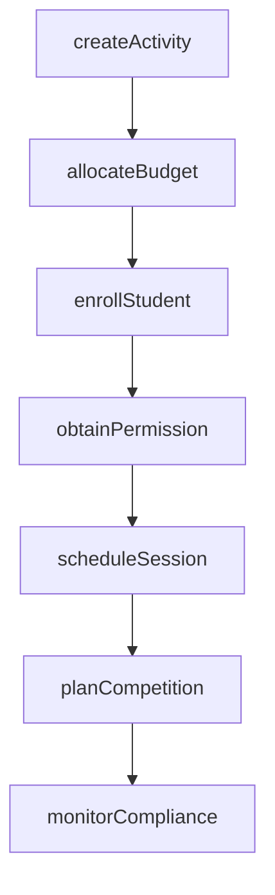
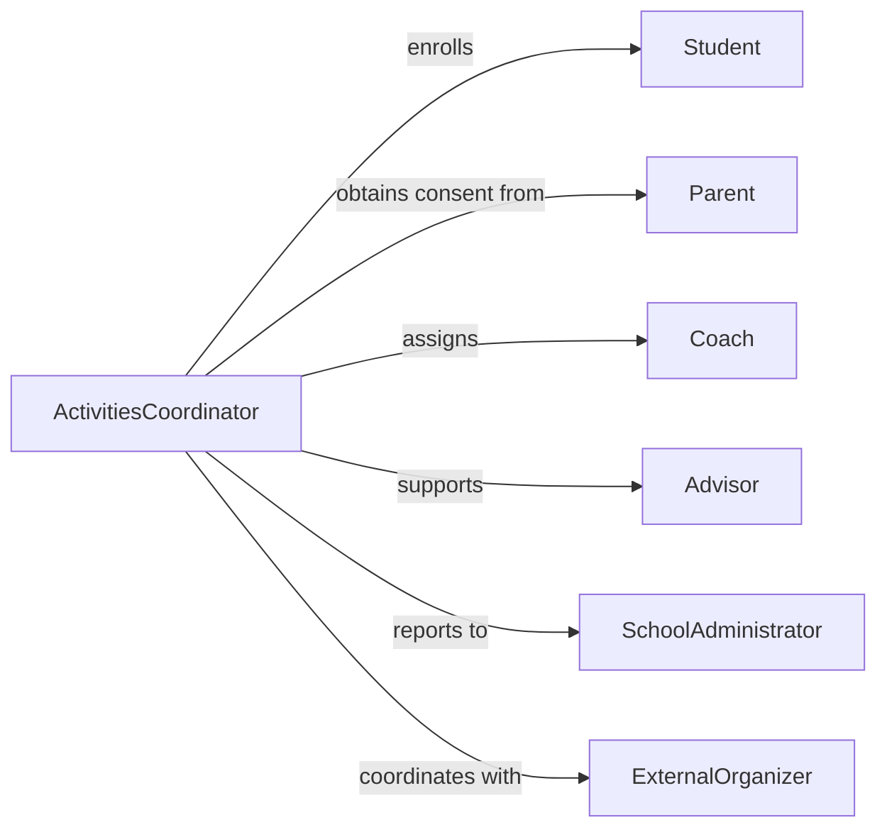

# Coordinate Student Extracurricular Activities

> Business-as-Code definition for student extracurricular activity coordination. Models the management of clubs, sports, competitions, and student organizations.

## Overview

Student extracurricular activity coordination involves organizing clubs, athletic teams, academic competitions, and student organizations. This definition exposes actions for activity planning, membership management, schedule coordination, and event execution, along with searches for participation tracking and compliance monitoring.

## Actors

| Actor | Description |
|-------|-------------|
| Student | Participant enrolled in extracurricular activities |
| Parent | Guardian providing consent and support |
| Coach | Instructor for athletic or competitive teams |
| Advisor | Faculty member overseeing student organizations |
| SchoolAdministrator | Approves activities and ensures policy compliance |
| ExternalOrganizer | Manages off-campus competitions or events |

## Roles

| Role | Description |
|------|-------------|
| ActivitiesCoordinator | Oversees all extracurricular programs |
| ClubAdvisor | Supports and mentors student organization leadership |
| AthleticDirector | Manages sports teams and athletic programs |
| CompetitionCoordinator | Organizes academic and athletic competitions |
| ComplianceOfficer | Ensures activities meet institutional policies |

## Entities

| Entity | Description |
|--------|-------------|
| Activity | Club, sport, or student organization |
| Membership | Student enrollment in an activity |
| Schedule | Calendar of meetings, practices, and events |
| Competition | Academic or athletic contest participation |
| PermissionForm | Parent consent for student participation |
| Budget | Funding allocation for activity operations |

## Actions

| Action | Description |
|--------|-------------|
| createActivity | Establish a new club, team, or organization |
| enrollStudent | Register a student for an activity |
| scheduleSession | Set date and time for meetings or practices |
| planCompetition | Organize participation in external events |
| obtainPermission | Collect parent consent for student involvement |
| allocateBudget | Assign funding to an activity |
| monitorCompliance | Review activities for policy adherence |

## Events

| Event | Description |
|-------|-------------|
| activityCreated | A new club or organization has been established |
| studentEnrolled | A student has joined an activity |
| sessionScheduled | A meeting or practice has been calendared |
| competitionPlanned | External event participation has been organized |
| permissionObtained | Parent consent has been received |
| budgetAllocated | Funding has been assigned to an activity |
| complianceMonitored | Policy review has been completed |

## Searches

| Search | Description |
|--------|-------------|
| findActivities | List clubs and organizations by type or status |
| getMembers | Retrieve students enrolled in an activity |
| getSchedule | View upcoming sessions and events |
| getCompetitions | Find planned or completed competitions |
| getPermissions | Check consent forms by student or activity |

## Workflow



## Actor Relationships



## Usage

### Calling Actions

```typescript
import { coordinateStudentExtracurricularActivities } from '@headlessly/coordinate-student-extracurricular-activities'

const activities = coordinateStudentExtracurricularActivities()

// Create a new club
const roboticsClub = await activities.createActivity({
  name: 'Robotics Club',
  type: 'academic',
  advisor: 'Dr. Martinez',
  meetingDay: 'Wednesday',
  maxMembers: 30
})

// Enroll students and obtain permissions
await activities.enrollStudent({
  activityId: roboticsClub.id,
  studentId: 'stu-4421',
  grade: 10
})

await activities.obtainPermission({
  studentId: 'stu-4421',
  activityId: roboticsClub.id,
  parentSignature: true,
  medicalRelease: true
})

// Schedule a competition
await activities.planCompetition({
  activityId: roboticsClub.id,
  name: 'State Robotics Championship',
  date: '2026-04-12',
  location: 'State University',
  transportNeeded: true
})
```

### Event-Driven Automation

```typescript
// Send welcome email when student enrolls
activities.studentEnrolled(async ({ studentId, activityId }) => {
  const activity = await activities.findActivities({ id: activityId })
  await notify({
    to: studentId,
    template: 'welcome-to-activity',
    data: { activityName: activity.name }
  })
})

// Remind parents to submit permission forms
activities.competitionPlanned(async ({ activityId, date }) => {
  const members = await activities.getMembers({ activityId })
  const missingPermissions = members.filter(m => !m.permissionOnFile)

  for (const member of missingPermissions) {
    await notify({
      to: member.parentEmail,
      message: `Please submit permission form for upcoming competition on ${date}`
    })
  }
})
```
